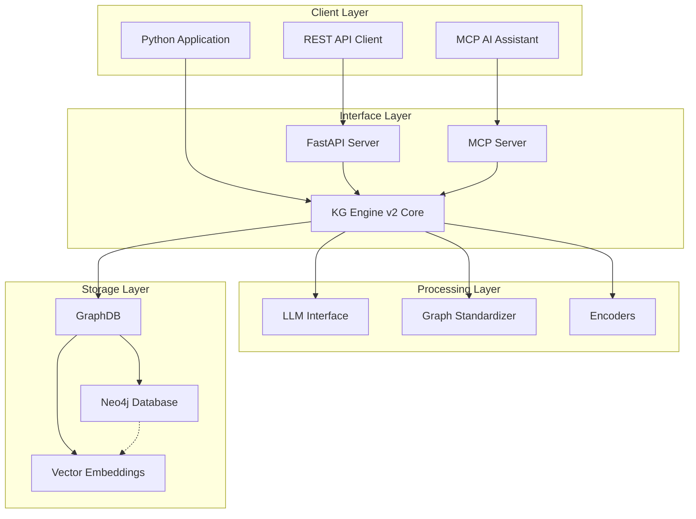
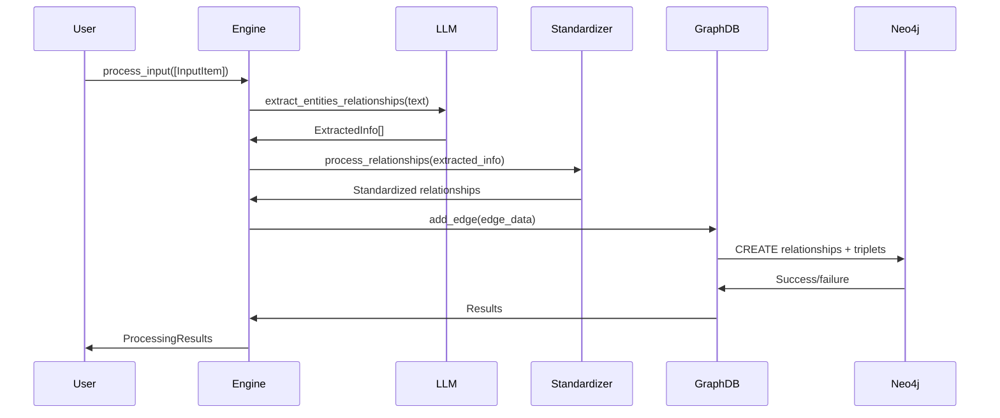
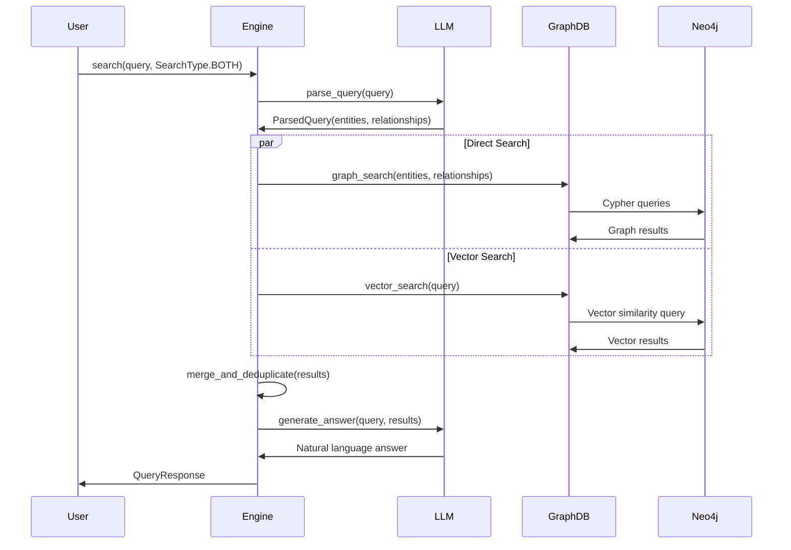

# Architecture Overview

High-level architecture and design principles of Knowledge Graph Engine v2.

## System Architecture



## Core Components

### 1. KnowledgeGraphEngineV2 (Core)
**Purpose**: Main orchestration layer  
**Responsibilities**:
- Process natural language input
- Coordinate between LLM, graph DB, and vector search
- Handle conflict resolution and temporal tracking
- Provide unified search interface

**Key Methods**:
```python
process_input(items: List[InputItem]) -> Dict[str, Any]
search(query: str, search_type: SearchType) -> QueryResponse  
get_node_relations(node_name: str) -> List[SearchResult]
```

### 2. LLM Interface
**Purpose**: Natural language processing  
**Responsibilities**:
- Extract entities and relationships from text
- Parse search queries
- Generate natural language answers
- Support multiple LLM providers (OpenAI, Ollama)

**Models Supported**:
- OpenAI: GPT-4, GPT-4o-mini, GPT-3.5-turbo
- Ollama: llama3.2, phi3, mistral, custom models
- Custom: Any OpenAI-compatible endpoint

### 3. Graph Database (GraphDB)
**Purpose**: Persistent graph storage and operations  
**Responsibilities**:
- Neo4j native operations (CRUD)
- Cypher query execution
- Transaction management
- Index management and optimization

**Storage Design**:
- **Entities**: Nodes with properties
- **Relationships**: Dynamic typed edges with metadata
- **Triplets**: Vector-searchable relationship representations

### 4. Vector Processing
**Purpose**: Semantic search and similarity matching  
**Components**:
- **BiEncoder**: Fast similarity search (all-MiniLM-L6-v2)
- **CrossEncoder**: Accurate reranking (ms-marco-MiniLM-L-6-v2)
- **GraphStandardizer**: Relationship normalization and categorization

**Architecture**:
```python
# Hybrid two-stage retrieval
candidates = bi_encoder.get_top_k_similar(query, embeddings, k=20)
results = cross_encoder.rerank_candidates(query, candidates)
```

## Deployment Architecture

### 1. Single Instance (Development)
```
┌─────────────────┐
│ KG Engine Core  │
│                 │
│ ┌─────────────┐ │
│ │    Neo4j    │ │
│ └─────────────┘ │
└─────────────────┘
```

### 2. API Server (Production)
```
┌─────────────────┐    ┌─────────────────┐
│   FastAPI       │    │   KG Engine     │
│   Server        │───▶│   Core          │
│                 │    │                 │
│ • REST API      │    │ ┌─────────────┐ │
│ • Documentation │    │ │    Neo4j    │ │
│ • Validation    │    │ └─────────────┘ │
└─────────────────┘    └─────────────────┘
```

### 3. MCP Server (AI Assistant Integration)
```
┌─────────────────┐    ┌─────────────────┐
│   MCP Server    │    │   KG Engine     │
│   (Claude/GPT)  │───▶│   Core          │
│                 │    │                 │
│ • Tool Interface│    │ ┌─────────────┐ │
│ • SSE Transport │    │ │    Neo4j    │ │
│ • AI Assistant │    │ └─────────────┘ │
└─────────────────┘    └─────────────────┘
```

## Data Flow

### 1. Input Processing Flow


### 2. Search Flow


## Performance Optimizations

### 1. Query Optimization
- **GraphQueryOptimizer**: Intelligent Cypher generation
- **Neo4jOptimizer**: Index management and query hints
- **Result Caching**: TTL-based caching for repeated queries
- **Lazy Loading**: On-demand relationship population

### 2. Memory Management
- **Connection Pooling**: Reuse Neo4j connections
- **Batch Operations**: Process multiple items together
- **Streaming Results**: Handle large result sets efficiently
- **Embedding Caching**: In-memory similarity search

## Error Handling Strategy

### 1. Exception Hierarchy
```python
KGEngineError
├── Neo4jConnectionError
├── LLMError
│   ├── LLMTimeoutError
│   └── LLMQuotaError
├── ValidationError
└── ProcessingError
```

### 2. Resilience Patterns
- **Circuit Breaker**: Fail fast on repeated LLM errors
- **Retry Logic**: Exponential backoff for transient failures
- **Graceful Degradation**: Fall back to graph-only search if vector fails
- **Transaction Safety**: Atomic operations with rollback

## External Interfaces

### 1. REST API Server
**Location**: [`kg_api_server/`](../../kg_api_server/)  
**Purpose**: Production-ready REST API  
**Features**:
- Complete CRUD operations
- Interactive documentation (/docs)
- Docker deployment support
- Comprehensive validation
- Error handling and logging

**Key Endpoints**:
```
POST /process     # Process natural language
POST /search      # Search knowledge graph
POST /edges       # Create relationships
GET  /nodes/{id}  # Get node information
POST /nodes/merge # Merge duplicate nodes
GET  /stats       # System statistics
```

### 2. MCP Server  
**Location**: [`kg_mcp_server/`](../../kg_mcp_server/)  
**Purpose**: AI assistant integration  
**Features**:
- Model Context Protocol (MCP) compliance
- SSE transport for real-time communication
- Direct integration with Claude, GPT, and other AI assistants
- Natural language tool interface
- Comprehensive knowledge management tools

**Available Tools**:
```
process_text    # Add knowledge from text
search          # Query knowledge graph
get_node        # Explore entity relationships
create_edge     # Manual relationship creation
update_edge     # Modify relationships
merge_nodes     # Combine duplicate entities
get_stats       # System monitoring
```

### 3. Python Package API
**Location**: Core package  
**Purpose**: Direct integration in applications  
**Features**:
- Clean API exports
- Type hints and validation
- Comprehensive error handling
- Flexible configuration options

```python
from exo_graph import (
    ExoGraphEngine, InputItem, Neo4jConfig,
    GraphEdge, EdgeMetadata, RelationshipStatus,
    SearchType, parse_date, __version__
)
```

## Configuration Management

### Environment Variables
```bash
# Neo4j Configuration
NEO4J_URI=bolt://localhost:7687
NEO4J_USERNAME=neo4j
NEO4J_PASSWORD=password
NEO4J_DATABASE=neo4j

# LLM Configuration  
OPENAI_API_KEY=your-key
OPENAI_MODEL=gpt-4o-mini

# Or Ollama
LLM_BASE_URL=http://localhost:11434/v1
OPENAI_MODEL=llama3.2:3b

# Performance
KG_CACHE_TTL=300
KG_MAX_BATCH_SIZE=100
```

### Code Configuration

```python
from exo_graph import Neo4jConfig

config = Neo4jConfig(
    uri="bolt://localhost:7687",
    username="neo4j",
    password="password",
    database="neo4j",
    max_connection_pool_size=50,
    connection_timeout=30
)
```

## Security Considerations

### 1. Data Protection
- **Input Sanitization**: Validate all user inputs
- **Cypher Injection Prevention**: Parameterized queries only
- **Secret Management**: Environment variables for credentials
- **Access Control**: User-based filtering (user_id field)

### 2. API Security
- **Rate Limiting**: Prevent abuse
- **Authentication**: Optional bearer token support
- **HTTPS Only**: TLS encryption for production
- **Input Validation**: Pydantic models for all inputs

## Extension Points

### 1. Custom LLM Providers
```python
class CustomLLMInterface(LLMInterface):
    def extract_entities_relationships(self, text: str) -> List[ExtractedInfo]:
        # Custom implementation
        pass
```

### 2. Custom Storage Backends
```python
class CustomGraphDB(GraphDB):
    def add_edge(self, edge_data: GraphEdge) -> bool:
        # Custom storage implementation
        pass
```

### 3. Custom Search Strategies
```python
class CustomSearchStrategy:
    def search(self, query: str, context: Dict) -> List[SearchResult]:
        # Custom search logic
        pass
```

This architecture provides a solid foundation for scalable, maintainable knowledge graph applications while maintaining flexibility for customization and extension.