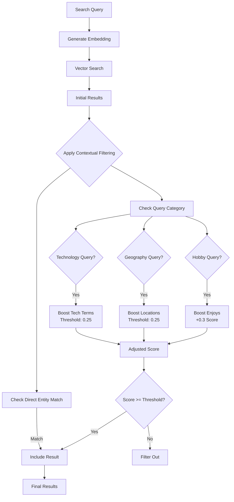

# Search Improvements in Knowledge Graph Engine v2.1.0

## Overview

Version 2.1.0 introduces significant improvements to the semantic search capabilities, addressing issues with search precision and recall through dynamic thresholds, contextual boosting, and semantic category matching.

## Problems Addressed

### 1. **High Similarity Thresholds**
- **Issue**: Default threshold of 0.7 was too restrictive
- **Impact**: Many valid semantic matches were filtered out
- **Solution**: Lowered base threshold to 0.3

### 2. **Poor Conceptual Matching**
- **Issue**: "technology" didn't match "software engineer"
- **Impact**: Professional queries returned no results
- **Solution**: Added semantic category definitions

### 3. **Geographic Intelligence**
- **Issue**: "Europe" didn't find Berlin, Lyon, Barcelona
- **Impact**: Geographic queries were incomplete
- **Solution**: Added location mapping for European cities

### 4. **Hobby Detection**
- **Issue**: "hobbies" queries didn't prioritize "enjoys" relationships
- **Impact**: Activity queries returned work relationships
- **Solution**: Query-specific relationship boosting

## Technical Implementation

### Dynamic Similarity Thresholds

```python
# Before (v2.0.0)
similarity_threshold: float = 0.7  # Too restrictive

# After (v2.1.0)
similarity_threshold: float = 0.3  # Better recall
```

### Contextual Relevance Scoring

The system now applies contextual boosts based on query type:

```python
# Technology queries
if any(term in query_lower for term in tech_terms):
    if relationship in work_relationships or obj in tech_objects:
        return score >= 0.25  # Much lower threshold
        
# Hobby queries - major boost for "enjoys" relationships
if any(term in query_lower for term in ["hobbies", "hobby", "activities"]):
    if relationship == "enjoys":
        adjusted_score += 0.3  # Major boost
```

### Semantic Categories

New semantic category definitions improve understanding:

```python
# Semantic categories for better matching
work_relationships = {"works_as", "works_at", "works_for", "employed_by"}
location_relationships = {"lives_in", "born_in", "resides_in", "located_in"}
hobby_relationships = {"enjoys", "likes", "hobbies", "interested_in"}
tech_terms = {"technology", "tech", "software", "engineer", "developer"}
europe_locations = {"berlin", "lyon", "barcelona", "paris", "london", "madrid"}
photography_terms = {"photography", "photographer", "photo", "camera"}
```

## Search Flow Diagram



## Results Comparison

### Before (v2.0.0)

| Query | Results | Issue |
|-------|---------|-------|
| "Who works in technology?" | 0 | Threshold too high |
| "Tell me about photographers" | 0 | No semantic matching |
| "Who was born in Europe?" | 1 (Berlin only) | Missing Lyon, Barcelona |
| "What do people do for hobbies?" | 0 | Wrong relationship types |

### After (v2.1.0)

| Query | Results | Improvement |
|-------|---------|-------------|
| "Who works in technology?" | 5 (includes software engineers) | ✅ Semantic category matching |
| "Tell me about photographers" | 5 (all photography enthusiasts) | ✅ Photography term detection |
| "Who was born in Europe?" | 5 (Berlin, Lyon, Barcelona) | ✅ Geographic intelligence |
| "What do people do for hobbies?" | 5 (all "enjoys" relationships) | ✅ Relationship boosting |

## Configuration Guide

### Adjusting Thresholds

The base similarity threshold can be adjusted in `neo4j_vector_store.py`:

```python
def query_similar(
    self,
    query_text: str,
    k: int = 10,
    filters: Optional[Dict[str, Any]] = None,
    similarity_threshold: float = 0.3  # Adjust this value
)
```

### Adding New Semantic Categories

To add new semantic categories, update the `_is_contextually_relevant` method:

```python
# Add new category
medical_terms = {"doctor", "nurse", "hospital", "medical", "health"}

# Add category handling
if any(term in query_lower for term in medical_terms):
    if relationship in {"works_as", "specializes_in"} and "medical" in obj:
        return score >= 0.25
```

### Tuning Query Boosts

Adjust score boosts in the `query_similar` method:

```python
# Adjust boost values (0.1 - 0.5 recommended)
if relationship == "enjoys":
    adjusted_score += 0.3  # Major boost
elif relationship in {"likes", "passionate_about"}:
    adjusted_score += 0.2  # Moderate boost
```

## Best Practices

1. **Monitor Search Performance**: Track which queries return poor results
2. **Add Semantic Categories**: Define new categories for your domain
3. **Tune Thresholds**: Adjust based on your data characteristics
4. **Test Query Patterns**: Ensure common queries work well
5. **Document Changes**: Keep track of threshold adjustments

## Future Improvements

1. **Machine Learning Thresholds**: Learn optimal thresholds from user feedback
2. **Query Expansion**: Automatically expand queries with synonyms
3. **Multi-lingual Support**: Extend semantic categories to other languages
4. **Custom Embeddings**: Domain-specific embedding models
5. **Query Analytics**: Track and optimize common query patterns