# System Workflows

This document describes the key workflows and processes in the Knowledge Graph Engine v2 system.

## 🔄 Core Workflows

### 1. **Information Processing Workflow**

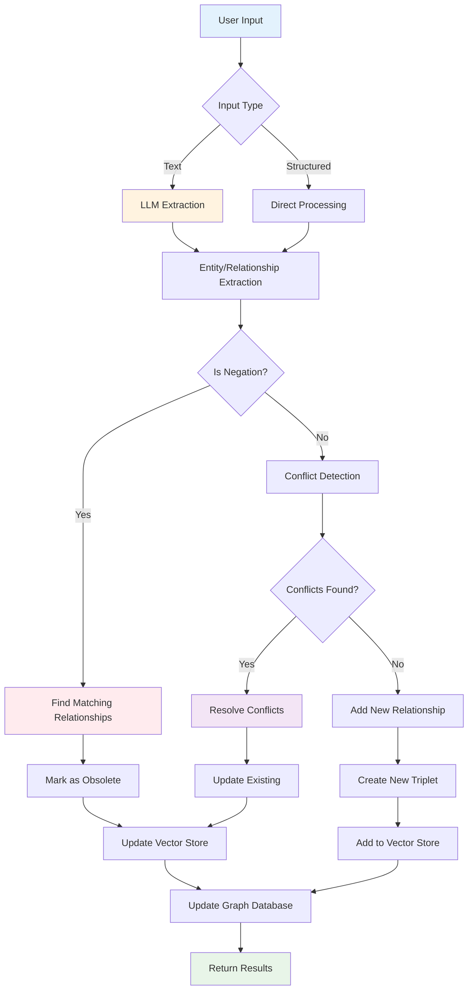

### 2. **Search and Query Workflow**

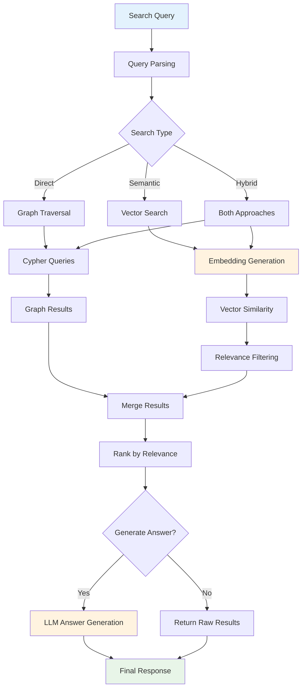

### 3. **Conflict Resolution Workflow**

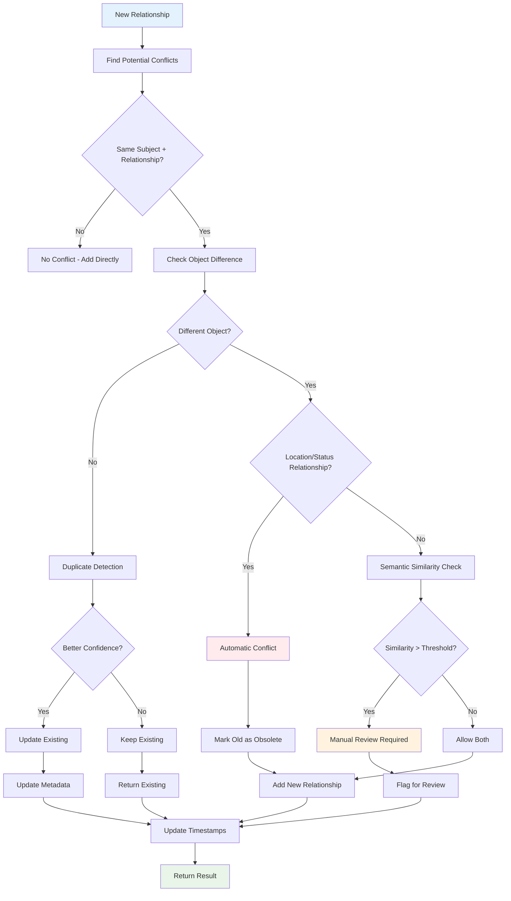

### 4. **Vector Search Precision Workflow**

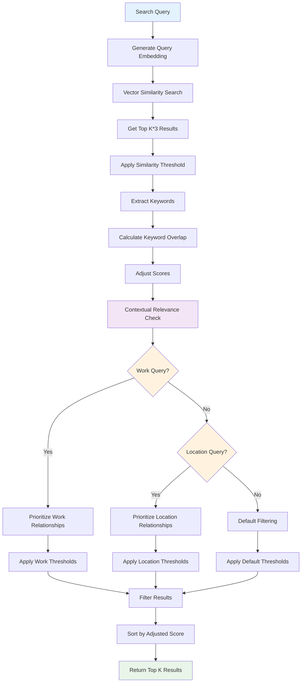

### 5. **Entity Search Workflow**

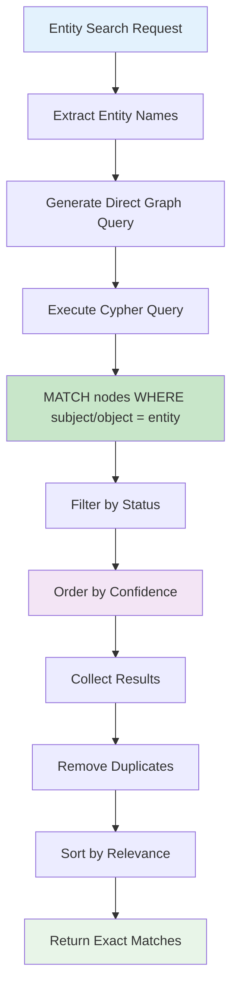

## 🔄 Data Transformation Workflows

### 6. **Triplet Creation Workflow**

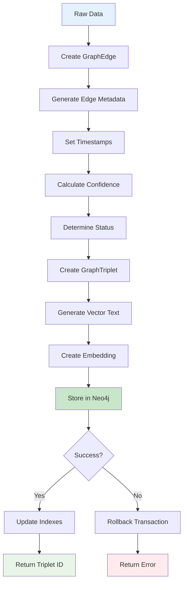

### 7. **Embedding Generation Workflow**

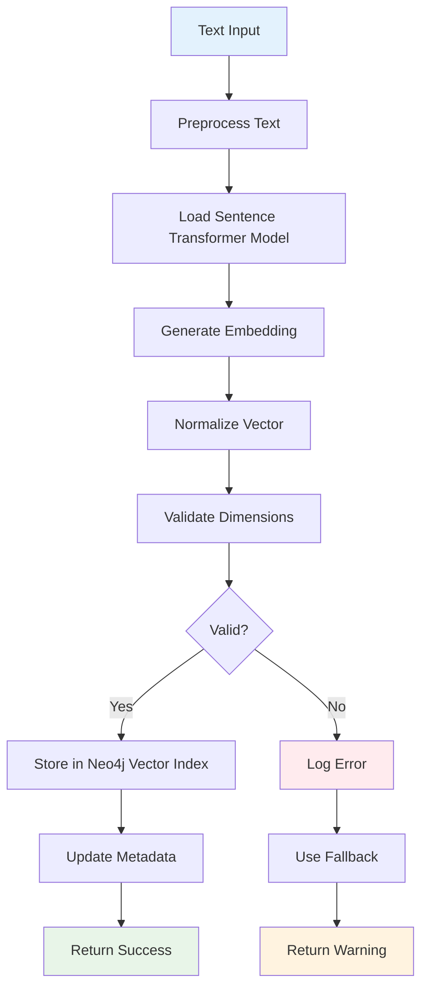

## 🎯 Performance Optimization Workflows

### 8. **Query Optimization Workflow**

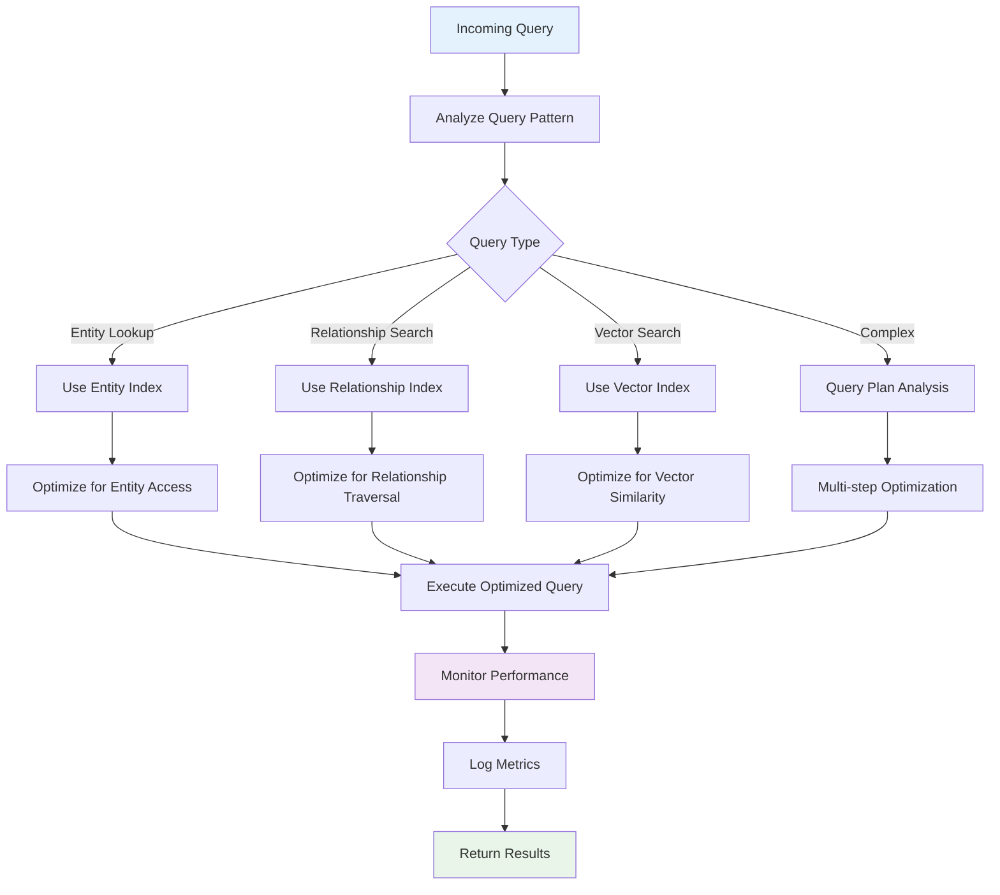

## ⚡ Error Handling Workflows

### 9. **Error Recovery Workflow**

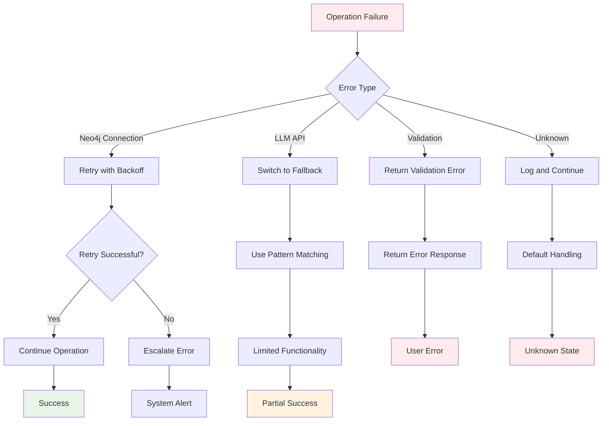

## 📊 Monitoring and Observability

### 10. **Health Check Workflow**

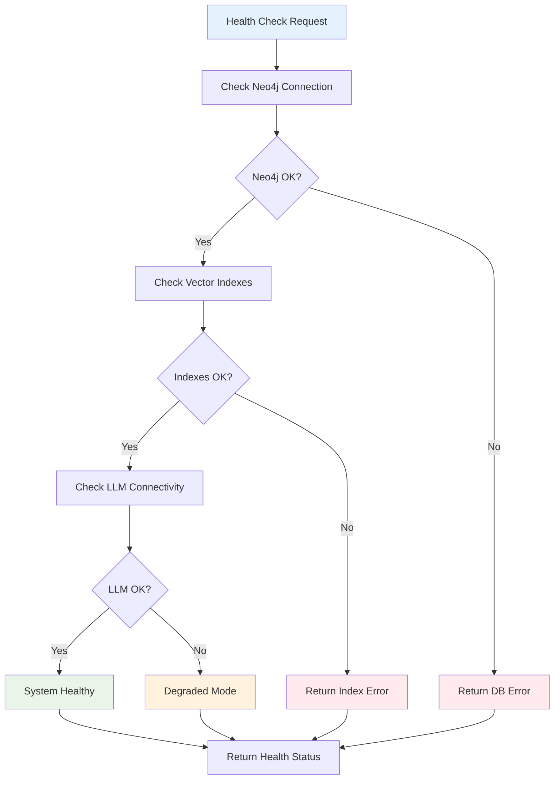

## 🔧 Maintenance Workflows

### 11. **Index Maintenance Workflow**

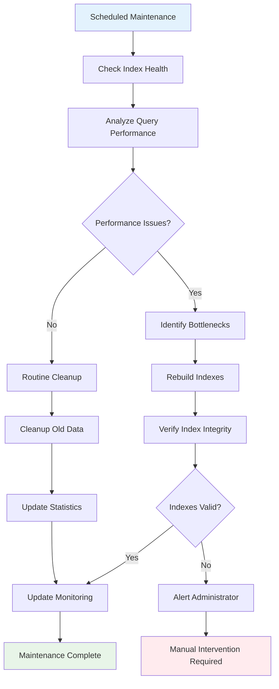

These workflows represent the core operational patterns of the Knowledge Graph Engine v2 system, showing how data flows through the system and how different components interact to provide intelligent knowledge graph capabilities.