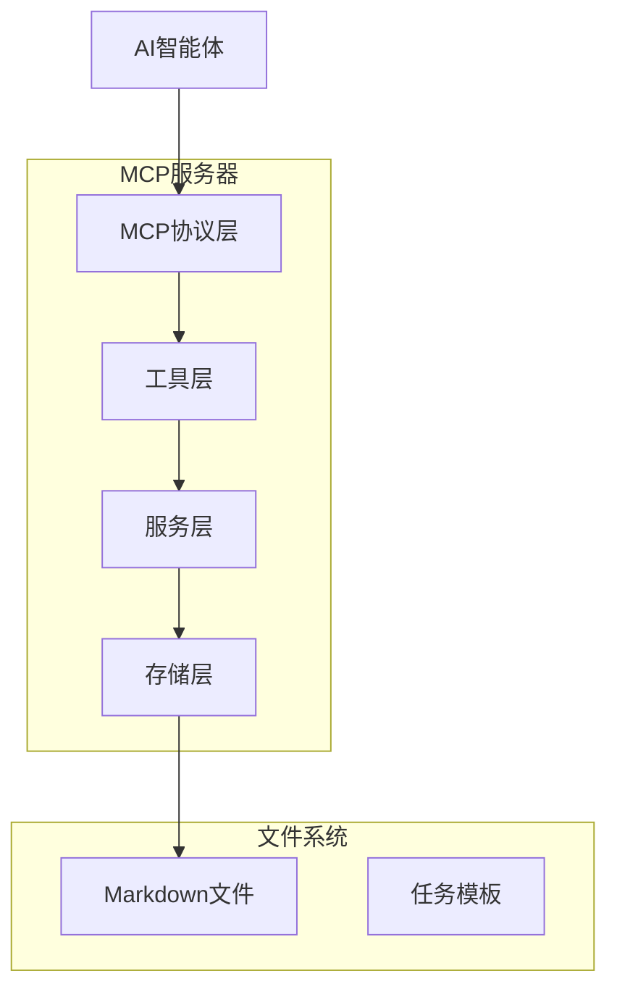

# 设计文档

## 概述

智能体任务系统是一个基于Python的MCP（模型上下文协议）服务器，为AI智能体提供全面的任务管理功能。系统使用带有YAML前置元数据的Markdown文件进行存储，确保人类可读性的同时保持结构化数据以供程序访问。架构采用分层方法，在MCP协议处理、业务逻辑和数据持久化之间实现清晰分离。

## 架构设计

### 高层架构



### 层级职责

1. **MCP协议层**: 处理JSON-RPC 2.0通信、工具发现和模式验证
2. **工具层**: 暴露MCP兼容的任务操作工具（CRUD、查询、状态管理）
3. **服务层**: 包含任务管理、层级处理和验证的业务逻辑
4. **存储层**: 管理Markdown文件I/O、解析和格式化
5. **模型层**: 定义数据结构和类型定义

## 组件和接口

### 核心模型

#### 任务模型
```python
@dataclass
class Task:
    id: str
    title: str
    description: str
    status: TaskStatus
    priority: Priority
    tags: List[str]
    parent_id: Optional[str]
    child_ids: List[str]
    created_at: datetime
    updated_at: datetime
    due_date: Optional[datetime]
    tool_calls: List[ToolCall]
    metadata: Dict[str, Any]
```

#### 任务状态枚举
```python
class TaskStatus(Enum):
    PENDING = "pending"
    IN_PROGRESS = "in_progress"
    COMPLETED = "completed"
    BLOCKED = "blocked"
```

#### 工具调用模型
```python
@dataclass
class ToolCall:
    timestamp: datetime
    tool_name: str
    parameters: Dict[str, Any]
    result: Optional[Dict[str, Any]]
    agent_id: Optional[str]
```

### MCP工具接口

#### 任务管理工具
- `create_task`: 创建新任务，可选择父任务关系
- `update_task`: 修改现有任务属性
- `delete_task`: 删除任务并处理子任务关系
- `get_task`: 通过ID检索单个任务
- `list_tasks`: 使用过滤选项查询任务
- `get_task_context`: 获取任务的完整上下文信息，包括父子关系和历史记录

#### 层级管理工具
- `add_child_task`: 建立父子任务关系
- `remove_child_task`: 断开父子任务关系
- `get_task_hierarchy`: 检索完整层级树
- `move_task`: 更改任务父级关系

#### 状态管理工具
- `update_task_status`: 验证并更改任务状态
- `bulk_status_update`: 批量更新多个任务状态
- `get_task_status`: 获取任务当前状态和进度信息
- `get_pending_tasks`: 获取所有待处理的任务列表
- `get_in_progress_tasks`: 获取所有进行中的任务列表
- `get_blocked_tasks`: 获取所有被阻塞的任务列表
- `get_completed_tasks`: 获取所有已完成的任务列表

#### 查询工具
- `search_tasks`: 跨任务内容的全文搜索
- `filter_tasks`: 多条件高级过滤
- `get_task_statistics`: 任务聚合数据统计

### 存储层

#### Markdown文件格式
```markdown
---
id: task_001
title: 实现用户认证
status: in_progress
priority: high
tags: [后端, 安全]
parent: epic_001
children: [task_002, task_003]
due: 2024-01-20T17:00:00Z
created: 2024-01-15T10:30:00Z
updated: 2024-01-16T14:20:00Z
agent_history:
  - timestamp: 2024-01-15T10:30:00Z
    tool: create_task
    agent: agent_001
    action: 创建任务
  - timestamp: 2024-01-16T14:20:00Z
    tool: update_task_status
    agent: agent_001
    action: 状态更新为进行中
metadata:
  estimated_hours: 8
  complexity: medium
  dependencies: [auth_library, database_setup]
---

# 实现用户认证

**状态**: 进行中 | **优先级**: 高 | **标签**: 后端, 安全 | **截止**: 2024-01-20

## 描述
为应用程序创建安全的认证系统，包含JWT令牌和密码哈希。

## 验收标准
- [ ] 使用bcrypt实现密码哈希
- [ ] 创建JWT令牌生成和验证
- [ ] 添加登录/登出端点
- [ ] 实现会话管理

## 子任务
- [task_002] 设计数据库用户表结构
- [task_003] 实现密码加密服务

## 依赖项
- 认证库选择和配置
- 数据库连接设置

## 备注
考虑使用行业标准库进行安全实现。

## 智能体操作历史
- **2024-01-15 10:30** - agent_001 创建任务
- **2024-01-16 14:20** - agent_001 状态更新为进行中

---
*预估工时: 8小时 | 复杂度: 中等 | 创建: 2024-01-15 | 更新: 2024-01-16*
```

#### 文件管理策略
- 文件命名: `{task_id}_{slug}.md` (例如: `task_001_implement-auth.md`)
- 目录结构: `data/tasks/` 存放活跃任务
- 原子文件操作防止损坏
- 文件监控外部修改
- 备份和恢复机制

## 数据模型

### 任务层级结构
```python
class HierarchyNode:
    task: Task
    parent: Optional['HierarchyNode']
    children: List['HierarchyNode']
    
    def get_ancestors(self) -> List['HierarchyNode']:
        """获取所有父节点直到根节点"""
        
    def get_descendants(self) -> List['HierarchyNode']:
        """递归获取所有子节点"""
        
    def validate_hierarchy(self) -> bool:
        """检查循环依赖"""
```

### 查询过滤器模型
```python
@dataclass
class TaskFilter:
    status: Optional[List[TaskStatus]]
    priority: Optional[List[Priority]]
    tags: Optional[List[str]]
    parent_id: Optional[str]
    created_after: Optional[datetime]
    created_before: Optional[datetime]
    due_after: Optional[datetime]
    due_before: Optional[datetime]
    search_text: Optional[str]
    include_completed: bool = True
```

## 错误处理

### 错误类别
1. **验证错误**: 无效输入参数、模式违规
2. **业务逻辑错误**: 循环依赖、无效状态转换
3. **存储错误**: 文件I/O失败、解析错误
4. **MCP协议错误**: 格式错误的请求、不支持的操作

### 错误响应格式
```python
@dataclass
class ErrorResponse:
    error_code: str
    message: str
    details: Optional[Dict[str, Any]]
    suggestions: Optional[List[str]]
```

### 错误处理策略
- 非关键操作的优雅降级
- 为智能体调试提供详细错误信息
- 临时故障的自动重试机制
- 全面的故障排除日志记录

## 测试策略

### 单元测试
- 模型验证和序列化
- 存储层操作（解析、写入）
- 服务层业务逻辑
- 工具参数验证

### 集成测试
- MCP协议合规性
- 端到端工具操作
- 文件系统交互
- 层级管理操作

### 性能测试
- 1000+任务的负载测试
- 并发访问场景
- 内存使用分析
- 查询性能基准测试

### 测试数据管理
- 各种任务场景的固定装置文件
- 工具测试的模拟MCP客户端
- 隔离测试的临时文件系统
- 自动化测试数据生成

## 性能考虑

### 优化策略
1. **延迟加载**: 仅在需要时加载任务内容
2. **缓存**: 为频繁访问的任务提供内存缓存
3. **索引**: 为常见查询模式维护索引
4. **批量操作**: 支持批量操作以提高效率

### 可扩展性措施
- 基于文件的存储随文件系统限制扩展
- 大型任务集的分层目录结构
- 基于可用内存的可配置缓存大小
- 有益的异步文件操作

### 监控和指标
- 任务操作延迟跟踪
- 内存使用监控
- 文件系统性能指标
- 错误率和类型跟踪

## 安全考虑

### 数据保护
- 输入验证和清理
- 安全文件路径处理以防止目录遍历
- 原子文件操作防止损坏
- 数据恢复的备份机制

### 访问控制
- 工具级权限（未来增强）
- 智能体识别和跟踪
- 通过工具调用记录的审计跟踪
- 资源保护的速率限制

## 配置管理

### 配置结构
```python
@dataclass
class TodoConfig:
    data_directory: Path
    max_cache_size: int
    file_watch_enabled: bool
    backup_enabled: bool
    log_level: str
    performance_monitoring: bool
```

### 环境特定设置
- 开发环境: 增强日志记录，启用文件监控
- 生产环境: 优化缓存，启用备份
- 测试环境: 隔离数据目录，最小日志记录