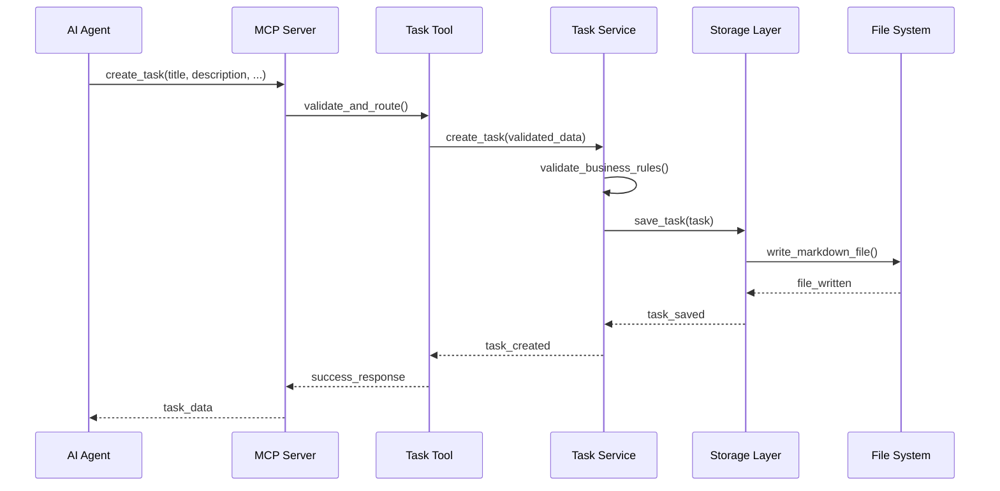
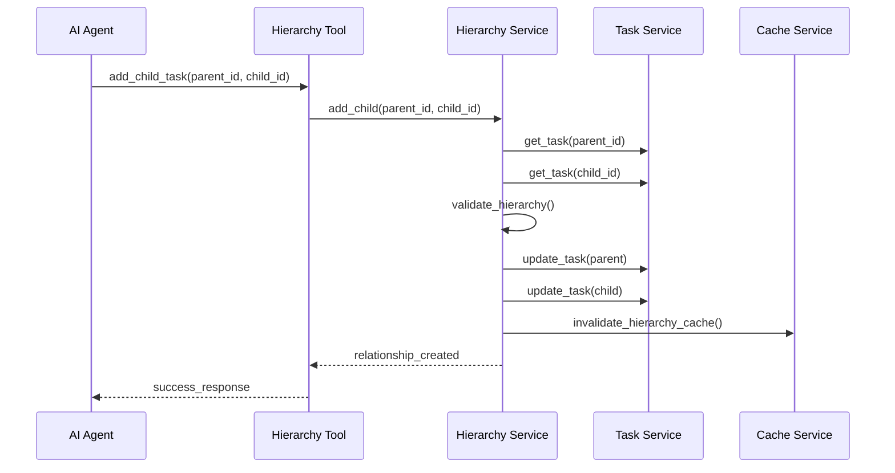

# Architecture Documentation

This document provides a comprehensive overview of the Todo MCP Server architecture, design decisions, and implementation details.

## Table of Contents

- [System Overview](#system-overview)
- [Architecture Patterns](#architecture-patterns)
- [Component Design](#component-design)
- [Data Flow](#data-flow)
- [Storage Architecture](#storage-architecture)
- [Performance Considerations](#performance-considerations)
- [Security Architecture](#security-architecture)
- [Scalability Design](#scalability-design)

## System Overview

The Todo MCP Server is designed as a high-performance, scalable task management system that implements the Model Context Protocol (MCP) for AI agent interactions. The architecture follows clean architecture principles with clear separation of concerns.

### High-Level Architecture

```
┌─────────────────────────────────────────────────────────────────┐
│                        AI Agents Layer                         │
│  ┌─────────────┐  ┌─────────────┐  ┌─────────────┐            │
│  │   Claude    │  │    GPT-4    │  │ Custom AI   │            │
│  │   Agents    │  │   Agents    │  │   Agents    │            │
│  └─────────────┘  └─────────────┘  └─────────────┘            │
└─────────────────────────────────────────────────────────────────┘
                                │
                                ▼
┌─────────────────────────────────────────────────────────────────┐
│                    MCP Protocol Layer                           │
│  ┌─────────────────────────────────────────────────────────┐   │
│  │              JSON-RPC 2.0 Transport                    │   │
│  │  • Tool Discovery  • Parameter Validation              │   │
│  │  • Error Handling  • Response Formatting               │   │
│  └─────────────────────────────────────────────────────────┘   │
└─────────────────────────────────────────────────────────────────┘
                                │
                                ▼
┌─────────────────────────────────────────────────────────────────┐
│                      Application Layer                         │
│  ┌─────────────┐  ┌─────────────┐  ┌─────────────┐            │
│  │    Task     │  │   Status    │  │ Hierarchy   │            │
│  │    Tools    │  │    Tools    │  │    Tools    │            │
│  └─────────────┘  └─────────────┘  └─────────────┘            │
│  ┌─────────────┐  ┌─────────────┐  ┌─────────────┐            │
│  │   Query     │  │    MCP      │  │   Config    │            │
│  │   Tools     │  │   Server    │  │  Manager    │            │
│  └─────────────┘  └─────────────┘  └─────────────┘            │
└─────────────────────────────────────────────────────────────────┘
                                │
                                ▼
┌─────────────────────────────────────────────────────────────────┐
│                     Business Logic Layer                       │
│  ┌─────────────┐  ┌─────────────┐  ┌─────────────┐            │
│  │    Task     │  │  Hierarchy  │  │   Cache     │            │
│  │  Service    │  │   Service   │  │  Service    │            │
│  └─────────────┘  └─────────────┘  └─────────────┘            │
│  ┌─────────────┐  ┌─────────────┐  ┌─────────────┐            │
│  │  Validation │  │   Search    │  │   Audit     │            │
│  │  Service    │  │   Service   │  │  Service    │            │
│  └─────────────┘  └─────────────┘  └─────────────┘            │
└─────────────────────────────────────────────────────────────────┘
                                │
                                ▼
┌─────────────────────────────────────────────────────────────────┐
│                      Data Access Layer                         │
│  ┌─────────────┐  ┌─────────────┐  ┌─────────────┐            │
│  │  Markdown   │  │  Markdown   │  │    File     │            │
│  │   Parser    │  │   Writer    │  │  Manager    │            │
│  └─────────────┘  └─────────────┘  └─────────────┘            │
│  ┌─────────────┐  ┌─────────────┐  ┌─────────────┐            │
│  │   Index     │  │   Backup    │  │    Lock     │            │
│  │  Manager    │  │  Manager    │  │  Manager    │            │
│  └─────────────┘  └─────────────┘  └─────────────┘            │
└─────────────────────────────────────────────────────────────────┘
                                │
                                ▼
┌─────────────────────────────────────────────────────────────────┐
│                       Storage Layer                            │
│  ┌─────────────────────────────────────────────────────────┐   │
│  │                File System Storage                      │   │
│  │  • Markdown Files    • YAML Frontmatter                │   │
│  │  • Atomic Operations • File Monitoring                 │   │
│  │  • Backup System     • Index Files                     │   │
│  └─────────────────────────────────────────────────────────┘   │
└─────────────────────────────────────────────────────────────────┘
```

## Architecture Patterns

### 1. Clean Architecture

The system follows clean architecture principles:

- **Independence**: Business logic is independent of frameworks, UI, and external systems
- **Testability**: Business rules can be tested without external dependencies
- **Framework Independence**: The architecture doesn't depend on specific frameworks
- **Database Independence**: Business rules don't know about the storage mechanism

### 2. Layered Architecture

```
┌─────────────────────────────────────────┐
│           Presentation Layer            │  ← MCP Tools, API Endpoints
├─────────────────────────────────────────┤
│            Application Layer            │  ← Use Cases, Orchestration
├─────────────────────────────────────────┤
│             Domain Layer                │  ← Business Logic, Entities
├─────────────────────────────────────────┤
│          Infrastructure Layer           │  ← Storage, External Services
└─────────────────────────────────────────┘
```

### 3. Repository Pattern

Data access is abstracted through repository interfaces:

```python
class TaskRepository(ABC):
    @abstractmethod
    async def create(self, task: Task) -> Task: ...
    
    @abstractmethod
    async def get_by_id(self, task_id: str) -> Optional[Task]: ...
    
    @abstractmethod
    async def update(self, task: Task) -> Task: ...
    
    @abstractmethod
    async def delete(self, task_id: str) -> bool: ...
```

### 4. Service Layer Pattern

Business logic is encapsulated in service classes:

```python
class TaskService:
    def __init__(self, repository: TaskRepository, cache: CacheService):
        self.repository = repository
        self.cache = cache
    
    async def create_task(self, task_data: dict) -> Task:
        # Business logic implementation
        pass
```

## Component Design

### Core Components

#### 1. MCP Server (`server.py`)

**Responsibilities:**
- Handle MCP protocol communication
- Route tool calls to appropriate handlers
- Manage request/response lifecycle
- Provide error handling and logging

**Key Features:**
- JSON-RPC 2.0 protocol implementation
- Tool discovery and introspection
- Unified error handling
- Performance monitoring
- Request/response logging

#### 2. Task Service (`services/task_service.py`)

**Responsibilities:**
- Core task management business logic
- Data validation and transformation
- Cache management
- Audit trail maintenance

**Key Features:**
- CRUD operations with validation
- Hierarchical relationship management
- Search and filtering capabilities
- Performance optimization
- Concurrent access handling

#### 3. Storage Layer (`storage/`)

**Components:**
- **MarkdownParser**: Parse markdown files with YAML frontmatter
- **MarkdownWriter**: Generate human-readable markdown files
- **FileManager**: Handle file operations with atomic writes

**Key Features:**
- Human-readable storage format
- Atomic file operations
- File system monitoring
- Backup and recovery
- Index management

#### 4. Models (`models/`)

**Components:**
- **Task**: Core task entity with validation
- **TaskStatus**: Status enumeration and transitions
- **Priority**: Priority levels and comparison
- **ToolCall**: Audit trail records

**Key Features:**
- Pydantic-based validation
- Type safety and serialization
- Business rule enforcement
- Immutable data structures

### Tool Architecture

Each tool category is organized into separate modules:

```
tools/
├── task_tools.py      # CRUD operations
├── status_tools.py    # Status management
├── hierarchy_tools.py # Parent-child relationships
└── query_tools.py     # Search and filtering
```

**Tool Design Principles:**
- Single responsibility per tool
- Consistent parameter validation
- Standardized response format
- Comprehensive error handling
- Performance optimization

## Data Flow

### Request Processing Flow

```
1. AI Agent Request
   │
   ▼
2. MCP Protocol Validation
   │
   ▼
3. Tool Parameter Validation
   │
   ▼
4. Business Logic Processing
   │
   ▼
5. Data Access Layer
   │
   ▼
6. Storage Operations
   │
   ▼
7. Response Formatting
   │
   ▼
8. MCP Protocol Response
   │
   ▼
9. AI Agent Response
```

### Task Creation Flow



### Hierarchy Management Flow



## Storage Architecture

### File System Layout

```
data/
├── tasks/                    # Task storage
│   ├── task-001_title.md    # Individual task files
│   ├── task-002_title.md
│   └── ...
├── indexes/                  # Search indexes
│   ├── title_index.json
│   ├── tag_index.json
│   └── status_index.json
├── cache/                    # Cache files
│   ├── hierarchy_cache.json
│   └── stats_cache.json
├── backups/                  # Backup storage
│   ├── 2024-01-15/
│   └── 2024-01-16/
└── templates/                # Task templates
    ├── bug_report.md
    └── feature_request.md
```

### Markdown File Format

```markdown
---
# YAML Frontmatter (Metadata)
id: task-001
title: "Task Title"
description: "Task description"
status: pending
priority: medium
tags: [tag1, tag2]
created_at: 2024-01-15T10:30:00Z
updated_at: 2024-01-15T10:30:00Z
due_date: null
parent_id: null
child_ids: []
metadata:
  estimated_hours: 8
  complexity: medium
tool_calls:
  - tool: create_task
    timestamp: 2024-01-15T10:30:00Z
    agent: user-agent
---

# Task Content (Markdown Body)

This is the detailed task description in markdown format.

## Requirements
- [ ] Requirement 1
- [ ] Requirement 2

## Notes
Additional notes and documentation.
```

### Storage Operations

#### Atomic Write Operations

```python
class AtomicFileWriter:
    def __init__(self, file_path: Path):
        self.file_path = file_path
        self.temp_path = file_path.with_suffix('.tmp')
    
    async def write(self, content: str):
        # Write to temporary file
        await self.temp_path.write_text(content, encoding='utf-8')
        
        # Atomic move to final location
        self.temp_path.replace(self.file_path)
```

#### File Locking

```python
class FileLockManager:
    def __init__(self):
        self.locks = {}
    
    async def acquire_lock(self, file_path: str):
        if file_path not in self.locks:
            self.locks[file_path] = asyncio.Lock()
        return self.locks[file_path]
```

## Performance Considerations

### Caching Strategy

#### Multi-Level Caching

```
┌─────────────────┐
│   L1 Cache      │  ← In-memory LRU cache (hot data)
│   (Memory)      │
├─────────────────┤
│   L2 Cache      │  ← File-based cache (warm data)
│   (Disk)       │
├─────────────────┤
│   L3 Storage    │  ← Markdown files (cold data)
│   (Files)      │
└─────────────────┘
```

#### Cache Implementation

```python
class CacheService:
    def __init__(self, max_size: int = 1000):
        self.memory_cache = LRUCache(max_size)
        self.disk_cache = DiskCache()
    
    async def get(self, key: str) -> Optional[Any]:
        # Try L1 cache first
        if value := self.memory_cache.get(key):
            return value
        
        # Try L2 cache
        if value := await self.disk_cache.get(key):
            self.memory_cache.set(key, value)
            return value
        
        return None
```

### Indexing Strategy

#### Search Indexes

```python
class SearchIndexManager:
    def __init__(self):
        self.title_index = InvertedIndex()
        self.tag_index = TagIndex()
        self.status_index = StatusIndex()
    
    async def update_indexes(self, task: Task):
        await asyncio.gather(
            self.title_index.update(task),
            self.tag_index.update(task),
            self.status_index.update(task)
        )
```

### Performance Optimizations

1. **Lazy Loading**: Load task content only when needed
2. **Batch Operations**: Group multiple operations for efficiency
3. **Connection Pooling**: Reuse file handles and connections
4. **Async I/O**: Non-blocking file operations
5. **Memory Management**: Efficient memory usage with object pooling

## Security Architecture

### Data Protection

#### File System Security

```python
class SecureFileManager:
    def __init__(self, base_path: Path):
        self.base_path = base_path
        self.allowed_extensions = {'.md', '.json'}
    
    def validate_path(self, file_path: Path) -> bool:
        # Prevent directory traversal
        resolved = file_path.resolve()
        return (
            resolved.is_relative_to(self.base_path) and
            resolved.suffix in self.allowed_extensions
        )
```

#### Input Validation

```python
class TaskValidator:
    @staticmethod
    def validate_task_data(data: dict) -> dict:
        # Sanitize inputs
        data['title'] = html.escape(data.get('title', ''))
        data['description'] = html.escape(data.get('description', ''))
        
        # Validate constraints
        if len(data['title']) > 200:
            raise ValidationError("Title too long")
        
        return data
```

### Access Control

#### Permission System

```python
class PermissionManager:
    def __init__(self):
        self.permissions = {
            'read': ['get_task', 'list_tasks', 'search_tasks'],
            'write': ['create_task', 'update_task'],
            'delete': ['delete_task'],
            'admin': ['get_statistics', 'manage_cache']
        }
    
    def check_permission(self, agent_id: str, tool: str) -> bool:
        agent_permissions = self.get_agent_permissions(agent_id)
        return any(tool in tools for perm, tools in self.permissions.items() 
                  if perm in agent_permissions)
```

## Scalability Design

### Horizontal Scaling

#### Load Balancing

```
┌─────────────┐    ┌─────────────────────────────────┐
│ Load        │    │         Server Instances        │
│ Balancer    │───►│  ┌─────┐  ┌─────┐  ┌─────┐     │
│             │    │  │ S1  │  │ S2  │  │ S3  │     │
└─────────────┘    │  └─────┘  └─────┘  └─────┘     │
                   └─────────────────────────────────┘
                                    │
                                    ▼
                   ┌─────────────────────────────────┐
                   │        Shared Storage           │
                   │  ┌─────────────────────────┐   │
                   │  │     File System         │   │
                   │  │   (NFS/GlusterFS)       │   │
                   │  └─────────────────────────┘   │
                   └─────────────────────────────────┘
```

#### Distributed Caching

```python
class DistributedCache:
    def __init__(self, redis_cluster: RedisCluster):
        self.redis = redis_cluster
    
    async def get(self, key: str) -> Optional[str]:
        return await self.redis.get(key)
    
    async def set(self, key: str, value: str, ttl: int = 3600):
        await self.redis.setex(key, ttl, value)
```

### Vertical Scaling

#### Resource Optimization

```python
class ResourceManager:
    def __init__(self):
        self.memory_limit = psutil.virtual_memory().total * 0.8
        self.cpu_limit = psutil.cpu_count()
    
    async def optimize_resources(self):
        # Memory optimization
        if self.get_memory_usage() > self.memory_limit:
            await self.clear_cache()
        
        # CPU optimization
        if self.get_cpu_usage() > 80:
            await self.throttle_requests()
```

### Database Scaling (Future)

For future database integration:

```python
class DatabaseScaling:
    def __init__(self):
        self.read_replicas = []
        self.write_master = None
    
    async def read_query(self, query: str):
        # Route to read replica
        replica = self.get_least_loaded_replica()
        return await replica.execute(query)
    
    async def write_query(self, query: str):
        # Route to master
        return await self.write_master.execute(query)
```

## Error Handling Architecture

### Error Hierarchy

```python
class TodoMCPError(Exception):
    """Base exception for Todo MCP system."""
    pass

class ValidationError(TodoMCPError):
    """Data validation errors."""
    pass

class TaskNotFoundError(TodoMCPError):
    """Task not found errors."""
    pass

class HierarchyError(TodoMCPError):
    """Hierarchy operation errors."""
    pass

class StorageError(TodoMCPError):
    """Storage system errors."""
    pass
```

### Error Recovery

```python
class ErrorRecoveryManager:
    def __init__(self):
        self.retry_strategies = {
            StorageError: ExponentialBackoffRetry(max_attempts=3),
            ConcurrencyError: LinearBackoffRetry(max_attempts=5),
        }
    
    async def handle_error(self, error: Exception, operation: Callable):
        strategy = self.retry_strategies.get(type(error))
        if strategy:
            return await strategy.retry(operation)
        raise error
```

This architecture documentation provides a comprehensive overview of the system design, enabling developers to understand the structure, make informed decisions, and contribute effectively to the project.