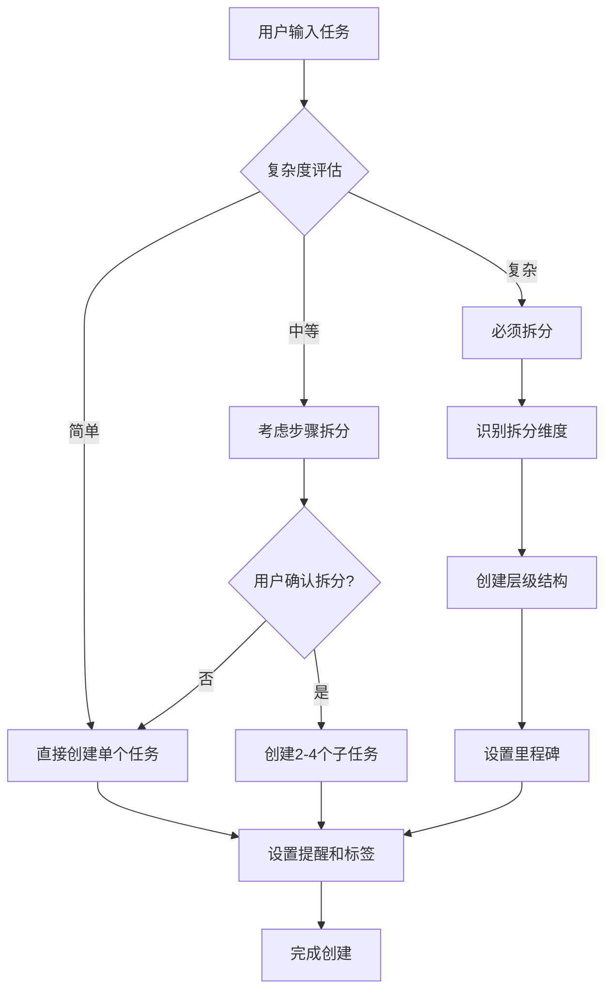

# 任务拆分决策指南

## 🎯 拆分决策流程图



## 🔍 复杂度评估标准

### 自动识别指标

| 指标 | 简单任务 | 中等任务 | 复杂任务 |
|------|---------|---------|---------|
| 描述长度 | <20字 | 20-50字 | >50字 |
| 关键动词数 | 1个 | 2-3个 | >3个 |
| 时间跨度 | <1天 | 1-7天 | >1周 |
| 涉及领域 | 单一 | 2个 | 多个 |
| 依赖关系 | 无 | 少量 | 复杂 |

### 关键词信号

#### 复杂任务信号词
```python
COMPLEX_INDICATORS = [
    # 项目类词汇
    "项目", "系统", "平台", "方案", "计划",
    
    # 范围类词汇  
    "完整", "全面", "详细", "整体", "综合",
    
    # 过程类词汇
    "流程", "步骤", "阶段", "环节", "过程",
    
    # 组织类词汇
    "团队", "协作", "配合", "分工", "统筹"
]
```

#### 拆分维度关键词
```python
DIMENSION_KEYWORDS = {
    "时间维度": ["阶段", "步骤", "先后", "顺序", "周期"],
    "功能维度": ["模块", "功能", "组件", "部分", "方面"], 
    "角色维度": ["团队", "人员", "分工", "负责", "协作"],
    "技术维度": ["前端", "后端", "数据库", "接口", "部署"]
}
```

## 🏗️ 拆分策略矩阵

### 按任务类型拆分

#### 1. 软件开发项目
```python
def decompose_software_project(project_desc):
    # 标准开发阶段
    phases = [
        {
            "title": "需求分析与设计",
            "description": "明确功能需求，设计系统架构",
            "priority": "high",
            "estimated_days": 3
        },
        {
            "title": "开发环境搭建", 
            "description": "配置开发工具和基础框架",
            "priority": "high",
            "estimated_days": 1
        },
        {
            "title": "核心功能开发",
            "description": "实现主要业务逻辑",
            "priority": "high", 
            "estimated_days": 10
        },
        {
            "title": "测试与调试",
            "description": "单元测试、集成测试、bug修复",
            "priority": "medium",
            "estimated_days": 3
        },
        {
            "title": "部署与上线",
            "description": "生产环境部署，监控配置",
            "priority": "medium",
            "estimated_days": 2
        }
    ]
    
    # 进一步细化核心功能
    if "用户管理" in project_desc:
        core_features = [
            "用户注册功能", "用户登录功能", "用户信息管理", "权限控制"
        ]
    
    return phases, core_features
```

#### 2. 营销活动项目
```python
def decompose_marketing_campaign(campaign_desc):
    phases = [
        {
            "title": "策略规划",
            "subtasks": ["目标受众分析", "竞品调研", "营销策略制定"],
            "priority": "high"
        },
        {
            "title": "内容制作", 
            "subtasks": ["文案撰写", "视觉设计", "素材准备"],
            "priority": "high"
        },
        {
            "title": "渠道投放",
            "subtasks": ["社交媒体", "广告投放", "PR推广"],
            "priority": "medium"
        },
        {
            "title": "效果监测",
            "subtasks": ["数据收集", "效果分析", "优化调整"],
            "priority": "medium"
        }
    ]
    
    return phases
```

#### 3. 学习计划项目
```python
def decompose_learning_plan(subject, duration, level):
    if duration <= 30:  # 1个月内
        phases = [
            f"第1周：{subject}基础概念学习",
            f"第2周：{subject}核心技能练习", 
            f"第3周：{subject}实践项目",
            f"第4周：总结复习与考核"
        ]
    elif duration <= 90:  # 3个月内
        phases = [
            f"第1月：{subject}理论基础",
            f"第2月：{subject}实践应用",
            f"第3月：{subject}项目实战"
        ]
    
    # 根据难度级别调整
    if level == "初级":
        focus = ["基础概念", "基本操作", "简单应用"]
    elif level == "中级":
        focus = ["深入理解", "复杂应用", "问题解决"]
    elif level == "高级":
        focus = ["系统掌握", "创新应用", "知识输出"]
    
    return phases, focus
```

### 按复杂度拆分

#### 复杂度评分算法
```python
def calculate_task_complexity(task_description):
    score = 0
    
    # 长度评分
    if len(task_description) > 100:
        score += 3
    elif len(task_description) > 50:
        score += 2
    elif len(task_description) > 20:
        score += 1
    
    # 关键词评分
    for keyword in COMPLEX_INDICATORS:
        if keyword in task_description:
            score += 2
    
    # 动词数量评分
    verbs = extract_verbs(task_description)
    if len(verbs) > 5:
        score += 3
    elif len(verbs) > 3:
        score += 2
    elif len(verbs) > 1:
        score += 1
    
    # 时间词汇评分
    time_indicators = ["周", "月", "季度", "年"]
    for indicator in time_indicators:
        if indicator in task_description:
            score += 2
    
    return score

def get_decomposition_strategy(complexity_score):
    if complexity_score <= 3:
        return "simple"  # 不需要拆分
    elif complexity_score <= 7:
        return "moderate"  # 适度拆分
    else:
        return "complex"  # 深度拆分
```

## 🎨 拆分模式模板

### 1. 时间维度拆分
```python
def time_based_decomposition(task, duration):
    if duration <= 7:  # 一周内
        return ["准备阶段", "执行阶段", "收尾阶段"]
    elif duration <= 30:  # 一月内
        return ["第1周", "第2周", "第3周", "第4周"]
    elif duration <= 90:  # 三月内
        return ["第1月", "第2月", "第3月"]
    else:
        return ["Q1阶段", "Q2阶段", "Q3阶段", "Q4阶段"]
```

### 2. 功能维度拆分
```python
def feature_based_decomposition(task_type):
    templates = {
        "网站开发": ["前端界面", "后端逻辑", "数据库设计", "API接口"],
        "移动应用": ["UI设计", "功能开发", "数据存储", "测试发布"],
        "营销活动": ["策略制定", "内容创作", "渠道推广", "效果评估"],
        "研究项目": ["文献调研", "实验设计", "数据收集", "结果分析"]
    }
    
    return templates.get(task_type, ["需求分析", "方案设计", "实施执行", "验收总结"])
```

### 3. 优先级维度拆分
```python
def priority_based_decomposition(subtasks):
    # 按重要性和紧急性分类
    categorized = {
        "urgent_important": [],    # 紧急重要
        "important_not_urgent": [], # 重要不紧急
        "urgent_not_important": [], # 紧急不重要
        "neither": []              # 既不紧急也不重要
    }
    
    for subtask in subtasks:
        category = classify_priority(subtask)
        categorized[category].append(subtask)
    
    return categorized
```

## 🔄 动态调整策略

### 1. 用户反馈学习
```python
class DecompositionLearner:
    def __init__(self):
        self.user_preferences = {
            "preferred_depth": 2,
            "max_subtasks_per_level": 5,
            "common_task_types": [],
            "decomposition_patterns": {}
        }
    
    def learn_from_feedback(self, feedback_type, task_context):
        if feedback_type == "too_detailed":
            self.user_preferences["preferred_depth"] -= 1
        elif feedback_type == "need_more_detail":
            self.user_preferences["preferred_depth"] += 1
        elif feedback_type == "too_many_subtasks":
            self.user_preferences["max_subtasks_per_level"] -= 1
        
        # 记录成功的拆分模式
        if feedback_type == "perfect":
            pattern = extract_decomposition_pattern(task_context)
            self.user_preferences["decomposition_patterns"][pattern.type] = pattern
```

### 2. 实时优化建议
```python
def suggest_decomposition_improvements(task_hierarchy):
    suggestions = []
    
    # 检查层级深度
    if task_hierarchy.max_depth > 4:
        suggestions.append({
            "type": "flatten_hierarchy",
            "message": "层级过深，建议合并一些中间层级",
            "action": "move_task"
        })
    
    # 检查子任务数量
    for node in task_hierarchy.nodes:
        if len(node.children) > 7:
            suggestions.append({
                "type": "group_subtasks", 
                "message": f"任务'{node.title}'的子任务过多，建议分组",
                "action": "create_intermediate_tasks"
            })
    
    # 检查任务粒度
    for node in task_hierarchy.nodes:
        if node.estimated_duration > 7 and not node.children:
            suggestions.append({
                "type": "decompose_large_task",
                "message": f"任务'{node.title}'较大，建议进一步分解",
                "action": "add_child_task"
            })
    
    return suggestions
```

## 📊 效果评估指标

### 1. 拆分质量评估
```python
def evaluate_decomposition_quality(original_task, decomposed_tasks):
    metrics = {}
    
    # 完整性评估
    metrics["completeness"] = check_task_completeness(original_task, decomposed_tasks)
    
    # 粒度合理性
    metrics["granularity"] = evaluate_task_granularity(decomposed_tasks)
    
    # 依赖关系清晰度
    metrics["dependency_clarity"] = check_dependency_clarity(decomposed_tasks)
    
    # 可执行性
    metrics["executability"] = evaluate_task_executability(decomposed_tasks)
    
    return metrics

def calculate_decomposition_score(metrics):
    weights = {
        "completeness": 0.3,
        "granularity": 0.25, 
        "dependency_clarity": 0.25,
        "executability": 0.2
    }
    
    score = sum(metrics[key] * weights[key] for key in weights)
    return min(100, max(0, score * 100))
```

### 2. 用户满意度跟踪
```python
def track_user_satisfaction(task_id, completion_time, user_rating):
    # 记录完成效率
    efficiency_score = calculate_efficiency(task_id, completion_time)
    
    # 记录用户评分
    satisfaction_data = {
        "task_id": task_id,
        "completion_time": completion_time,
        "user_rating": user_rating,
        "efficiency_score": efficiency_score,
        "decomposition_depth": get_task_depth(task_id),
        "subtask_count": count_subtasks(task_id)
    }
    
    # 更新拆分策略
    update_decomposition_strategy(satisfaction_data)
```

## 🎯 最佳实践总结

### 1. 拆分原则
- **SMART原则**：具体、可衡量、可达成、相关性、时限性
- **2-7原则**：每层级2-7个子任务，避免过多或过少
- **依赖最小化**：减少任务间的复杂依赖关系
- **渐进细化**：先粗后细，逐步深入

### 2. 工具使用技巧
- **批量创建**：使用模板快速创建标准结构
- **层级管理**：合理使用add_child_task和move_task
- **状态同步**：父子任务状态保持一致
- **标签统一**：使用一致的标签体系

### 3. 用户体验优化
- **确认机制**：重要拆分操作前询问用户确认
- **可视化展示**：使用get_task_hierarchy展示结构
- **进度跟踪**：定期提供项目进度报告
- **灵活调整**：支持用户随时调整任务结构

记住：好的任务拆分不仅要技术上可行，更要符合用户的思维习惯和工作流程！