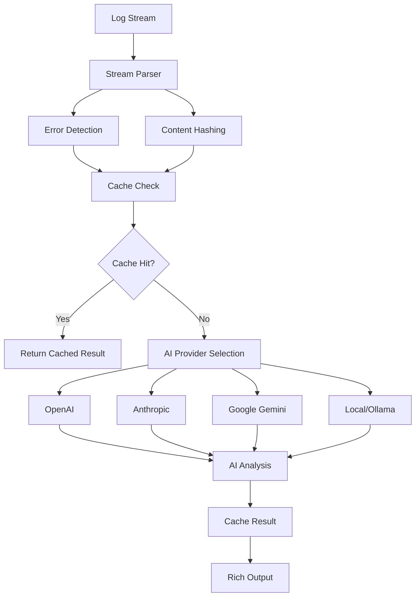

<div align="center">

# 🔍 LogLense

### *AI-Powered Log Analysis for the Command Line*

[](https://www.python.org/downloads/)
[](https://opensource.org/licenses/MIT)
[](https://badge.fury.io/py/loglense)
[](https://pepy.tech/project/loglense)
[](https://github.com/yourusername/loglense)

*Transform cryptic log files into actionable insights with the power of AI*

[🚀 Quick Start](#-quick-start) • [📖 Documentation](#-usage) • [🤖 Models](#-supported-models) • [🛠️ Contributing](#-contributing)

</div>


---

## ✨ Features

- **AI-powered error analysis** - Get root cause analysis and actionable insights, on the fly
- **Multiple AI providers** - OpenAI, Anthropic, Google, local models via Ollama
- **Smart caching** - Avoid redundant API calls for similar logs
- **Works with any log source** - Pipes, files, Docker, Kubernetes, journalctl

---

## 🚀 Quick Start

### Installation

```bash
pip install loglense
```

### Basic Usage

```bash
# Analyze logs from any source
tail -f /var/log/app.log | loglense analyze

# Use with Docker logs
docker logs container_name | loglense analyze

# Analyze with specific model
kubectl logs pod-name | loglense analyze --model claude-sonnet

# Use local models
journalctl -u nginx | loglense analyze --model ollama-llama3
```

### First Time Setup

```bash
# Interactive configuration
loglense configure

# View available models
loglense list-available-models

# Check your configuration
loglense show-config
```

---

## 📖 Usage

### Core Commands

#### `loglense analyze`
The main command for log analysis. Reads from stdin and provides AI-powered insights.

```bash
# Basic analysis
cat error.log | loglense analyze

# Specify model
tail -100 app.log | loglense analyze --model gpt-4o

# Use custom API endpoint
cat debug.log | loglense analyze --api-base http://localhost:8000/v1 --model custom-model

# Skip cache
docker logs app | loglense analyze --no-cache
```

**Options:**
- `--model, -m`: Choose specific model (see [supported models](#-supported-models))
- `--api-base`: Custom API endpoint for OpenAI-compatible services
- `--no-cache`: Bypass cache for fresh analysis

#### `loglense configure`
Interactive setup for default model and API keys.

```bash
loglense configure
```

<details>
<summary>📸 Configuration Preview</summary>

```
🔧 LogLense Configuration

Select Default Model

#    Provider     Model           Description
1    OpenAI       gpt-4o          GPT-4 Optimized - Latest multimodal model
2    OpenAI       gpt-4o-mini     Smaller, faster GPT-4 for simple tasks
3    Anthropic    opus-4          Anthropic's state-of-the-art flagship model
4    Anthropic    sonnet-4        Balanced model with superior performance
...

Select default model [2]: 1
✅ Default model set to: gpt-4o

API Key Configuration
This model requires: OPENAI_API_KEY

Enter your OPENAI_API_KEY: ••••••••••••••••
✅ API key saved for OPENAI_API_KEY
```

</details>

#### Cache Management

```bash
# View cache location and size
loglense cache path
loglense cache size

# Clear cache
loglense cache clear
```

---

## 🤖 Supported Models

<table>
<tr>
<th>Provider</th>
<th>Model Alias</th>
<th>Full ID</th>
<th>Best For</th>
</tr>
<tr>
<td rowspan="2"><strong>OpenAI</strong></td>
<td><code>gpt-4o</code></td>
<td>openai/gpt-4o</td>
<td>Complex log analysis, multi-step reasoning</td>
</tr>
<tr>
<td><code>gpt-4o-mini</code></td>
<td>openai/gpt-4o-mini</td>
<td>Fast analysis, simple error detection</td>
</tr>
<tr>
<td rowspan="3"><strong>Anthropic</strong></td>
<td><code>opus-4</code></td>
<td>anthropic/claude-opus-4-0</td>
<td>Flagship model, comprehensive analysis</td>
</tr>
<tr>
<td><code>sonnet-4</code></td>
<td>anthropic/claude-sonnet-4-0</td>
<td>Balanced performance and speed</td>
</tr>
<tr>
<td><code>sonnet-3.7</code></td>
<td>anthropic/claude-3-7-sonnet</td>
<td>Advanced log pattern recognition</td>
</tr>
<tr>
<td rowspan="2"><strong>Google</strong></td>
<td><code>gemini-flash</code></td>
<td>gemini/gemini-2.0-flash</td>
<td>Ultra-fast processing</td>
</tr>
<tr>
<td><code>gemini-pro</code></td>
<td>gemini/gemini-2.5-pro</td>
<td>Advanced reasoning capabilities</td>
</tr>
<tr>
<td rowspan="2"><strong>Local</strong></td>
<td><code>ollama-llama3</code></td>
<td>ollama/llama3</td>
<td>Privacy-focused, offline analysis</td>
</tr>
<tr>
<td><code>ollama-gemma</code></td>
<td>ollama/gemma</td>
<td>Lightweight local processing</td>
</tr>
<tr>
<td rowspan="2"><strong>Other</strong></td>
<td><code>mistral-large</code></td>
<td>mistral/mistral-large-latest</td>
<td>European AI, GDPR compliant</td>
</tr>
<tr>
<td><code>deepseek-chat</code></td>
<td>deepseek/deepseek-chat</td>
<td>Cost-effective analysis</td>
</tr>
</table>

### API Key Requirements

| Provider | Environment Variable | How to Get |
|----------|---------------------|------------|
| OpenAI | `OPENAI_API_KEY` | [platform.openai.com](https://platform.openai.com/api-keys) |
| Anthropic | `ANTHROPIC_API_KEY` | [console.anthropic.com](https://console.anthropic.com/) |
| Google | `GEMINI_API_KEY` | [aistudio.google.com](https://aistudio.google.com/app/apikey) |
| Mistral | `MISTRAL_API_KEY` | [console.mistral.ai](https://console.mistral.ai/) |
| DeepSeek | `DEEPSEEK_API_KEY` | [platform.deepseek.com](https://platform.deepseek.com/) |
| Ollama | None | [Install locally](https://ollama.ai/) |

---

## 🎯 Real-World Examples

### Web Server Error Analysis

```bash
tail -1000 /var/log/nginx/error.log | loglense analyze
```

<details>
<summary>📊 Sample Output</summary>

```markdown
🤖 LogLense AI Analysis

## Likely Root Cause:
Database connection pool exhaustion causing cascading failures in the web application.

## Sequence of Events:
1. **14:23:15** - Initial database timeout errors begin
2. **14:23:45** - Connection pool reaches maximum capacity (500 connections)
3. **14:24:00** - Application starts rejecting new requests
4. **14:24:30** - Load balancer begins failing health checks

## Recommended Next Steps:
1. **Immediate**: Restart the database connection pool service
2. **Short-term**: Increase connection pool size from 500 to 750
3. **Long-term**: Implement connection pooling monitoring and alerts
```

</details>

### Kubernetes Pod Debugging

```bash
kubectl logs deployment/api-server --tail=500 | loglense analyze --model claude-sonnet
```

### Docker Container Analysis

```bash
docker logs --since=1h webapp-container | loglense analyze --model gemini-pro
```

### Application Performance Issues

```bash
journalctl -u myapp --since="1 hour ago" | loglense analyze --model gpt-4o
```

---

## 🏗️ Architecture



---

## 🛠️ Contributing

We love contributions! Here's how you can help make LogLense even better:

### 🐛 Bug Reports & Feature Requests

Found a bug or have an idea? [Open an issue](https://github.com/yourusername/loglense/issues) with:
- Clear description of the problem/feature
- Steps to reproduce (for bugs)
- Your environment details
- Sample log files (anonymized)

### 🔧 Development Setup

```bash
# Clone the repository
git clone https://github.com/yourusername/loglense.git
cd loglense

# Create virtual environment
python -m venv venv
source venv/bin/activate  # On Windows: venv\Scripts\activate

# Install in development mode
pip install -e .

# Install development dependencies
pip install pytest black flake8 mypy

# Run tests
pytest

# Format code
black loglense_package/
```

### 🎯 Areas We Need Help With

- [ ] **Testing Framework**: Add comprehensive test suite for reliability
- [ ] **New AI Providers**: Add support for additional AI services
- [ ] **Documentation**: More real-world examples and use cases
- [ ] **Error Handling**: Improve network timeout and rate limit handling
- [ ] **Configuration**: Enhanced config validation and migration

### 📝 Pull Request Guidelines

1. **Fork** the repository
2. **Create** a feature branch (`git checkout -b feature/amazing-feature`)
3. **Write** tests for your changes
4. **Ensure** your code follows Python best practices
6. **Commit** your changes (`git commit -m 'Add amazing feature'`)
7. **Push** to the branch (`git push origin feature/amazing-feature`)
8. **Open** a Pull Request

---

## 🔒 Security & Privacy

- **API Keys**: Stored locally in `~/.config/loglense/config.json`
- **Log Data**: Never stored permanently, only processed in memory
- **Cache**: Contains only AI analysis results, not raw logs
- **Local Models**: Full privacy with Ollama integration

---

## 📄 License

This project is licensed under the MIT License - see the [LICENSE](LICENSE) file for details.

---

## 🙏 Acknowledgments

- **[Typer](https://typer.tiangolo.com/)** - For the amazing CLI framework
- **[Rich](https://rich.readthedocs.io/)** - For beautiful terminal output
- **[LiteLLM](https://litellm.ai/)** - For unified AI provider interfaces

---

<div align="center">

### 🌟 Star History

[](https://star-history.com/#greenblade29/loglense&Date)

**Purr-fect for debugging - because every log has nine lives** 🐱

[⬆ Back to Top](#-loglense)

</div>
