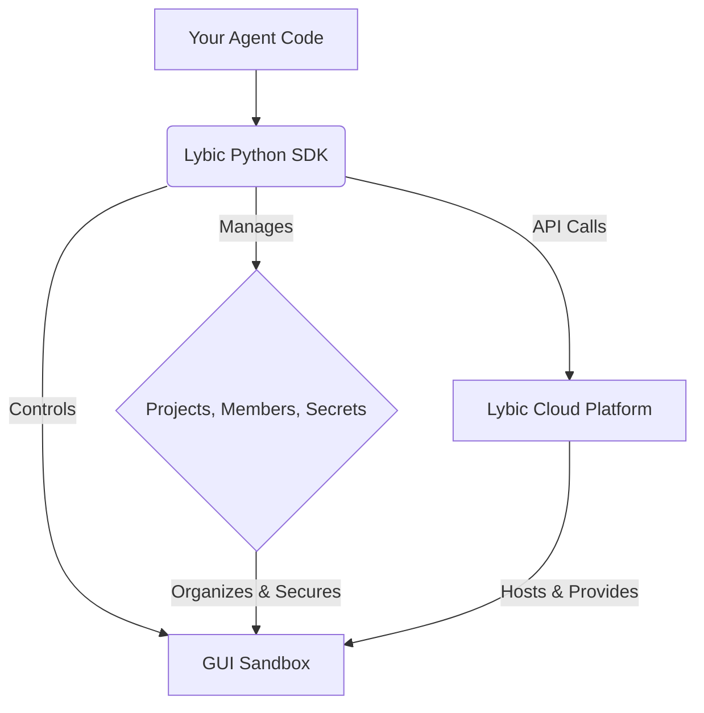

<p align="center">
  <a href="https://lybic.ai/">
    
  </a>
</p>

<h1 align="center">Lybic SDK for Python</h1>

<p align="center">
  <a href="https://pypi.org/project/lybic/"></a>
  <a href="https://github.com/lybic/lybic-sdk-python/blob/master/LICENSE"></a>
  <a href="https://lybic.ai/docs"></a>
  <a href="https://github.com/lybic/lybic-sdk-python/actions/workflows/pylint.yml"></a>
</p>

Developing, testing, and deploying GUI-based AI agents is complex. Developers waste precious time wrestling with cloud instances, VNC servers, and environment configurations instead of focusing on what matters: building intelligent agents.

**Lybic is the infrastructure layer for your GUI agents.**

**Lybic** (/ˈlaɪbɪk/) provides a robust, on-demand infrastructure platform designed specifically for the AI agent development lifecycle. This SDK for Python is your command center for programmatically controlling the entire Lybic ecosystem, empowering you to build, test, and scale your agents with unprecedented speed and simplicity.

## How It Works

The Lybic ecosystem is designed for clarity and control. Your code, powered by the Lybic SDK, interacts with the Lybic Cloud Platform to manage your resources and run your agents in secure, isolated GUI sandboxes.



## ✨ Why Lybic?

Lybic is a complete ecosystem designed to eliminate infrastructure friction and accelerate your agent development workflow.

#### 🚀 Focus on Your Agent, Not Infrastructure
Forget about managing virtual machines, display drivers, and remote desktop software. Lybic provides clean, on-demand GUI sandboxes in the cloud. Spin up a fresh environment in seconds and dedicate your time to your agent's core logic.

#### 🔐 Securely Manage Your Secrets
Stop hardcoding API keys and other sensitive credentials. Lybic includes built-in **Secret Management** at the project level. Store your secrets securely in our vault and access them programmatically from your agents, without ever exposing them in your codebase.

#### 👥 Built for Teams, Ready for Scale
Organize your work with **Projects** and manage team access with fine-grained **Member Roles**. Whether you're a solo developer or part of a large team, Lybic provides the structure and security you need to collaborate and scale effectively.

#### 🤖 Observe and Interact in Real-Time
Every GUI sandbox includes a live, accessible desktop stream. This allows you to monitor your agent's actions in real-time for debugging, or to step in and provide guidance, making it perfect for developing complex tasks and implementing human-in-the-loop workflows.

## 🚀 Getting Started

### 1. Installation & Setup

Getting started is simple. First, install the package from PyPI:

```bash
pip install lybic
```

Then, initialize the client in your Python application. For better security, we recommend using environment variables (`LYBIC_ORG_ID`, `LYBIC_API_KEY`).

```python
from lybic import LybicClient

# The client automatically picks up credentials from your environment
client = LybicClient()
```

### 2. Core Workflow

With the client initialized, the typical workflow follows these logical steps:

1. **Register(Or be invited into) an Organization**: Lybic allows you to register a new organization to manage your projects and resources.

2. **Create a `Project`**: Projects are the primary way to organize your work. They act as containers for your sandboxes, team members, and secrets.

3. **Launch a `Sandbox`**: Within a project, you can launch a GUI sandbox. This is your agent's secure, cloud-based home.

4. **Automate and Interact**: Once the sandbox is running, your agent can begin its work. The SDK provides all the necessary tools to interact with the sandbox, from executing commands to capturing screenshots.

## 📔 Examples:

Please refer to [example](docs/example.md)

## 📚 Full Documentation & API Reference

This README provides a high-level overview of Lybic's capabilities. For detailed, up-to-date code examples, tutorials, and a complete API reference, please visit our **[official documentation site](https://lybic.ai/docs)**.

## 🤝 Contributing

We welcome contributions from the community! Please see our [Contributing Guidelines](https://github.com/lybic/lybic-sdk-python/blob/master/CONTRIBUTING.md) for more details on how to get involved.

## 📄 License

This project is licensed under the MIT License. See the [LICENSE](https://github.com/lybic/lybic-sdk-python/blob/master/LICENSE) file for details.