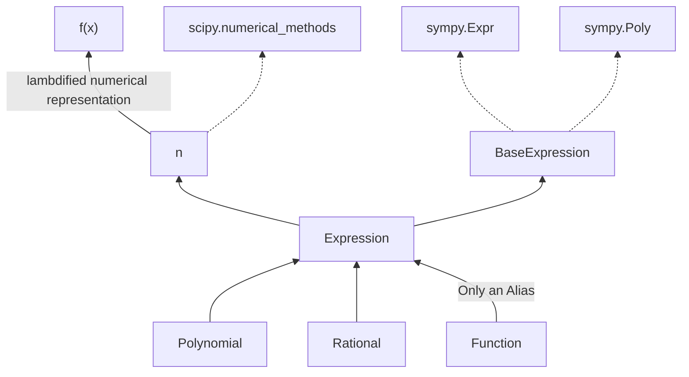

# MathFlow 🧮
**A Pythonic Interface for Symbolic and Numerical Mathematics**

MathFlow bridges the gap between symbolic mathematics (SymPy) and numerical computations (NumPy/SciPy), offering a unified interface that maintains mathematical rigor while providing practical tools for real-world problems.  
  

[](https://opensource.org/licenses/MIT)  

**Ready to revolutionize your mathematical computing workflow?**
```bash
pip install mathflow
```

**Have Questions? Take a look at the Q&A:**
[Questions & Answers: Addressing Potential Concerns](docs/QA.md)

## ✨ Key Features
  
- **🔒 Operative Closure**: Mathematical operations return new Expression objects by default, maintaining functional programming principles  
- **⚡ Mutability Control**: Choose between immutable (default) and mutable expressions for different workflows  
- **🔗 Seamless Numerical Integration**: Every symbolic expression has a `.n` attribute providing numerical methods without manual lambdification (uses cached lambdified expression when needed)
- **🎨 Enhanced Printing**: Flexible output formatting through the `.print` attribute (LaTeX, pretty printing, code generation)  
- **📡 Signal System**: Qt-like signals for tracking expression mutations and clones, enabling reactive programming  
- **🔄 Automatic Type Conversions**: Seamlessly and automatically converts between internal Poly and Expr representations based on context
- **📦 Lightweight**: ~0.5 MB itself, ~100 MB including dependencies
- **🧩 Fully backward compatible**: Seamlessly integrate SymPy and MathFlow in the same script. All methods that work on SymPy Expr or Poly objects work on MathFlow objects
- **🔍 Exploratory**: Full IDE support, enabling easy tool finding and minimizing the learning curve.


## 🚀 Quick Start

```python
from mathflow import Expression, Polynomial, Rational

# Create expressions naturally
f = Expression("2x^2 + 3x + \frac{1}{2}")  # latex is automatically parsed
g = Expression("sin(x) + cos(x)")

# Automatic operative closure - operations return new objects of the same type
h = f + g  # f and g remain unchanged
hprime = h.diff()  # hprime is still an Expression object

# Numerical evaluation made easy
result = f(2.5)  # Numerically evaluate at x = 2.5

# Use the .n attribute to access fast numerical methods
numerical_roots = f.n.all_roots()
# Call f's n-prefixed methods to use variable precision numerical methods
precise_roots = f.nsolve_all(prec=50)  # 50 digits of accuracy

# quick and easy printing
f.print()
f.print('latex')
f.print('mathematica_code')
# or
print(f.print.latex())    # LaTeX output
print(f.print.ccode())    # c code output
```  


## 🎯 Numerical Computing

MathFlow excels at bridging symbolic and numerical mathematics:  
```python
f = Expression("x^3 - 2x^2 + x - 1")

# Root finding
all_roots = f.n.all_roots(bounds=(-5, 5))
specific_root = f.nsolve_all(bounds=(-5, 5), prec=50)  # High-precision solve

# Numerical calculus
derivative_func = f.n.derivative_lambda(df_order=2)  # 2nd derivative numerical function  
integral_result = f.n.integrate(-1, 1)               # Definite integral  

# Optimization
minimum = f.n.minimize(bounds=[(-2, 2)])
```


## 📚 Core Classes


> Diagram Notes
> - Dotted arrows mean "proxy to".
> - Additional methods are not shown, only the core structure.


### Expression
The primary class for general symbolic expressions with numerical and printing capabilities.
```python
# Create from string with natural notation
expr = Expression("2x^2 + ln(|x-1|)")

# Or from SymPy objects
from sympy import sin, cos
expr = Expression(sin(x) + cos(x))

# Symbolic operations
derivative = expr.diff(x)
expanded = expr.expand()

# Numerical methods via .n attribute
roots = expr.n.all_roots(bounds=(-10, 10))
integral = expr.n.quad(0, 1)  # Numerical integration
```


### Polynomial
Specialized Expression subclass with polynomial-specific functionality.
```python
# Create from coefficients (ascending order by default)
poly = Polynomial.from_coeffs([1, 2, 3])  # 1 + 2x + 3x²

# Create from roots
poly = Polynomial.from_roots([1, 2, 3])   # (x-1)(x-2)(x-3)  

# Access polynomial-specific methods
coeffs = poly.all_coeffs()
degree = poly.degree()
roots = poly.n.all_poly_roots()  # Optimized polynomial root finding
```


### Rational
For rational functions (quotients of polynomials).
```python  
# Create from numerator and denominator coefficients  
rational = Rational.from_coeffs([1, 2], [1, 1, 1])  # (1 + 2x)/(1 + x + x²)  
  
# Access numerator and denominator as Expression objects  
num = rational.numerator  
den = rational.denominator  
  
# Partial fraction decomposition
poles = den.n.all_roots()  # numerically find the poles.
pf = rational.partial_fractions(x)
```  


## 🔧 Advanced Features
### Mutability Control  
  
```python
# Immutable (default)
f = Expression("x^2")
g = f + 1  # f unchanged, g is new Expression object

# Mutable Mode (f is modified in-place)
f = Expression("(x-1)^2", mutable=True)
f += 1
f.expand()
```


### Flexible String Parsing  
  
```python
# Natural mathematical notation
expr = Expression("2x^2 + ln(|x-1|)")

# LaTeX input support
expr = Expression(r"\frac{x^2+1}{x-1}")

# Implicit multiplication
expr = Expression("2x sin(x)")
```


### Signal System for Reactive Programming  
  
```python  
def on_change(expr):  # runs whenever an operation changes f
    print(f"Expression changed to: {expr}")  
f = Expression("x^2")  
f.on_self_mutated.connect(on_change)  
f.on_self_cloned.connect(on_change)
f += 1  # on_change() is called
```  


### Padé Approximations (Useful in Engineering Applications)

```python
# High-quality Padé approximants for function approximation
f = Expression("exp(x)")
pade_approx = f.pade(m=3, n=3, x0=0)  # [3/3] Padé approximant around x=0
  
# Multiple backends available (returns Expression by default, but you can change return type)
pade_fast = f.pade(3, 3, backend='mpmath')      # Fast numerical
pade_exact = f.pade(3, 3, backend='symbolic')   # Exact symbolic
pade_verbose = f.pade(3, 3, backend='verbose')  # Educational output
```

When `backend='verbose'`, each step is displayed as the Padé approximation is computed.
```python
f = Expression("sqrt(x)")
p = f.pade(2, 2, x0=1, backend='verbose')
```

For example, the above displays this:
```
Step 1. Create rational function with numerator P and denominator Q, each with unknown coefficients:
(a0 + a1*h + a2*h^2)/(1 + b1*h + b2*h^2)

Step 2. Equate the rational function to the taylor series A so that the unknown coefficients may be solved:
(a0 + a1*h + a2*h^2)/(1 + b1*h + b2*h^2)  =  1 + 1/2*h + -1/8*h^2 + 1/16*h^3 + -5/128*h^4

Step 3. Multiply the rhs by the denominator of the lhs to get the equation in the form P = QA:
a0 + a1*h + a2*h^2  =  (1 + b1*h + b2*h^2) (1 + 1/2*h + -1/8*h^2 + 1/16*h^3 + -5/128*h^4)

Step 4. Expand the RHS by performing discrete convolution on the coefficient vectors of Q and A (using a table):
	Q's coeffs = [1, b1, b2]
	A's coeffs = [1, 1/2, -1/8, 1/16, -5/128]
╭────┬─────┬────────┬───────────┬─────────┬─────────────╮
│    │ 1   │ 1/2    │ -1/8      │ 1/16    │ -5/128      │
├────┼─────┼────────┼───────────┼─────────┼─────────────┤
│ 1  │ 1   │ 1*1/2  │ 1*(-1/8)  │ 1*1/16  │ 1*(-5/128)  │
├────┼─────┼────────┼───────────┼─────────┼─────────────┤
│ b1 │ b1  │ b1*1/2 │ b1*(-1/8) │ b1*1/16 │ b1*(-5/128) │
├────┼─────┼────────┼───────────┼─────────┼─────────────┤
│ b2 │ b2  │ b2*1/2 │ b2*(-1/8) │ b2*1/16 │ b2*(-5/128) │
╰────┴─────┴────────┴───────────┴─────────┴─────────────╯

Step 5. Get the sum of the anti-diagonals from the above table to form the new coeffs (only as many terms as unknown coeffs we need to solve for, in this case 5):
╭────────┬──────────────────────╮
│ Term   │ Coeff                │
├────────┼──────────────────────┤
│ h^0    │ 1                    │
├────────┼──────────────────────┤
│ h^1    │ b1 + 1/2             │
├────────┼──────────────────────┤
│ h^2    │ b1/2 + b2 - 1/8      │
├────────┼──────────────────────┤
│ h^3    │ -b1/8 + b2/2 + 1/16  │
├────────┼──────────────────────┤
│ h^4    │ b1/16 - b2/8 - 5/128 │
╰────────┴──────────────────────╯

Step 6. Use these coefficients to setup a system of equations:
a0 = 1
a1 = b1 + 1/2
a2 = b1/2 + b2 - 1/8
 0 = -b1/8 + b2/2 + 1/16
 0 = b1/16 - b2/8 - 5/128

Step 7. Solving the above system yields:
a0 = 1
a1 = 5/4
a2 = 5/16
b1 = 3/4
b2 = 1/16

Step 8. Substituting these values back into the original rational function yields:
(1 + 5/4*h + 5/16*h^2)/(1 + 3/4*h + 1/16*h^2)

Step 9. `h` may be substituted for the original (x-c), and then expanded. `c` is the point at which both the Taylor series and the Padé approximation are centered at:
(1 + 5/4*(x-c) + 5/16*(x-c)^2)/(1 + 3/4*(x-c) + 1/16*(x-c)^2)
```


## 🏗️ Design Philosophy  
  
MathFlow follows several key principles:

1. **Intuitive API**: Mathematical operations should feel natural in Python, providing an "exploratory" experience
2. **Performance**: Automatic optimizations (Horner's method, efficient algorithms, automatic numerical computing when needed)  
3. **Flexibility**: Support both functional and imperative programming styles  
4. **Extensibility**: Easy integration with other mathematical libraries  
5. **Type Safety**: Comprehensive type and method hints for full IDE support


## 🚀 Next Steps & Our Vision

- Provide a better testing suite to ensure all edge cases are taken care of
- Integrate AI by introducing an `.ai()` method that calls a local instance of [MathΣtral](https://mistral.ai/news/mathstral) and [Project Numina](https://projectnumina.ai/) models over ollama. It would be given context of both the expressions structure and its mathematical properties. One could also use it construct expressions using natural language.

AI Integration Example
```python
>>> f = Expression("A polynomial with the first five prime numbers as coefficients")
>>> f.ai("Have you seen a polynomial with such properties before?")
...
>>> fp = f.diff()
>>> fp.ai("How have the coefficients changed?")
...
```


## 🤝 Contributing  

We welcome contributions! Soon, we will publish a list of documents covering contribution guidelines here. Come back later if you are interested in contributing!


## 📋 Dependencies  

- **SymPy**: Symbolic mathematics engine  
	- **mpmath**: High-precision arithmetic
- **SciPy**: Advanced numerical algorithms  
	- **NumPy**: Numerical array operations    
- **tabulate**: Pretty table printing (for verbose modes)  


## 📄 License (MIT)

This project is licensed under the MIT License - see the LICENSE file for details.  


## 🙏 Acknowledgments

- Built on the excellent [SymPy](https://www.sympy.org/) symbolic mathematics library  
- Numerical computing powered by [NumPy](https://numpy.org/) and [SciPy](https://scipy.org/)  
- High-precision arithmetic via [mpmath](http://mpmath.org/)  

[^1]: 
