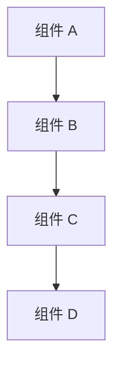
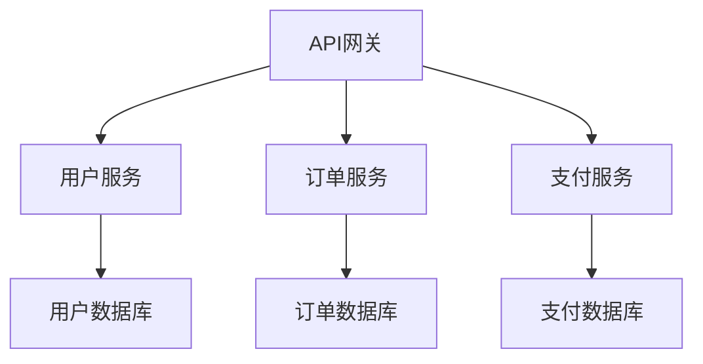

# 设计文档模板

## 文档结构

```markdown
# 设计文档

## 概述

[提供功能设计的全面概述，包括：
- 功能简要总结
- 技术栈和架构方法
- 关键设计决策和理由
- 与现有系统的集成]

## 架构

[描述高级架构，适当时包含图表]



[解释架构图和组件关系]

## 组件和接口

### 组件名称

**目的**：[组件目的和职责的清晰描述]

**主要职责**：
- [职责 1]
- [职责 2]
- [职责 3]

**接口**：[接口定义和契约]

**依赖**：[外部依赖和集成点]

[为每个主要组件重复]

## 数据模型

[定义数据结构、关系和验证规则]

```python
# 示例数据模型定义
@dataclass
class ModelName:
    field1: str
    field2: int
    field3: Optional[List[str]] = None
```

[解释数据模型关系和约束]

## 错误处理

[描述错误处理策略和恢复机制]

### 错误类别
- [错误类型 1]：[处理策略]
- [错误类型 2]：[处理策略]
- [错误类型 3]：[处理策略]

### 恢复策略
- [恢复方法 1]
- [恢复方法 2]

## 测试策略

[概述测试方法，包括单元测试、集成测试和验证测试]

### 单元测试
- [单元测试方法]
- [覆盖率要求]

### 集成测试
- [集成测试策略]
- [测试场景]

### 验证测试
- [验证方法]
- [质量保证方法]
```

## 编写指南

### 概述部分
- 提供全面的功能总结
- 解释技术选择和理由
- 突出关键架构决策
- 保持对技术和非技术利益相关者都易于理解

### 架构部分
- 使用图表说明复杂关系
- 解释组件之间的交互
- 描述数据流和控制流
- 包含性能和可扩展性考虑

### 组件部分
- 为每个主要组件提供清晰的职责
- 定义明确的接口和契约
- 记录依赖关系和集成点
- 包含配置和部署注意事项

### 数据模型部分
- 使用清晰的数据结构定义
- 解释关系和约束
- 包含验证规则
- 考虑数据迁移和版本控制

### 错误处理部分
- 分类不同类型的错误
- 为每种错误类型定义处理策略
- 包含恢复和回退机制
- 考虑用户体验和系统稳定性

### 测试策略部分
- 定义测试层次和范围
- 包含自动化测试方法
- 描述质量保证流程
- 考虑性能和安全测试

## 质量检查清单

### 文档结构
- [ ] 标题遵循命名约定
- [ ] 概述提供全面的功能总结
- [ ] 架构部分包含清晰的图表
- [ ] 所有主要组件都有详细描述

### 技术内容
- [ ] 架构决策有明确理由
- [ ] 组件职责清晰定义
- [ ] 接口和契约明确指定
- [ ] 数据模型完整且一致

### 错误处理
- [ ] 错误类型全面分类
- [ ] 每种错误都有处理策略
- [ ] 包含恢复机制
- [ ] 考虑用户体验

### 测试覆盖
- [ ] 测试策略全面
- [ ] 包含所有测试层次
- [ ] 质量保证方法明确
- [ ] 自动化测试计划

## 常见模式

### 微服务架构
```markdown
## 架构

系统采用微服务架构，包含以下主要服务：



### 服务间通信
- 同步通信：REST API
- 异步通信：消息队列
- 数据一致性：事件溯源
```

### 数据库设计
```markdown
## 数据模型

### 用户表
```sql
CREATE TABLE users (
    id BIGINT PRIMARY KEY,
    username VARCHAR(50) UNIQUE NOT NULL,
    email VARCHAR(100) UNIQUE NOT NULL,
    created_at TIMESTAMP DEFAULT CURRENT_TIMESTAMP
);
```

### 关系设计
- 用户与订单：一对多关系
- 订单与商品：多对多关系
- 支付与订单：一对一关系
```

### API设计
```markdown
## 组件和接口

### 用户服务API

**端点**：`/api/v1/users`

**方法**：
- GET /users/{id} - 获取用户信息
- POST /users - 创建新用户
- PUT /users/{id} - 更新用户信息
- DELETE /users/{id} - 删除用户

**数据格式**：
```json
{
  "id": "string",
  "username": "string",
  "email": "string",
  "created_at": "datetime"
}
```
```

## 成功技巧

1. **从需求开始**：确保设计满足所有需求
2. **保持简单**：避免过度设计和复杂性
3. **考虑可扩展性**：设计应支持未来增长
4. **文档化决策**：记录重要的设计决策和理由
5. **使用图表**：视觉化复杂的架构和流程
6. **考虑错误情况**：设计健壮的错误处理
7. **计划测试**：从设计阶段就考虑测试策略
8. **获得反馈**：与团队和利益相关者审查设计

此模板为创建全面、可实施的技术设计提供了结构化方法，确保设计质量和实施成功。
