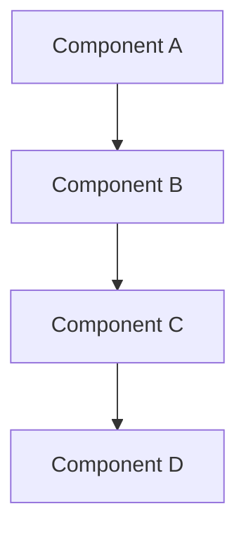
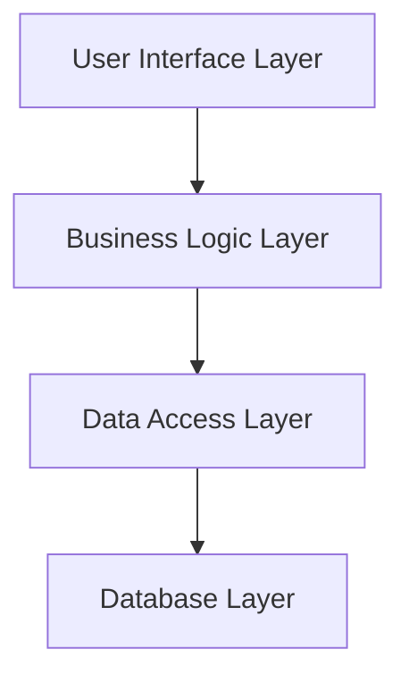
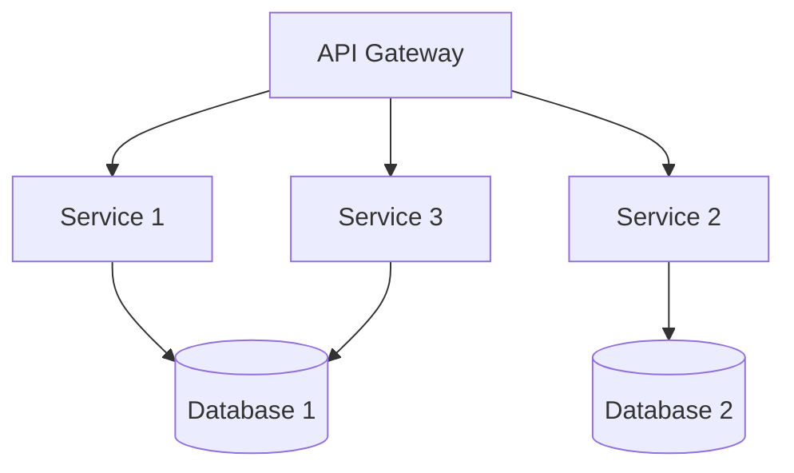
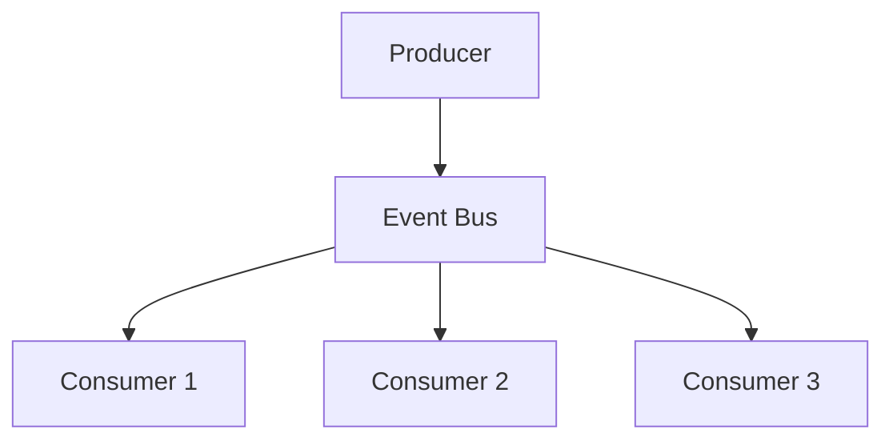

# Design Document Template

## Document Structure

```markdown
# Design Document

## Overview

[Provide comprehensive overview of the feature design, including:
- Brief feature summary
- Technology stack and architectural approach
- Key design decisions and rationales
- Integration with existing systems]

## Architecture

[Describe the high-level architecture with diagrams where appropriate]



[Explain the architecture diagram and component relationships]

## Components and Interfaces

### Component Name

**Purpose**: [Clear description of component purpose and responsibilities]

**Key Responsibilities**:
- [Responsibility 1]
- [Responsibility 2]
- [Responsibility 3]

**Interface**: [Interface definition and contracts]

**Dependencies**: [External dependencies and integration points]

[Repeat for each major component]

## Data Models

[Define data structures, relationships, and validation rules]

```python
# Example data model definitions
@dataclass
class ModelName:
    field1: str
    field2: int
    field3: Optional[List[str]] = None
```

[Explain data model relationships and constraints]

## Error Handling

[Describe error handling strategies and recovery mechanisms]

### Error Categories
- [Error type 1]: [Handling strategy]
- [Error type 2]: [Handling strategy]
- [Error type 3]: [Handling strategy]

### Recovery Strategies
- [Recovery approach 1]
- [Recovery approach 2]

## Testing Strategy

[Outline testing approach including unit, integration, and validation testing]

### Unit Testing
- [Unit testing approach]
- [Coverage requirements]

### Integration Testing
- [Integration testing strategy]
- [Test scenarios]

### Validation Testing
- [Validation approach]
- [Quality assurance methods]
```

## Writing Guidelines

### Overview Section
- Provide comprehensive feature summary
- Explain technology choices and rationale
- Highlight key architectural decisions
- Keep it accessible to both technical and non-technical stakeholders

### Architecture Section
- Use diagrams to illustrate complex relationships
- Explain component interactions and data flow
- Document integration points with existing systems
- Consider scalability and performance implications

### Components and Interfaces
- Define clear responsibilities for each component
- Specify interface contracts and APIs
- Document dependencies and coupling
- Plan for testability and maintainability

### Data Models
- Define all data structures and relationships
- Include validation rules and constraints
- Consider data persistence and storage
- Plan for data migration if needed

### Error Handling
- Identify potential failure points
- Define error categories and handling strategies
- Plan for graceful degradation
- Include logging and monitoring considerations

### Testing Strategy
- Cover all levels of testing
- Define quality criteria and coverage goals
- Plan for automated testing where possible
- Include performance and security testing

## Quality Checklist

### Document Structure
- [ ] All required sections are present
- [ ] Content is well-organized and logical
- [ ] Diagrams support and clarify text
- [ ] Technical decisions are justified

### Requirements Traceability
- [ ] All requirements are addressed in design
- [ ] Design elements trace back to specific requirements
- [ ] No requirements are overlooked
- [ ] Additional design elements are justified

### Technical Quality
- [ ] Architecture is scalable and maintainable
- [ ] Components have clear responsibilities
- [ ] Interfaces are well-defined
- [ ] Data models are complete and validated

### Implementation Readiness
- [ ] Design provides sufficient detail for implementation
- [ ] Technology choices are appropriate
- [ ] Dependencies are identified and manageable
- [ ] Testing approach is comprehensive

## Architecture Patterns

### Layered Architecture


### Microservices Architecture


### Event-Driven Architecture


## Component Design Patterns

### Repository Pattern
```python
class UserRepository:
    def create(self, user: User) -> User:
        """Create new user record."""
        pass

    def get_by_id(self, user_id: str) -> Optional[User]:
        """Retrieve user by ID."""
        pass

    def update(self, user: User) -> User:
        """Update existing user."""
        pass

    def delete(self, user_id: str) -> bool:
        """Delete user by ID."""
        pass
```

### Service Layer Pattern
```python
class UserService:
    def __init__(self, user_repo: UserRepository):
        self.user_repo = user_repo

    def register_user(self, user_data: dict) -> User:
        """Register new user with validation."""
        # Business logic here
        pass

    def authenticate_user(self, credentials: dict) -> Optional[User]:
        """Authenticate user credentials."""
        # Authentication logic here
        pass
```

## Error Handling Patterns

### Result Pattern
```python
from typing import Union, Generic, TypeVar

T = TypeVar('T')
E = TypeVar('E')

class Result(Generic[T, E]):
    def __init__(self, value: T = None, error: E = None):
        self.value = value
        self.error = error

    def is_success(self) -> bool:
        return self.error is None

    def is_error(self) -> bool:
        return self.error is not None
```

### Exception Hierarchy
```python
class ApplicationError(Exception):
    """Base application exception."""
    pass

class ValidationError(ApplicationError):
    """Data validation error."""
    pass

class AuthenticationError(ApplicationError):
    """Authentication failure."""
    pass

class AuthorizationError(ApplicationError):
    """Authorization failure."""
    pass
```

## Testing Patterns

### Unit Test Structure
```python
class TestUserService:
    def setup_method(self):
        """Set up test fixtures."""
        self.mock_repo = Mock(spec=UserRepository)
        self.service = UserService(self.mock_repo)

    def test_register_user_success(self):
        """Test successful user registration."""
        # Arrange
        user_data = {"email": "test@example.com", "password": "secure123"}
        expected_user = User(email="test@example.com")
        self.mock_repo.create.return_value = expected_user

        # Act
        result = self.service.register_user(user_data)

        # Assert
        assert result == expected_user
        self.mock_repo.create.assert_called_once()
```

## Tips for Success

1. **Start with Requirements**: Ensure design addresses all requirements
2. **Think in Components**: Break complex systems into manageable parts
3. **Document Decisions**: Explain why choices were made
4. **Use Diagrams**: Visual representations clarify complex relationships
5. **Consider Non-Functional Requirements**: Performance, security, scalability
6. **Plan for Testing**: Design with testability in mind
7. **Get Feedback**: Review with stakeholders and team members
8. **Iterate as Needed**: Refine design based on feedback and new insights

This template provides a comprehensive framework for creating detailed, implementable designs that serve as the foundation for successful development.
