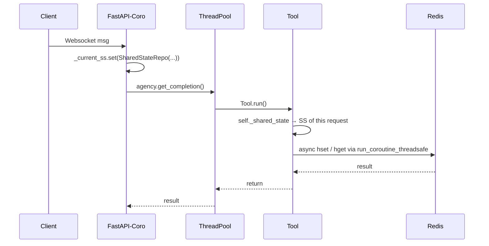

# Mimeiapify (Version 1.4.2, 2025-06-09)

Mimeiapify is a Python library designed to host several API integrations and utility functions. It currently bundles an Airtable client, a full Wompi payment wrapper and a new **symphony_ai** module which provides concurrency utilities and Redis-backed state management for [Agency-Swarm](https://github.com/VRSEN/agency-swarm) agents. More integrations are planned for future releases.

---

## Current APIs

### Airtable
The library currently supports operations for Airtable API. For detailed documentation on the Airtable API itself, visit: [Airtable API Documentation](https://airtable.com/developers/web/api/introduction).

Supported Airtable operations include:
- Fetching base schemas
- Extracting table IDs
- Creating fields in Airtable tables
- Fetching and filtering records
- Creating, updating, and deleting records
- Uploading attachments to Airtable fields
- Managing Airtable fields and configurations

The library provides two interfaces:
- **Airtable**: A synchronous interface for Airtable API interactions.
- **AirtableAsync**: An asynchronous interface for Airtable API interactions with optimized session management.

### Wompi
The library provides comprehensive integration with the Wompi payment platform, a popular payment solution in Latin America. For detailed documentation on the Wompi API itself, visit: [Wompi API Documentation](https://docs.wompi.co/en).

Supported Wompi operations include:
- Generating checkout URLs for payment processing with full support for all parameters
- Retrieving transaction information by ID or reference
- Verifying webhook events for payment notifications with secure cryptographic validation
- Supporting both sandbox and production environments
- Flexible session management for optimized HTTP connection handling

The library currently offers:
- **WompiAsync**: An asynchronous interface for Wompi payment platform interactions with efficient session management.

## Future Plans

- Add integrations for additional APIs (Notion, WhatsApp, Gmail).
- Expand utility functions for data processing and manipulation.
- Provide improved error handling and logging for all operations.
- Add synchronous interface for Wompi integration.

---

## Installation

### UV Install
```bash
uv add mimeiapify
```

This will make the library available for use across your projects.

---

## Usage (Synchronous)

To start using the `mimeiapify` library in synchronous code, import the `Airtable` class:

```python
from mimeiapify import Airtable

# Initialize
airtable = Airtable(base_id="your_base_id", api_key="your_api_key")

# Fetch Schema
schema = airtable.get_schema()
print(schema)
```

---

## Usage (Asynchronous)

### Airtable Async

To use the Airtable async interface, import the `AirtableAsync` class:

```python
from mimeiapify.airtable_async import AirtableAsync
import asyncio

async def main():
    # Initialize
    airtable_async = AirtableAsync(base_id="your_base_id", api_key="your_api_key")

    # Example: Fetch schema asynchronously
    schema = await airtable_async.get_schema()
    print(schema)

# Run the async entry point
asyncio.run(main())
```

### Wompi Async

To use the Wompi async interface, import the `WompiAsync` class:

```python
from mimeiapify.wompi_async import WompiAsync
import asyncio

async def main():
    # Initialize
    wompi = WompiAsync(
        public_key="your_public_key", 
        integrity_key="your_integrity_key",
        environment="sandbox"  # or "production"
    )

    # Example: Generate a checkout URL
    checkout_data = await wompi.generate_checkout_url(
        amount_in_cents=10000,  # 100.00 in currency
        currency="COP",
        redirect_url="https://your-site.com/success"
    )
    
    print(f"Checkout URL: {checkout_data['checkout_url']}")
    print(f"Reference: {checkout_data['reference']}")

# Run the async entry point
asyncio.run(main())
```

---

## Optimized Session Management

Both `AirtableAsync` and `WompiAsync` classes support efficient session management to optimize HTTP connections and improve performance. There are three ways to manage the HTTP session:

### 1. Automatic Session Management

The simplest approach is to let the library manage sessions automatically:

```python
# Session is created when needed and closed when done
async def fetch_data():
    airtable = AirtableAsync(base_id="your_base_id", api_key="your_api_key")
    data = await airtable.fetch_records("your_table_id")
    # Session is automatically cleaned up when airtable is garbage collected
    return data
```

### 2. Using Async Context Manager

For more controlled session management:

```python
async def fetch_with_context():
    async with AirtableAsync(base_id="your_base_id", api_key="your_api_key") as airtable:
        # Session is created when entering the context
        data = await airtable.fetch_records("your_table_id")
        # Session is automatically closed when exiting the context
        return data
```

### 3. Sharing an External Session

For maximum efficiency, especially in applications making multiple API calls:

```python
import aiohttp

async def fetch_with_shared_session():
    # Create a shared session
    async with aiohttp.ClientSession() as session:
        # Pass the session to both clients
        airtable = AirtableAsync(base_id="your_base_id", api_key="your_api_key", session=session)
        wompi = WompiAsync(public_key="your_key", integrity_key="your_key", session=session)
        
        # Make API calls with both clients using the same session
        airtable_data = await airtable.fetch_records("your_table_id")
        wompi_data = await wompi.get_transaction_by_reference("your_reference")
        
        # The shared session is managed by the caller, not the API clients
        return airtable_data, wompi_data
```

---

## Wompi Examples

### Generating a Checkout URL

```python
from mimeiapify.wompi_async import WompiAsync
import asyncio

async def create_payment_link():
    wompi = WompiAsync(
        public_key="your_public_key", 
        integrity_key="your_integrity_key"
    )
    
    # Generate a checkout URL with custom parameters
    checkout_data = await wompi.generate_checkout_url(
        amount_in_cents=15000,
        currency="COP",
        reference="INV-001",  # Optional: provide your own reference
        redirect_url="https://yoursite.com/payment/success",
        expiration_time="2023-12-31T23:59:59+00:00",  # ISO8601 format
        tax_vat_in_cents=2850,  # VAT/IVA
        customer_data={
            "email": "customer@example.com",
            "full-name": "John Doe",
            "phone-number": "3001234567",
            "phone-number-prefix": "+57"  # Colombia
        },
        collect_shipping=False
    )
    
    return checkout_data["checkout_url"]
```

### Verifying a Webhook Event

```python
from mimeiapify.wompi_async import WompiAsync
from fastapi import FastAPI, Request, HTTPException

app = FastAPI()

@app.post("/wompi-webhook")
async def handle_wompi_webhook(request: Request):
    # Get the raw event data from the request
    event_data = await request.json()
    
    # Your Events Secret from the Wompi dashboard
    events_secret = "your_events_secret"
    
    # Verify the event is authentic
    is_valid = WompiAsync.verify_webhook_event(event_data, events_secret)
    
    if not is_valid:
        raise HTTPException(status_code=400, detail="Invalid webhook signature")
    
    # Process the valid event
    event_type = event_data.get("event")
    if event_type == "transaction.updated":
        # Handle successful payment
        transaction = event_data.get("data", {}).get("transaction", {})
        status = transaction.get("status")
        
        if status == "APPROVED":
            # Payment was successful
            reference = transaction.get("reference")
            amount = transaction.get("amount_in_cents")
            
            # Update your database or perform business logic
            await update_order_status(reference, "paid", amount)
    
    return {"status": "success"}
```

### Retrieving Transaction Data

```python
from mimeiapify.wompi_async import WompiAsync
import asyncio

async def check_transaction_status(reference):
    async with WompiAsync(
        public_key="your_public_key", 
        integrity_key="your_integrity_key"
    ) as wompi:
        # Get transactions by reference
        transactions = await wompi.get_transaction_by_reference(reference)
        
        if transactions:
            # Get the first matching transaction
            transaction_id = transactions[0]["id"]
            
            # Get detailed transaction information
            details = await wompi.get_transaction(transaction_id)
            
            return {
                "status": details["data"]["status"],
                "payment_method": details["data"]["payment_method_type"],
                "amount": details["data"]["amount_in_cents"] / 100,  # Convert to currency units
                "created_at": details["data"]["created_at"]
            }
        
        return {"status": "not_found"}
```

---

## Example with FastAPI

Below is a minimal FastAPI example demonstrating how to integrate `AirtableAsync`:

```python
from fastapi import FastAPI
from mimeiapify.airtable_async import AirtableAsync

app = FastAPI()

@app.get("/records")
async def get_records():
    airtable_async = AirtableAsync(base_id="your_base_id", api_key="your_api_key")
    records = await airtable_async.fetch_records(table_id="your_table_id")
    return {"records": records}
```

### Using concurrency in FastAPI

Within FastAPI, calling multiple Airtable operations in parallel is as simple as using `asyncio.gather`. For instance:

```python
@app.get("/parallel")
async def parallel_requests():
    airtable_async = AirtableAsync(base_id="your_base_id", api_key="your_api_key")

    # Suppose you want to fetch records from two different tables concurrently:
    task1 = airtable_async.fetch_records(table_id="Table1")
    task2 = airtable_async.fetch_records(table_id="Table2")

    results = await asyncio.gather(task1, task2)
    return {"table1": results[0], "table2": results[1]}
```

### Class Manager pattern (reusing the ClientSession)

If you prefer to manage the `AirtableAsync` instance yourself (for example, to reuse the underlying HTTP session), you might do:

```python
class AirtableManager:
    def __init__(self, base_id: str, api_key: str):
        self.airtable = AirtableAsync(base_id, api_key)

    async def fetch_two_tables(self):
        table1, table2 = await asyncio.gather(
            self.airtable.fetch_records("Table1"),
            self.airtable.fetch_records("Table2")
        )
        return table1, table2

@app.get("/manager-example")
async def manager_example():
    manager = AirtableManager(base_id="your_base_id", api_key="your_api_key")
    table1, table2 = await manager.fetch_two_tables()
    return {"table1": table1, "table2": table2}
```
#### The Goal
The purpose of the Class Manager pattern is to encapsulate the setup of your AirtableAsync client (or any other resource) into a single Python class. This lets you:
1. Reuse the same instance of AirtableAsync across multiple methods or endpoints.
2. Potentially reuse the underlying HTTP session (if you modify AirtableAsync to store a single session, rather than creating it anew in each call).
3. Keep related Airtable logic in one place, making your codebase more organized and testable.

#### Example Code

```python
import asyncio
from fastapi import FastAPI
from mimeiapify.airtable_async import AirtableAsync

# 1) Create a Manager class that holds a single AirtableAsync instance
class AirtableManager:
    def __init__(self, base_id: str, api_key: str):
        # Here we initialize exactly one AirtableAsync client
        self.airtable = AirtableAsync(base_id, api_key)

    async def fetch_two_tables(self):
        """
        Example method that fetches data from two separate tables in parallel (asynchronously).
        """
        # asyncio.gather will run these two coroutines concurrently
        table1, table2 = await asyncio.gather(
            self.airtable.fetch_records("Table1"),
            self.airtable.fetch_records("Table2")
        )
        return table1, table2

# 2) Create a FastAPI app
app = FastAPI()

@app.get("/manager-example")
async def manager_example():
    """
    Example FastAPI endpoint that uses the AirtableManager to fetch data from two tables.
    """
    # Instantiate the manager (in real code, you might do this once at startup)
    manager = AirtableManager(base_id="your_base_id", api_key="your_api_key")
    
    # Call the manager method which performs concurrent Airtable calls
    table1, table2 = await manager.fetch_two_tables()

    return {"table1": table1, "table2": table2}
```

#### Key Points

1. Single Instantiation: By creating the AirtableAsync client in the AirtableManager.`__init__`, all subsequent methods in that manager can reuse the same instance.
2. Encapsulation: Any additional logic (e.g., error handling, caching, logging) can live inside methods of AirtableManager.

If you want to go even further, you could hold a single `aiohttp.ClientSession` inside `AirtableAsync`, manually open it at manager initialization, and close it gracefully on shutdown. This helps reuse TCP connections and reduce overhead.

---

## Rate-Limiting Examples

Airtable imposes rate limits, and you may want to **throttle** or **delay** your requests to avoid hitting them. Below are three illustrative methods:

1. **Explicit Delay in Your Code**  
   Simply call `await asyncio.sleep(...)` after your Airtable call:
   ```python
   from mimeiapify.airtable_async import AirtableAsync
   import asyncio

   async def create_records_with_sleep():
       airtable = AirtableAsync(base_id="your_base_id", api_key="your_api_key")
       await airtable.create_records("your_table_id", [{"fields": {"Name": "Test"}}])
       await asyncio.sleep(1.0)  # Sleep for 1 second before next request
   ```

2. **Decorator-Based Approach**  
   Define a decorator that injects a delay before or after the function call:
   ```python
   import asyncio
   import functools
   from mimeiapify.airtable_async import AirtableAsync

   def rate_limit(delay: float = 1.0):
       def decorator(func):
           @functools.wraps(func)
           async def wrapper(*args, **kwargs):
               result = await func(*args, **kwargs)
               await asyncio.sleep(delay)
               return result
           return wrapper
       return decorator

   @rate_limit(delay=2.0)
   async def create_record_decorated():
       airtable = AirtableAsync("base_id", "api_key")
       return await airtable.create_records("table_id", [{"fields": {"Name": "Decorated"}}])

   # Usage
   # records = await create_record_decorated()  # This will always wait 2 seconds after finishing
   ```

3. **Token Bucket or Semaphore**  
   A more advanced pattern involves a semaphore to limit concurrent requests. For instance:
   ```python
   import asyncio
   from mimeiapify.airtable_async import AirtableAsync

   # Global semaphore (e.g., allow 5 concurrent Airtable calls)
   airtable_semaphore = asyncio.Semaphore(5)

   async def fetch_with_semaphore():
       async with airtable_semaphore:
           # Your code here
           airtable = AirtableAsync("base_id", "api_key")
           return await airtable.fetch_records("table_id")

   async def main():
       # Launch many tasks, each must acquire the semaphore first
       tasks = [fetch_with_semaphore() for _ in range(20)]
       return await asyncio.gather(*tasks)

   # results = asyncio.run(main())
   ```

Each approach can be fine-tuned to your project's needs. The token bucket or semaphore pattern is often the most flexible and powerful for controlling concurrency in a production environment.

---

## Getting Help

To get help on any function in the `Airtable`, `AirtableAsync`, or `WompiAsync` classes, you can use Python's built-in `help()` function. For example:

```python
help(AirtableAsync.fetch_records)
help(WompiAsync.generate_checkout_url)
```

This will display the function's docstring, including its purpose, arguments, and return values.

---

## Dependencies

The following libraries are required to use `mimeiapify`:

- **requests**: For making HTTP requests in the synchronous API.
- **aiohttp**: For making HTTP requests in the asynchronous API.
- **pandas**: For processing and managing Airtable records as DataFrames.

You can install these dependencies using:

```bash
pip install requests aiohttp pandas
```

---

## Symphony-AI × Agency-Swarm — Concurrency + Redis Integration Guide

| Layer              | What we added                                                                                                                                                                                           | Why it matters                                                                                |
| ------------------ | ------------------------------------------------------------------------------------------------------------------------------------------------------------------------------------------------------- | --------------------------------------------------------------------------------------------- |
| **Infrastructure** | **`GlobalSymphony`** singleton → event-loop + 3 named `ThreadPoolExecutor`s + Redis client + CapacityLimiter                                                                                            | Keeps blocking Agency-Swarm work off the FastAPI loop while sharing one Redis pool per worker |
| **Redis plumbing** | • `redis_client.py` (fork-safe pool)<br>• `redis/ops.py` (atomic helpers)<br>• `serde.py` (swap JSON↔MsgPack later)<br>• `key_factory.py` (names all keys)<br>• `tenant_cache.py` (TTL + helper mix-in) | Zero duplicated socket code; one place for key rules and (de)serialisation                    |
| **Domain repos**   | `SharedStateRepo`, `RedisUser`, `HandlerRepo`, … (all subclass `TenantCache`)                                                                                                                            | Each repo ≤ 150 LOC, single responsibility, testable with `fakeredis`                         |
| **Tool shim**      | `AsyncBaseTool` overrides `self._shared_state` to read a **ContextVar** (`_current_ss`)                                                                                                                 | Removes the unsafe global `BaseTool._shared_state = …` assignment race                        |
| **FastAPI glue**   | In the request/web-socket handler:<br>`python<br>ss = SharedStateRepo(tenant=t_id, user_id=u_id)<br>tok = _current_ss.set(ss)<br>try: result = await call_agent()<br>finally: _current_ss.reset(tok)`   | Every in-flight coroutine—and its thread-pool jobs—sees the **correct** per-user SharedState  |

### Quick-start checklist

```bash
uv add mimeiapify  # your private wheel
```

#### 1. FastAPI lifespan

```python
from contextlib import asynccontextmanager
from mimieiapify.symphony_ai.globals import GlobalSymphony, GlobalSymphonyConfig
from mimieiapify.symphony_ai.utils.logger import setup_logging
from mimieiapify.symphony_ai.redis import _current_ss, SharedStateRepo

@asynccontextmanager
async def lifespan(app):
    setup_logging(level="INFO", mode="DEV", log_dir="./logs")
    await GlobalSymphony.create(GlobalSymphonyConfig(redis_url="redis://cache/0"))
    yield                                     # shutdown handled automatically
```

#### 2. Request / WebSocket handler

```python
async def handle_message(tenant: str, user_id: str, text: str):
    ss = SharedStateRepo(tenant=tenant, user_id=user_id)           # ①
    token = _current_ss.set(ss)                                    # ② bind ContextVar
    try:
        pool = GlobalSymphony.get().pool_user
        fut  = pool.submit(lambda: agency.get_completion(text))    # ③ sync API call
        return await asyncio.wrap_future(fut)
    finally:
        _current_ss.reset(token)                                   # ④ avoid leaks
```

#### 3. Inside any Tool

```python
class RememberStep(AsyncBaseTool):
    def run(self, state_name: str, step: int):
        coro = self._shared_state.set_field(state_name, "step", step)
        loop = GlobalSymphony.get().loop
        return asyncio.run_coroutine_threadsafe(coro, loop).result()
```

### Current implementation status  ✅

* **Global orchestration** (`globals.py`) finished; pools tuned for network I/O.
* **Redis connectivity** fork-safe; pool caps @ 64 sockets per worker.
* **Core utils**: Rich logger, BoundedExecutor, ContextVar wiring.
* **Redis repos**: `SharedStateRepo`  (complete), `RedisUser`  (sketched), other repos stubs ready.
* **Agency-Swarm bridge**: `AsyncBaseTool` property override done; Send-message streaming via Redis pub/sub queued for next sprint.

### Roadmap

1. **Unit-tests** with `fakeredis.asyncio` (P0).
2. Full `RedisUser`, `HandlerRepo`, `TableRepo` implementation (P1).
3. Prometheus metrics for pool queue length + loop latency (P1).
4. Optional Temporal workflow driver for CPU-heavy Tool chains (P2).

### How Shared-State flows per request



With `ContextVar`, each coroutine & its downstream worker threads
*automatically* carry the right `SharedStateRepo`—no global mutation, no races.

---

## License

This library is licensed under the [MIT License](LICENSE).

---

For questions, feedback, or contributions, contact [Sasha Nicolai](mailto:sasha@candyflip.co).
