# 🔔 Redis Key-Expiry Triggers

Turn Redis TTLs into background jobs – cleanly separated by pool alias using a three-component architecture.

## 🏗️ Architecture Overview

The expiry trigger system consists of three distinct components working together:

| **Component** | **Role** | **Lifecycle** | **Key Operations** |
|---------------|----------|---------------|-------------------|
| **`RedisTrigger` Repository** | Creates/cancels TTL keys whose expiration signals deferred work | App runtime (HTTP handlers, tools, agents) | `SETEX tenant:EXPTRIGGER:action:identifier` |
| **`ExpirationHandlerRegistry`** | Maps action prefixes to async handler functions via decorators | Import time (every worker process) | In-memory dict: `{"EXPTRIGGER:process_batch:": <coroutine>}` |
| **`run_expiry_listener` Task** | Subscribes to Redis expiry events, parses keys, dispatches handlers | Background task (one per worker) | `SUBSCRIBE __keyevent@8__:expired` |

### Why Three Separate Components?

| **Concern** | **Where Solved** | **Why Separate?** |
|-------------|------------------|-------------------|
| **Key construction & TTL writes** | `RedisTrigger` | Needs tenant-aware prefixes, pool alias, retries; lives close to business code |
| **Action → coroutine mapping** | `ExpirationHandlerRegistry` | Pure configuration; import-time registration avoids circular imports |
| **Long-running connection & dispatch** | `run_expiry_listener` | Keeps network I/O and reconnect logic out of request paths; can be sharded per DB |

## 🔄 Complete Flow Diagram

```mermaid
sequenceDiagram
    participant App as Application Code
    participant RT as RedisTrigger
    participant Redis as Redis DB 8
    participant Listener as run_expiry_listener
    participant Registry as ExpirationHandlerRegistry
    participant Handler as User Handler

    Note over Registry: Import time registration
    Registry->>Registry: @on_expire_action("process_batch")
    Registry->>Registry: Store: {"EXPTRIGGER:process_batch:": handler_fn}

    Note over App,RT: Schedule deferred work
    App->>RT: set("process_batch", "wa_123", ttl=300)
    RT->>Redis: SETEX tenant:EXPTRIGGER:process_batch:wa_123 300 ""
    Redis-->>RT: OK
    RT-->>App: True

    Note over Redis: 5 minutes later...
    Redis->>Redis: Key expires (TTL=0)
    Redis->>Listener: PUBLISH __keyevent@8__:expired
    Note right of Redis: tenant:EXPTRIGGER:process_batch:wa_123

    Note over Listener: Parse and dispatch
    Listener->>Listener: parse_trigger(key) → (tenant, action, id)
    Listener->>Registry: lookup("EXPTRIGGER:process_batch:")
    Registry-->>Listener: handler_fn
    Listener->>Handler: asyncio.create_task(handler_fn("wa_123", full_key))
    
    Note over Handler: Business logic execution
    Handler->>Handler: Process batched messages for wa_123
```



## 🎯 Pool Architecture

```
expiry       → DB 8   (listener & SETEX triggers)
handlers     → DB 10  (repositories that *create* the TTL keys)
```

The separation ensures:
- **Trigger keys** live in DB 8 (monitored by the listener)
- **Handler state/data** lives in DB 10 (separate from trigger mechanism)
- **Clean isolation** between trigger timing and business data

## 🚀 Usage Guide

### 1. Enable keyspace notifications (automatic)

The system automatically enables Redis keyspace notifications during `GlobalSymphony.create()`:

```python
config = GlobalSymphonyConfig(
    redis_enable_key_events=True,  # Default: True
    redis_keyevent_flags="Ex"      # Default: "Ex" (expiry events)
)
await GlobalSymphony.create(config)
```

Manual setup (if automatic config is disabled):
```bash
redis-cli CONFIG SET notify-keyspace-events Ex
```

### 2. Register expiry handlers

```python
from mimeiapify.symphony_ai.redis.listeners import expiration_registry

@expiration_registry.on_expire_action("process_message_batch")
async def handle_batch_processing(identifier: str, full_key: str):
    """
    Called when tenant:EXPTRIGGER:process_message_batch:identifier expires
    
    Args:
        identifier: The identifier part (e.g., "wa_123")
        full_key: Complete Redis key for debugging/logging
    """
    tenant = full_key.split(":", 1)[0]
    logger.info(f"[{tenant}] Processing batch for: {identifier}")
    
    # Your business logic here:
    # 1. Retrieve accumulated data
    # 2. Process the batch
    # 3. Clean up temporary state

@expiration_registry.on_expire_action("send_reminder")
async def handle_reminder(user_id: str, full_key: str):
    """Send delayed reminder notification"""
    # Implementation here...
```

**Key Format**: All trigger keys follow the pattern:
```
{tenant}:EXPTRIGGER:{action}:{identifier}
```

### 3. Start the listener (FastAPI lifespan)

```python
import asyncio
from contextlib import asynccontextmanager
from fastapi import FastAPI
from mimeiapify.symphony_ai.redis.listeners import run_expiry_listener
from mimeiapify.symphony_ai import GlobalSymphony, GlobalSymphonyConfig

@asynccontextmanager
async def lifespan(app: FastAPI):
    # Initialize GlobalSymphony with Redis pools
    config = GlobalSymphonyConfig(
        redis_url="redis://localhost:6379",
        redis_enable_key_events=True  # Enables notify-keyspace-events
    )
    await GlobalSymphony.create(config)
    
    # Start the expiry listener
    listener_task = asyncio.create_task(
        run_expiry_listener(alias="expiry"),
        name="redis-expiry-listener"
    )
    
    try:
        yield
    finally:
        # Cleanup: cancel the listener
        listener_task.cancel()
        try:
            await listener_task
        except asyncio.CancelledError:
            pass

app = FastAPI(lifespan=lifespan)
```

### 4. Schedule deferred work

```python
from mimeiapify.symphony_ai.redis.redis_handler import RedisTrigger

# In your application code
async def process_user_message(tenant: str, message: dict):
    # Process the message immediately
    # ...
    
    # Schedule batch processing for 5 minutes later
    triggers = RedisTrigger(tenant=tenant)  # Uses "expiry" pool automatically
    await triggers.set(
        action="process_message_batch", 
        identifier="wa_123", 
        ttl_seconds=300  # 5 minutes
    )
    
    # Set a reminder for 1 hour later
    await triggers.set(
        action="send_reminder",
        identifier="user456",
        ttl_seconds=3600  # 1 hour
    )
```

### 5. Cancel scheduled work (optional)

```python
# Cancel a specific trigger
await triggers.delete("process_message_batch", "wa_123")

# Cancel all triggers for an identifier
await triggers.delete_all_by_identifier("wa_123")
```

## 🔧 Advanced Configuration

### Multiple Listeners for Different Databases

```python
# Start listeners for different Redis databases
asyncio.create_task(run_expiry_listener(alias="expiry"))     # DB 8
asyncio.create_task(run_expiry_listener(alias="handlers"))   # DB 10 (if needed)
```

### Custom Pool Configuration

```python
config = GlobalSymphonyConfig(
    redis_url={
        "default": "redis://localhost:6379/15",
        "expiry": "redis://redis-cache:6379/8",  # Dedicated expiry server
        "handlers": "redis://localhost:6379/10",
    },
    redis_enable_key_events=True
)
```

### Error Handling and Monitoring

```python
@expiration_registry.on_expire_action("critical_task")
async def handle_critical_task(task_id: str, full_key: str):
    try:
        # Your critical business logic
        await process_critical_task(task_id)
    except Exception as e:
        logger.error(f"Critical task {task_id} failed: {e}")
        # Maybe reschedule or alert operations
        await send_alert(f"Critical task {task_id} failed")
```

## 🔍 Monitoring and Debugging

### Listener Status

The listener logs key events:
```
INFO  - Expiry listener on alias 'expiry' (db=8) channel=__keyevent@8__:expired
INFO  - Subscribed to __keyevent@8__:expired
DEBUG - Dispatched handle_batch_processing for wa_123 (tenant=mimeia, action=process_message_batch)
```

### Registry Inspection

```python
from mimeiapify.symphony_ai.redis.listeners import expiration_registry

# See all registered handlers
print(expiration_registry._handlers)
# {'EXPTRIGGER:process_message_batch:': <function>, 'EXPTRIGGER:send_reminder:': <function>}
```

### Key Debugging

```python
from mimeiapify.symphony_ai.redis.redis_handler.utils.key_factory import KeyFactory

# Create KeyFactory instance (following Factory pattern)
keys = KeyFactory()

# Parse a trigger key
parsed = keys.parse_trigger("mimeia:EXPTRIGGER:process_batch:wa_123")
if parsed:
    tenant, action, identifier = parsed
    print(f"Tenant: {tenant}, Action: {action}, ID: {identifier}")
```

## ❓ FAQ

### Can I run multiple listeners?

Yes! Each listener subscribes only to its own database's expiry events:

```python
# DB 8 expiry events only
asyncio.create_task(run_expiry_listener(alias="expiry"))

# DB 10 expiry events only  
asyncio.create_task(run_expiry_listener(alias="handlers"))
```

### What if Redis CONFIG SET is forbidden?

The bootstrap automatically handles this:

```python
# Disable automatic CONFIG SET
config = GlobalSymphonyConfig(
    redis_enable_key_events=False  # Skip automatic setup
)

# Then manually set via redis.conf or CLI:
# redis-cli CONFIG SET notify-keyspace-events Ex
```

### How do I handle handler failures?

Handler failures are isolated - they won't crash the listener:

```python
@expiration_registry.on_expire_action("risky_operation")
async def handle_risky_operation(id: str, key: str):
    try:
        await risky_business_logic(id)
    except Exception as e:
        logger.exception(f"Handler failed for {id}: {e}")
        # Optionally reschedule or alert
```

### Can I use colons in action names or identifiers?

Yes! The `KeyFactory` automatically escapes colons to underscores:

```python
# This works fine - colons become underscores in the key
await triggers.set("user:profile:update", "user:123", ttl_seconds=300)
# Creates key: tenant:EXPTRIGGER:user_profile_update:user_123
```

## 🎯 Best Practices

1. **Keep handlers lightweight** - Offload heavy work to thread pools via `GlobalSymphony.pool_tool`
2. **Use descriptive action names** - `"process_message_batch"` not `"batch"`
3. **Handle errors gracefully** - Don't let one failed handler crash the system
4. **Log handler execution** - Include tenant/identifier in logs for debugging
5. **Test with short TTLs** - Use seconds in development, minutes/hours in production
6. **Monitor Redis memory** - TTL keys consume space until expiry
7. **Clean up on cancellation** - Use `triggers.delete()` when work is no longer needed

## 📚 Integration Examples

### With Agency-Swarm Tools

```python
from agency_swarm.tools import BaseTool
from mimeiapify.symphony_ai.redis.redis_handler import RedisTrigger

class ScheduleBatchTool(BaseTool):
    user_id: str = Field(..., description="User ID for batch processing")
    delay_minutes: int = Field(default=5, description="Delay before processing")
    
    def run(self) -> str:
        triggers = RedisTrigger(tenant="mimeia")
        
        # Schedule using GlobalSymphony's async bridge
        from mimeiapify.symphony_ai import GlobalSymphony
        import asyncio
        
        loop = GlobalSymphony.get().loop
        coro = triggers.set("process_user_batch", self.user_id, self.delay_minutes * 60)
        future = asyncio.run_coroutine_threadsafe(coro, loop)
        success = future.result(timeout=5)
        
        return f"Batch scheduled for {self.user_id} in {self.delay_minutes} minutes"
```

### With FastAPI Background Tasks

```python
from fastapi import BackgroundTasks

@app.post("/schedule-work")
async def schedule_work(user_id: str, background_tasks: BackgroundTasks):
    # Immediate response
    background_tasks.add_task(do_immediate_work, user_id)
    
    # Deferred work via expiry trigger
    triggers = RedisTrigger(tenant="api")
    await triggers.set("followup_email", user_id, ttl_seconds=3600)
    
    return {"status": "scheduled", "followup": "in 1 hour"}
``` 