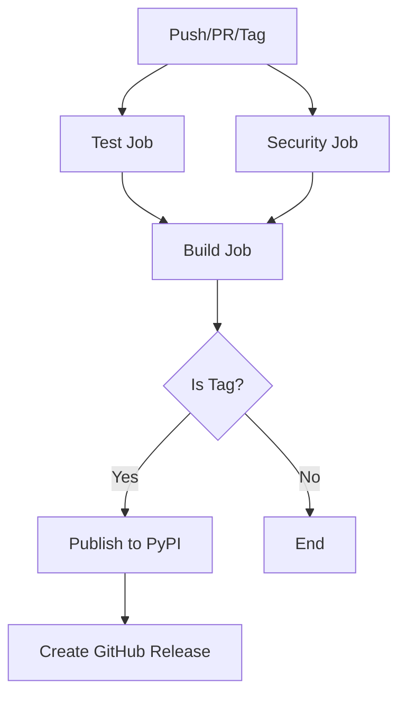

# GitHub Actions CI/CD Setup Guide

This directory contains GitHub Actions workflows for the Ray Simplify Python package, providing comprehensive CI/CD automation.

## 📋 Workflow Files

### 1. `ci.yml` - Main CI/CD Pipeline
**Triggers:** Push to main/master, tags, and pull requests

**Features:**
- ✅ Multi-Python version testing (3.11, 3.12)
- ✅ Code quality checks (Black, Ruff)
- ✅ Test coverage reporting
- ✅ Security scanning (Safety, Bandit)
- ✅ Package building and verification
- ✅ PyPI publishing (on tags)
- ✅ GitHub release creation

### 2. `dev.yml` - Development Builds
**Triggers:** Push to feature branches and pull requests

**Features:**
- ✅ Quick feedback for development
- ✅ Fast linting and basic tests
- ✅ Package build verification
- ✅ Minimal resource usage

### 3. `nightly.yml` - Comprehensive Testing
**Triggers:** Daily at 2 AM UTC, manual dispatch

**Features:**
- ✅ Cross-platform testing (Ubuntu, Windows, macOS)
- ✅ Multi-Python version matrix
- ✅ Installation verification
- ✅ Automatic issue creation on failure

## 🚀 Quick Setup

### 1. Repository Secrets (Required for full functionality)

Go to your GitHub repository → Settings → Secrets and variables → Actions, and add:

```
PYPI_API_TOKEN          # PyPI API token for publishing
CODECOV_TOKEN           # Codecov token for coverage (optional)
```

### 2. Environment Setup (for PyPI publishing)

1. Go to Settings → Environments
2. Create environment named `release`
3. Add protection rules (optional):
   - Required reviewers
   - Wait timer
   - Deployment branches (only tags)

### 3. Branch Protection (Recommended)

1. Go to Settings → Branches
2. Add protection rule for `main`/`master`:
   - Require status checks: ✅
   - Require branches to be up to date: ✅
   - Status checks: Select "Test and Quality Checks"

## 🔧 Workflow Details

### Main CI/CD Pipeline (`ci.yml`)



**Jobs:**
1. **Test:** Runs on Python 3.11 & 3.12
   - Code formatting (Black)
   - Linting (Ruff)
   - Unit tests with coverage
   - Uploads test results and coverage

2. **Security:** Vulnerability scanning
   - Safety check for known vulnerabilities
   - Bandit static security analysis

3. **Build:** Package creation
   - Builds wheel and source distribution
   - Verifies package integrity
   - Uploads build artifacts

4. **Publish:** PyPI publishing (tags only)
   - Publishes to PyPI using API token
   - Requires `release` environment

5. **Release:** GitHub release (tags only)
   - Creates GitHub release
   - Attaches package files
   - Auto-generates release notes

### Development Pipeline (`dev.yml`)

**Purpose:** Fast feedback for development branches
- Single Python version (3.11)
- Essential checks only
- Quick package build verification

### Nightly Testing (`nightly.yml`)

**Purpose:** Comprehensive cross-platform testing
- Tests on Ubuntu, Windows, macOS
- Multiple Python versions
- Full package installation testing
- Auto-creates issues on failure

## 📊 Status Badges

Add these badges to your README.md:

```markdown
[](https://github.com/DINHDUY/ray-simplify/actions/workflows/ci.yml)
[](https://github.com/DINHDUY/ray-simplify/actions/workflows/dev.yml)
[](https://codecov.io/gh/DINHDUY/ray-simplify)
[](https://badge.fury.io/py/ray-simplify)
[](https://pypi.org/project/ray-simplify/)
```

## 🔐 Security Features

### Dependency Scanning
- **Dependabot:** Automated dependency updates
- **Safety:** Known vulnerability detection
- **Bandit:** Static security analysis

### Publishing Security
- **Environment protection:** Release environment with optional reviews
- **Token security:** API tokens stored as repository secrets
- **Tag-based releases:** Only tagged commits can publish

## 📦 Artifacts and Outputs

### Build Artifacts (Available for download)
- `python-package`: Wheel and source distribution files
- `test-results-{python-version}`: JUnit XML test results
- `coverage-{python-version}`: Coverage reports (XML and HTML)
- `security-reports`: Security scan results

### Published Outputs
- **PyPI Package:** Automatically published on version tags
- **GitHub Releases:** Created with package files attached
- **Coverage Reports:** Uploaded to Codecov

## 🛠 Local Development Commands

Run the same checks locally that the CI runs:

```bash
# Install dependencies
uv pip install -e ".[dev]"

# Code formatting check
black --check --diff src tests

# Linting
ruff check src tests

# Run tests with coverage
pytest --cov=ray_simplify --cov-report=xml --cov-report=html

# Security scans
safety check
bandit -r src

# Build package
python -m build
```

## 📋 Release Process

### Automatic Releases (Recommended)

1. Update version in `src/ray_simplify/__init__.py`
2. Commit and push to main branch
3. Create and push a version tag:
   ```bash
   git tag v1.0.0
   git push origin v1.0.0
   ```
4. GitHub Actions will automatically:
   - Build and test the package
   - Publish to PyPI
   - Create GitHub release

### Manual Release Steps

If you prefer manual control:

1. Disable the `publish` and `release` jobs in `ci.yml`
2. Download artifacts from successful builds
3. Manually publish using:
   ```bash
   twine upload dist/*
   ```

## 🐛 Troubleshooting

### Common Issues

1. **Tests fail on Windows:**
   - Check path separators in tests
   - Verify file encoding issues

2. **PyPI publishing fails:**
   - Verify `PYPI_API_TOKEN` secret is set
   - Check if version already exists on PyPI
   - Ensure package name is available

3. **Coverage upload fails:**
   - Add `CODECOV_TOKEN` secret (optional for public repos)
   - Check Codecov configuration

4. **Dependency installation slow:**
   - Cache is working, subsequent runs will be faster
   - Consider reducing dependency matrix for dev builds

### Debug Actions

Enable debug logging by adding this secret:
```
ACTIONS_STEP_DEBUG = true
```

## 🔄 Workflow Customization

### Modify Python Versions
Edit the matrix in `ci.yml`:
```yaml
strategy:
  matrix:
    python-version: ['3.11', '3.12', '3.13']  # Add/remove versions
```

### Change Trigger Branches
Update the trigger section:
```yaml
on:
  push:
    branches: [ main, develop ]  # Add your branches
```

### Disable Nightly Tests
Comment out or delete `nightly.yml` if not needed.

### Add More Platforms
Extend the matrix in `nightly.yml`:
```yaml
matrix:
  os: [ubuntu-latest, windows-latest, macos-latest, macos-13]
```

This GitHub Actions setup provides enterprise-grade CI/CD for your Python package with comprehensive testing, security scanning, and automated publishing.
