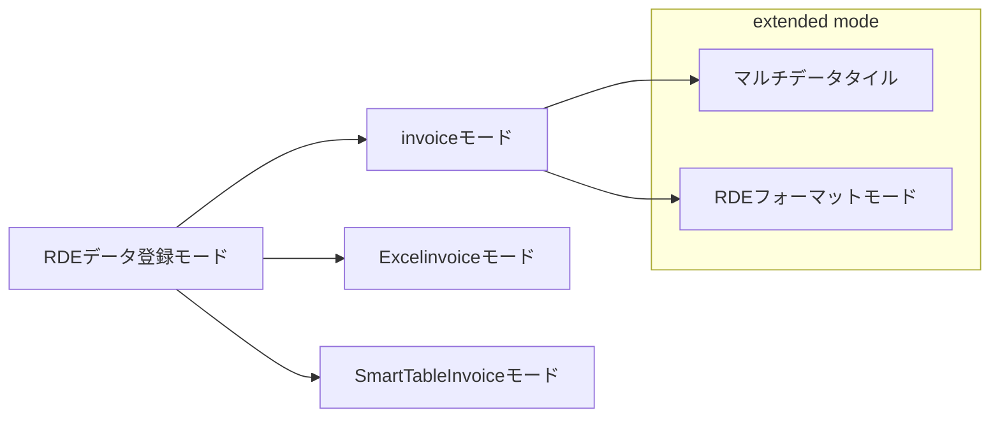

# RDEToolKitのデータ登録モード

RDEの構造化処理でサポートしているデータ登録モードは、以下5つのモードをサポートしています。

| モード名                | 起動条件                                             |
| ----------------------- | ---------------------------------------------------- |
| invoiceモード           | デフォルトのデータ登録モード                         |
| Excelinvoiceモード      | 入力ファイルに`*._excel_invoice.xlsx`を格納          |
| SmartTableInvoiceモード | 入力ファイルに`smarttable_*.{xlsx,csv,tsv}`を格納    |
| マルチデータタイル      | 設定ファイルに`extended_mode: 'MultiDataTile'`を追加 |
| RDEフォーマットモード   | 設定ファイルに`extended_mode: 'rdeformat'`を追加     |

マルチデータタイルと、RDEフォーマットモードは、invoiceモードの拡張機能になります。



ここでは、各種モードの説明と実行例をまとめました。

## invoiceモード

### 説明

このモードは、通常のRDE登録画面でデータを登録するモードを指します。一番、基本的かつデフォルトのモードになります。

以下のように、Entry画面から、データを投入するモードです。


### 起動条件

デフォルトのデータ登録モード。設定等は必要ありません。

### invoiceモード実行例

#### 投入データ

| 登録ファイル                           | 説明                                              |
| -------------------------------------- | ------------------------------------------------- |
| `data/inputdata/test23_1.csv`          | 登録するデータ                                    |
| `data/invoice/invoice.json`            | ローカルで事前に準備・作成/システムが自動的に生成 |
| `data/tasksupport/invoice.schema.json` | ローカルで事前に準備・作成/システムに事前に登録   |
| `data/tasksupport/metadata-def.json`   | ローカルで事前に準備・作成/システムに事前に登録   |

```shell
data
├── inputdata
│   └── test23_1.csv
├── invoice
│   └── invoice.json
└── tasksupport
    ├── rdeconfig.yaml
    ├── invoice.schema.json
    └── metadata-def.json
```

#### configファイル

モードの指定等を指定する必要はありません。

```yaml
save_raw: true
magic_variable: false
save_thumbnail_image: ture
```

#### 構造化処理実行実行後ファイル構成

上記の設定で、構造化処理を実行すると、以下の出力が得られます。

```shell
data
├── inputdata
│   └── test23_1.csv
├── invoice
│   └── invoice.json
├── logs
│   └── rdesys.log
├── main_image
├── meta
├── other_image
├── raw
│   └── test23_1.csv
├── structured
├── tasksupport
│   ├── rdeconfig.yaml
│   ├── invoice.schema.json
│   └── metadata-def.json
├── temp
└── thumbnail
```

## ExcelInvoiceモード

### 説明

このモードは、一度に複数件のデータセットを登録するものモードです。通常のinvoiceモードでは、一件ずつしかデータセットの登録実行できませんが、Excelinvoiceモードを使うと、一度に複数データセットを登録することができます。

このモードの起動条件として、入力ファイルに、`*._excel_invoice.xlsx`という命名規則を持つExcelファイルを投入するとExcelinvoiceとして登録されます。

このExcelinvoiceのテンプレートファイルはRDEへ問い合わせください。


!!! Tip "Documents"
    ExcelInvoiceには、ファイルモードとフォルダモードという概念があります。[File Mode / Folder Mode](file_folder_mode.md)を参照ください。

### 起動条件

入力ファイルに`*._excel_invoice.xlsx`を格納する

### ExcelInvoiceモード実行例

#### 投入データ

- 登録ファイル(data/inputdata)
  - data.zip (投入ファイルをzip圧縮したもの)
  - sample_excel_invoice.xlsx (この事例では3行3データタイル分を記載)
- tasksupport
  - 追加なし

#### 実行前ディレクトリ構成

> `data/invoice/invoice.json`は、空のjsonファイルでも構いません。

```shell
container/
├── main.py
├── requirements.txt
├── modules/
│   ├── <任意の構造化処理モジュール>
└── data
    ├── inputdata
    │   ├── data.zip
    │   └── sample_excel_invoice.xlsx
    ├── invoice
    │   └── invoice.json
    └── tasksupport
        ├── invoice.schema.json
        └── metadata-def.json
```

data.zipの内容は、エクセルインボイスに3行追加するため3ファイルzip化する。

```shell
$ unzip -t data.zip
Archive:  data.zip
    testing: data0000.dat
    testing: data0001.dat
    testing: data0002.dat
```


#### 構造化処理実行後のディレクトリ構造

上記の設定で、構造化処理を実行すると、以下の出力が得られます。

- data.zipの内容は展開される
- sample_excel_invoice.xlsxの記入内容に従ってdividedを含むフォルダに展開
- 各invoice.jsonは、excel_invoiceの各行から読み出した情報が入力される

```shell
data
├── divided
│   ├── 0001
│   │   ├── invoice
│   │   │   └── invoice.json
│   │   ├── logs
│   │   ├── main_image
│   │   ├── meta
│   │   ├── other_image
│   │   ├── raw
│   │   │   └── data0001.dat
│   │   ├── structured
│   │   ├── temp
│   │   └── thumbnail
│   └── 0002
│       ├── invoice
│       │   └── invoice.json
│       ├── logs
│       ├── main_image
│       ├── meta
│       ├── other_image
│       ├── raw
│       │   └── data0002.dat
│       ├── structured
│       ├── temp
│       └── thumbnail
├── inputdata
│   ├── data.zip
│   └── sample_excel_invoice.xlsx
├── invoice
│   └── invoice.json
├── logs
│   └── rdesys.log
├── main_image
├── meta
├── other_image
├── raw
│   └── data0000.dat
├── structured
├── tasksupport
│   ├── invoice.schema.json
│   └── metadata-def.json
├── temp
│   ├── data0000.dat
│   ├── data0001.dat
│   ├── data0002.dat
│   └── invoice_org.json
└── thumbnail
```

#### dividedフォルダ以下の内容について

`divided/0001/invoice/invoice.json`の内容は、事前に配置されたinvoice.jsonがコピーされ`basic/dataName`,
`basic/dataOwnerId` がエクセルインボイスの内容で書き換えが行われている。

書き換え後の、`data/invoice/invoice.json`

```json
{
    "datasetId": "ab9536f2-5fe4-49c4-bb82-dd8212453d85",
    "basic": {
        "dateSubmitted": "2023-03-14",
        "dataOwnerId": "153cbe4798cb8c1c3c0fc66062c7e55a9b4255fe3364613035643239",
        "dataName": "dumm.dat",
        "instrumentId": null,
        "experimentId": null,
        "description": null
    },
    "custom": null
}
```

書き換え後の、`data/divided/0001/invoice/invoice.json`

```json
{
    "datasetId": "e751fcc4-b926-4747-b236-cab40316fc49",
    "basic": {
        "dateSubmitted": "2023-03-14",
        "dataOwnerId": "97e05f8b9ed6b4b5dd6fd50411a9c163a2d4e38d6264623666383663",
        "dataName": "data0001.dat",
        "instrumentId": null,
        "experimentId": null,
        "description": null
    }
}
```

!!! Warning
    - `smple.zip`に不要なファイルが含まれていないか確認する。Mac特有の`.DS_Store`ファイルが格納されている場合、実行エラーが発生します。
    - エクセルインボイスファイルを開いたまま実行している場合、Microsoft特有のファイル(`~$`から始まるファイル)が残ってしまい、実行エラーが発生します。
    - ローカルで実行する場合、tempフォルダに前回の実行結果が残っているとエラーが発生します。

### フォルダを含むzipのExcelInvoiceモード実行例

フォルダを含むzipファイルを登録する方法は、zipファイルは以下の通りです。

!!! Tip "Documents"
    ExcelInvoiceには、ファイルモードとフォルダモードという概念があります。[File Mode / Folder Mode](file_folder_mode.md)を参照ください。

```shell
# フォルダありでzip
$ zip data_folder.zip -r ./inputdata -x \*/.DS_Store *\.xlsx
  adding: inputdata/ (stored 0%)
  adding: inputdata/data0001.dat (stored 0%)
  adding: inputdata/data0000.dat (stored 0%)
  adding: inputdata/data0002.dat (stored 0%)
```

## SmartTableInvoiceモード

### 説明

SmartTableInvoiceモードは、テーブルファイル（Excel/CSV/TSV）からメタデータを読み取り、自動的にinvoice.jsonファイルを生成する新しい登録モードです。ExcelInvoiceモードと同様に複数のデータセットを一度に登録できますが、より柔軟なメタデータマッピング機能を提供します。

このモードの特徴：
- **多形式対応**: Excel (.xlsx)、CSV、TSVファイルの読み込み
- **2行ヘッダー形式**: 1行目に表示名、2行目にマッピングキーを配置
- **自動メタデータマッピング**: `basic/`、`custom/`、`sample/`プレフィックスによる構造化データ生成
- **配列データサポート**: `generalAttributes`および`specificAttributes`への適切なマッピング
- **zipファイル統合**: データファイルを含むzipとテーブルファイルの自動関連付け


### 起動条件

入力ファイルに`smarttable_*.{xlsx,csv,tsv}`を格納する

### テーブルファイル形式

#### ヘッダー構成

テーブルファイルは以下の形式で作成します：

```csv
# 1行目: 表示名（ユーザー向けの説明、処理対象外）
データ名,入力ファイル1,入力ファイル2,サイクル,厚さ,温度,試料名,試料ID,一般項目

# 2行目: マッピングキー（実際の処理で使用）
basic/dataName,inputdata1,inputdata2,custom/cycle,custom/thickness,custom/temperature,sample/names,sample/sampleId,sample/generalAttributes.3adf9874-7bcb-e5f8-99cb-3d6fd9d7b55e

# 3行目以降: データ
実験1,file1.txt,file2.txt,1,2mm,25,sample001,S001,value1
実験2,file3.txt,file4.txt,2,3mm,30,sample002,S002,value2
20250601_exp1,file1,sub/file11,file12,3,25,sample001,0,value1
20250601_exp2,file2,sub/file21,file22,4,30,sample002,1,value2
20250601_exp3,,,,5,50,sample003,2,value3
```


#### マッピングキーの仕様

- `basic/xxxx`: invoice.jsonの`basic`オブジェクト内の`xxxx`キーにマッピング
- `custom/xxxx`: invoice.jsonの`custom`オブジェクト内の`xxxx`キーにマッピング
- `sample/xxxx`: invoice.jsonの`sample`オブジェクト内の`xxxx`キーにマッピング
- `sample/generalAttributes.<termId>`: `generalAttributes`配列内の該当する`termId`の`value`にマッピング
- `sample/specificAttributes.<classId>.<termId>`: `specificAttributes`配列内の該当する`classId`と`termId`の`value`にマッピング
- `inputdataX`: zipファイル内のファイルパスを指定（X=1,2,3...）
- `meta/xxxx`: メタ情報として扱われ、invoice.jsonには出力されない

### SmartTableInvoiceモード実行例

#### 投入データ

| ファイル                                    | 説明                                          |
| ------------------------------------------- | --------------------------------------------- |
| `data/inputdata/smarttable_experiment.xlsx` | メタデータを含むテーブルファイル              |
| `data/inputdata/data.zip`                   | データファイルを含むzipファイル（オプション） |
| `data/invoice/invoice.json`                 | 既存のinvoice.json（値が継承される）          |
| `data/tasksupport/invoice.schema.json`      | スキーマファイル                              |

```shell
data
├── inputdata
│   ├── smarttable_experiment.xlsx
│   └── data.zip
├── invoice
│   └── invoice.json
└── tasksupport
    ├── invoice.schema.json
    └── metadata-def.json
```

#### 処理フロー

1. SmartTableファイルの各行を個別のCSVファイルに分割
   - ファイル名: `fsmarttable_experiment_0001.csv`, `fsmarttable_experiment_0002.csv`...
2. zipファイルがある場合は`data/temp`に展開
3. `inputdataX`列の値とzipファイル内のファイルを関連付け
4. 各CSVファイルからinvoice.jsonを生成
5. 既存のinvoice.jsonがある場合は値を継承

#### 構造化処理実行後のファイル構成

```shell
data
├── divided
│   ├── 0001
│   │   ├── invoice
│   │   │   └── invoice.json  # smarttableの1行目から生成
│   │   ├── raw
│   │   │   ├── file1.txt
│   │   │   └── file2.txt
│   │   └── (その他の標準フォルダ)
│   └── 0002
│       ├── invoice
│       │   └── invoice.json  # smarttableの2行目から生成
│       ├── raw
│       │   ├── file3.txt
│       │   └── file4.txt
│       └── (その他の標準フォルダ)
├── temp
│   ├── fsmarttable_experiment_0001.csv
│   ├── fsmarttable_experiment_0002.csv
│   ├── file1.txt
│   ├── file2.txt
│   ├── file3.txt
│   └── file4.txt
└── (その他の標準フォルダ)
```

#### 生成されるinvoice.jsonの例

`divided/0001/invoice/invoice.json`:
```json
{
    "datasetId": "999999884-1111-41b0-1dea-23bf4dh09g12",
    "basic": {
        "dataName": "実験1",
        "dateSubmitted": "2024-01-15",
        "dataOwnerId": "xxx"
    },
    "custom": {
        "polymerName": "PVC",
        "cycle": "1",
        "thickness": "2mm",
        "temperature": "25"
    },
    "sample": {
        "names": ["sample001"],
        "sampleId": "S001",
        "generalAttributes": [
            {
                "termId": "3adf9874-7bcb-e5f8-99cb-3d6fd9d7b55e",
                "value": "value1"
            }
        ]
    }
}
```

### SmartTable設定オプション

SmartTableInvoiceモードでは、以下の設定オプションが利用できます：

#### save_table_file

オリジナルのSmartTableファイル（smarttable_*.xlsx/csv/tsv）をraw/nonshared_rawディレクトリに保存するかどうかを制御します。

**設定項目**: `smarttable.save_table_file`
**デフォルト値**: `false`
**データ型**: boolean

```yaml
# YAML設定例
smarttable:
  save_table_file: true  # SmartTableファイルを保存する場合
```

```toml
# TOML設定例
[smarttable]
save_table_file = true
```

#### 動作の違い

**save_table_file: false（デフォルト）の場合:**
- SmartTableファイルはraw/nonshared_rawディレクトリに保存されません
- CSV生成ファイルのみが処理対象となります
- ストレージ使用量を節約できます

**save_table_file: trueの場合:**
- オリジナルのSmartTableファイルがraw/nonshared_rawディレクトリに保存されます
- データの完全な監査証跡を維持できます
- SmartTableファイルとCSV生成ファイルの両方が処理されます

#### 設定例と出力ファイル構成

**save_table_file: falseの場合の出力:**
```shell
data
├── divided
│   ├── 0001
│   │   ├── raw
│   │   │   ├── file1.txt  # zipから展開されたファイル
│   │   │   └── file2.txt
│   │   └── (その他フォルダ)
│   └── 0002
│       ├── raw
│       │   ├── file3.txt
│       │   └── file4.txt
│       └── (その他フォルダ)
└── temp
    ├── fsmarttable_experiment_0001.csv  # 生成されたCSVファイル
    ├── fsmarttable_experiment_0002.csv
    └── (展開されたファイル)
```

**save_table_file: trueの場合の出力:**
```shell
data
├── divided
│   ├── 0001
│   │   ├── raw
│   │   │   ├── file1.txt
│   │   │   └── file2.txt
│   │   └── (その他フォルダ)
│   └── 0002
│       ├── raw
│       │   ├── file3.txt
│       │   └── file4.txt
│       └── (その他フォルダ)
├── raw  # または nonshared_raw
│   └── smarttable_experiment.xlsx  # オリジナルファイルが保存
└── temp
    ├── fsmarttable_experiment_0001.csv
    ├── fsmarttable_experiment_0002.csv
    └── (展開されたファイル)
```

### 注意事項

- テーブルファイルの命名規則（`smarttable_*.{xlsx,csv,tsv}`）に従う必要があります
- Excelファイルの場合、最初のシート（インデックス0）が読み込まれます
- 既存のinvoice.jsonがある場合、SmartTableで指定されていない値は保持されます
- `meta/`プレフィックスのデータはinvoice.jsonに出力されません
- zipファイルがない場合でも動作しますが、`inputdataX`列は無視されます
- `save_table_file`設定は、システム設定の`save_raw`または`save_nonshared_raw`が有効な場合にのみ動作します

## RDEformatモード

### 説明

RDEフォーマットモードは、データセットのモックを作成するモードです。データ登録時に、具体的な構造化処理は行わず、指定された入力データをRDEデータセットの形式に登録をします。

入力データとして、以下のフォーマットを持つzip形式のファイルを投入する必要があります。zipファイルの中に、`invoice`, `main_image`, `other_image`, `structured`というディレクトリがあり、その中に、それぞれのデータを格納してください。zipファイルは、すでに構造化処理が実行され出力された想定のファイルを格納し、そのデータを指定フォルダに格納するイメージです。

```text
└── sample.zip
    ├── invoice/
    │   └── invoice.json
    ├── main_image/
    │   └── xxxx.png
    ├── other_image/
    │   └── xxxx.png
    └── structured/
        └── sample.csv
```


### 起動条件

設定ファイルに`extended_mode: 'rdeformat'`を追加

```yaml
extended_mode: 'rdeformat'
```

### RDEformatモード実行例

#### 投入データ

- 登録ファイル
  - structured.zip (RDEformat形式で展開されたファイル一式をzipでまとめたもの)
- tasksupport
  - rdeconfig.yml

!!! Tip "Documents"
    設定ファイル`rdeconfig.yml`は、[設定ファイル - config](config.md)を参照ください。

structured.zipの内容は下記の通りです。

```shell
# unzip -t structured.zip
Archive: structured.zip
    testing: divided/
    testing: divided/0002/
    testing: divided/0002/meta/
    testing: divided/0002/meta/metadata.json
    testing: divided/0002/structured/
    testing: divided/0002/structured/test23_2-output.html
    testing: divided/0002/structured/test23_2-output.csv
    testing: divided/0002/main_image/
    testing: divided/0002/main_image/test23_2-output.png
    testing: divided/0002/raw/
    testing: divided/0002/raw/test23_2.csv
    testing: divided/0001/
    testing: divided/0001/meta/
    testing: divided/0001/meta/metadata.json
    testing: divided/0001/structured/
    testing: divided/0001/structured/test23_1-output.html
    testing: divided/0001/structured/test23_1-output.csv
    testing: divided/0001/main_image/
    testing: divided/0001/main_image/test23_1-output.png
    testing: divided/0001/raw/
    testing: divided/0001/raw/test23_1.csv
    testing: meta/
    testing: meta/metadata.json
    testing: structured/
    testing: structured/test23_0-output.html
    testing: structured/test23_0-output.csv
    testing: main_image/
    testing: main_image/test23_0-output.png
    testing: raw/
    testing: raw/test23_0.csv
No errors detected in compressed data of data/inputdata/structured.zip.
```

#### 実行後ファイル構成

上記の設定で、構造化処理を実行すると、以下の出力が得られます。

```shell
data
├── divided
│   ├── 0001
│   │   ├── invoice
│   │   │   └── invoice.json
│   │   ├── logs
│   │   ├── main_image
│   │   │   └── test23_1-output.png
│   │   ├── meta
│   │   │   └── metadata.json
│   │   ├── other_image
│   │   ├── raw
│   │   │   └── test23_1.csv
│   │   ├── structured
│   │   │   ├── test23_1-output.csv
│   │   │   └── test23_1-output.html
│   │   ├── temp
│   │   └── thumbnail
│   │       └── test23_1-output.png
│   └── 0002
│       ├── invoice
│       │   └── invoice.json
│       ├── logs
│       ├── main_image
│       │   └── test23_2-output.png
│       ├── meta
│       │   └── metadata.json
│       ├── other_image
│       ├── raw
│       │   └── test23_2.csv
│       ├── structured
│       │   ├── test23_2-output.csv
│       │   └── test23_2-output.html
│       ├── temp
│       └── thumbnail
│           └── test23_2-output.png
├── inputdata
│   └── structured.zip
├── invoice
│   └── invoice.json
├── logs
│   └── rdesys.log
├── main_image
│   └── test23_0-output.png
├── meta
│   └── metadata.json
├── other_image
├── raw
│   └── test23_0.csv
├── structured
│   ├── test23_0-output.csv
│   └── test23_0-output.html
├── tasksupport
│   ├── invoice.schema.json
│   └── metadata-def.json
├── temp
│   ├── divided
│   │   ├── 0001
│   │   │   ├── invoice
│   │   │   │   └── invoice.json
│   │   │   ├── main_image
│   │   │   │   └── test23_1-output.png
│   │   │   ├── meta
│   │   │   │   └── metadata.json
│   │   │   ├── raw
│   │   │   │   └── test23_1.csv
│   │   │   └── structured
│   │   │       ├── test23_1-output.csv
│   │   │       └── test23_1-output.html
│   │   └── 0002
│   │       ├── invoice
│   │       │   └── invoice.json
│   │       ├── main_image
│   │       │   └── test23_2-output.png
│   │       ├── meta
│   │       │   └── metadata.json
│   │       ├── raw
│   │       │   └── test23_2.csv
│   │       └── structured
│   │           ├── test23_2-output.csv
│   │           └── test23_2-output.html
│   ├── invoice
│   │   └── invoice.json
│   ├── invoice_org.json
│   ├── main_image
│   │   └── test23_0-output.png
│   ├── meta
│   │   └── metadata.json
│   ├── raw
│   │   └── test23_0.csv
│   └── structured
│       ├── test23_0-output.csv
│       └── test23_0-output.html
└── thumbnail
    └── test23_0-output.png
```

structured.zipがtempフォルダに展開されたのちに規程のフォルダに展開されます。

#### invoice.jsonをzipに含めた場合

RDEformatモードでは、投入した`invoice.json`は利用されず`invoice/invoice.json`がコピーされる

!!! Warning
    - RDEformatモードでは、`invoice/invoice.json`が利用される(dividedにもコピー)
    - tempフォルダに展開されるが終了後削除されない

## マルチデータタイル(MultiDataTile)

### 説明

マルチデータタイルは、一度に複数のデータセットを追加するモードです。このモードは、ブラウザのRDEデータ受け入れ画面より登録します。下記の例の場合、`rdeconfig.yml`をデータセットテンプレートに格納し、`extended_mode: 'MultiDataTile'`を追加すると、登録したデータ数ごとに、データセットタイルが作成されます。`rdeconfig.yml`がない場合、もしくは、`extended_mode`の指定がない場合、一つのデータセットタイルに登録したファイルがすべて登録されます。


### 起動条件

設定ファイルに`extended_mode: 'MultiDataTile'`を追加

```yaml
extended_mode: 'MultiDataTile'
```

!!! Tip "Documents"
    設定ファイル`rdeconfig.yml`は、[設定ファイル - config](config.md)を参照ください。

### マルチデータタイル(MultiDataTile) 実行例

#### 投入データ

- 登録ファイル
  - tdata0000.dat
  - data0001.dat
- tasksupport
  - rdeconfig.yaml

#### 実行前ファイル構成

```shell
$ tree data
data
├── inputdata
│   ├── data0000.dat
│   └── data0001.dat
├── invoice
│   └── invoice.json
└── tasksupport
    ├── rdeconfig.yml
    ├── invoice.schema.json
    └── metadata-def.json
```

#### 実行後ファイル構成

上記の設定で、構造化処理を実行すると、以下の出力が得られます。

```shell
data
├── divided
│   └── 0001
│       ├── invoice
│       │   └── invoice.json
│       ├── logs
│       ├── main_image
│       ├── meta
│       ├── other_image
│       ├── raw
│       │   └── data0000.dat
│       ├── structured
│       ├── temp
│       └── thumbnail
├── inputdata
│   ├── data0000.dat
│   └── data0001.dat
├── invoice
│   └── invoice.json
├── logs
│   └── rdesys.log
├── main_image
├── meta
├── other_image
├── raw
│   └── data0001.dat
├── structured
├── tasksupport
│   ├── rdeconfig.yml
│   ├── metadata-def.json
│   └── invoice.schema.json
├── temp
│   └── invoice_org.json
└── thumbnail
```
