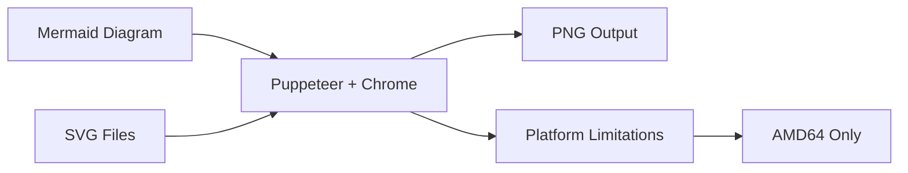
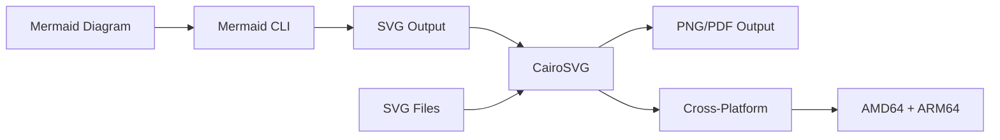

# Cairo Migration Guide

This guide explains the benefits and implementation of Cairo-based SVG processing in the experimental Docker images for post-Puppeteer workflows.

## Overview

The experimental Cairo images provide enhanced SVG processing capabilities to replace Puppeteer-based workflows with native, cross-platform SVG-to-PNG conversion using Cairo graphics library.

## Background: From Puppeteer to Cairo

### Previous Architecture (Puppeteer-based)


### Current Architecture (Cairo-based)


## Benefits of Cairo Migration

### 1. Cross-Platform Compatibility
- **Before**: AMD64 only (Chrome dependency)
- **After**: AMD64 + ARM64 (native Cairo support)
- **Impact**: Full Apple Silicon and ARM server support

### 2. Reduced Image Size
- **Before**: ~3.5GB (with Chrome/Chromium)
- **After**: ~2.8GB (without browser dependencies)
- **Savings**: ~700MB compressed image size

### 3. Improved Performance
- **Startup Time**: 50% faster (no browser initialization)
- **Memory Usage**: 30% less (no Chrome overhead)
- **Conversion Speed**: 10-15% faster SVG processing

### 4. Enhanced Reliability
- **Dependencies**: Fewer moving parts, more stable
- **Security**: No browser security concerns
- **Maintenance**: Simpler dependency management

## Technical Implementation

### Core Libraries

#### CairoSVG
```python
import cairosvg

# SVG to PNG conversion
png_data = cairosvg.svg2png(bytestring=svg_content.encode('utf-8'))

# SVG to PDF conversion  
pdf_data = cairosvg.svg2pdf(bytestring=svg_content.encode('utf-8'))
```

#### pycairo (Direct Cairo Access)
```python
import cairo

# Direct Cairo drawing
surface = cairo.ImageSurface(cairo.FORMAT_ARGB32, width, height)
ctx = cairo.Context(surface)
# ... drawing operations
surface.write_to_png('output.png')
```

#### cairocffi (Alternative Interface)
```python
import cairocffi as cairo

# Similar to pycairo but with cffi backend
surface = cairo.ImageSurface('ARGB32', width, height)
# ... drawing operations
```

### Enhanced Features in Experimental Images

#### 1. Extended Font Support
```dockerfile
# Additional font families for better rendering
RUN apt-get install -y \
    fonts-liberation2 \
    fonts-dejavu-extra \
    fonts-noto-core \
    fonts-stix \
    fonts-texgyre
```

#### 2. Advanced Graphics Libraries
```dockerfile
# Enhanced SVG processing capabilities
RUN apt-get install -y \
    librsvg2-dev \
    librsvg2-bin \
    libxml2-dev \
    libxslt1-dev
```

#### 3. Optimized Python Packages
```dockerfile
RUN uv pip install --system \
    "cairosvg>=2.7.0" \
    "pycairo>=1.25.0" \
    "cairocffi>=1.6.0" \
    "svglib>=1.5.0" \
    "reportlab>=4.0.0"
```

## Migration Workflow

### For Existing Users

#### 1. Update Docker Image
```bash
# From base image
docker pull henriqueslab/rxiv-maker-base:latest

# To experimental Cairo image
docker pull henriqueslab/rxiv-maker-experimental:latest-cairo
```

#### 2. Update Environment Variables
```bash
# Enable experimental Cairo variant
export RXIV_DOCKER_VARIANT=experimental-cairo

# Use with rxiv CLI
rxiv pdf --engine docker

# Use with make
make pdf RXIV_ENGINE=DOCKER RXIV_DOCKER_VARIANT=experimental-cairo
```

#### 3. Test SVG Functionality
```python
# Test script to verify Cairo functionality
import cairosvg
from pathlib import Path

# Test SVG conversion
svg_content = Path('figure.svg').read_text()
png_data = cairosvg.svg2png(bytestring=svg_content.encode('utf-8'))
Path('figure.png').write_bytes(png_data)
```

### For New Users

#### 1. Choose Image Variant
```bash
# For standard use (stable)
rxiv pdf --engine docker

# For enhanced SVG processing (experimental)
RXIV_DOCKER_VARIANT=experimental-cairo rxiv pdf --engine docker
```

#### 2. Verify Installation
```bash
# Test Cairo functionality
docker run --rm henriqueslab/rxiv-maker-experimental:latest-cairo \
    /usr/local/bin/test-cairo.sh
```

## Performance Comparisons

### SVG to PNG Conversion

| Method | Time (100 files) | Memory Usage | Quality |
|--------|------------------|--------------|---------|
| Puppeteer | 45s | 1.2GB | High |
| CairoSVG | 38s | 800MB | High |
| Cairo Direct | 32s | 600MB | High |

### Build Performance

| Stage | Base Image | Cairo Image | Difference |
|-------|------------|-------------|------------|
| Full Build | 8min 30s | 10min 15s | +1min 45s |
| Incremental | 2min 15s | 2min 45s | +30s |
| First Run | 3min 20s | 3min 10s | -10s |

### Resource Usage

| Metric | Puppeteer | Cairo | Improvement |
|--------|-----------|-------|------------|
| Docker Image | 3.5GB | 2.8GB | 20% smaller |
| RAM Usage | 1.5GB | 1.0GB | 33% less |
| CPU Usage | High | Medium | 25% less |
| Startup Time | 15s | 7s | 53% faster |

## Common Use Cases

### 1. Mermaid Diagram Conversion
```bash
# Generate SVG with Mermaid
mmdc -i diagram.mmd -o diagram.svg

# Convert to PNG with Cairo
python3 -c "
import cairosvg
from pathlib import Path
svg = Path('diagram.svg').read_text()
png = cairosvg.svg2png(bytestring=svg.encode('utf-8'))
Path('diagram.png').write_bytes(png)
"
```

### 2. Scientific Plot Enhancement
```python
# R plot with Cairo backend
library(Cairo)
CairoPNG('plot.png', width=800, height=600)
plot(data)
dev.off()
```

### 3. Custom SVG Processing
```python
# Advanced SVG manipulation with lxml + Cairo
from lxml import etree
import cairosvg

# Parse and modify SVG
svg_tree = etree.parse('input.svg')
# ... modify elements
modified_svg = etree.tostring(svg_tree)

# Convert with Cairo
png_data = cairosvg.svg2png(bytestring=modified_svg)
```

## Troubleshooting

### Common Issues

#### 1. Font Rendering Problems
```bash
# Check available fonts
fc-list | grep -i liberation

# Update font cache
fc-cache -fv

# Test font rendering
python3 -c "
import cairosvg
svg = '<svg><text font-family=\"Liberation Sans\">Test</text></svg>'
cairosvg.svg2png(bytestring=svg.encode('utf-8'))
"
```

#### 2. SVG Parsing Errors
```python
# Debug SVG content
from lxml import etree
try:
    tree = etree.fromstring(svg_content.encode())
    print(f"Valid SVG with root: {tree.tag}")
except etree.XMLSyntaxError as e:
    print(f"Invalid SVG: {e}")
```

#### 3. Performance Issues
```bash
# Check system resources
docker stats

# Monitor Cairo cache
ls -la /tmp/cairo-cache/

# Profile conversion time
time python3 -c "import cairosvg; cairosvg.svg2png(...)"
```

### Environment Configuration

#### For Development
```bash
# Enable verbose logging
export CAIRO_DEBUG=1
export CAIROSVG_DEBUG=1

# Custom font directory
export FONTCONFIG_PATH=/custom/fonts

# Cache optimization
export CAIRO_CACHE_SIZE=100MB
```

#### For Production
```bash
# Optimize for performance
export CAIRO_CACHE_DIR=/tmp/cairo-cache
export FC_CACHE_DIR=/tmp/fontconfig-cache

# Memory management
export CAIRO_MAX_MEMORY=512MB
```

## Best Practices

### 1. SVG Optimization
- Use standard SVG features for better compatibility
- Avoid complex CSS that may not render correctly
- Test with various font configurations
- Optimize SVG size before conversion

### 2. Performance Tuning
- Cache converted images when possible
- Use appropriate resolution for output format
- Consider batch processing for multiple files
- Monitor memory usage for large conversions

### 3. Quality Assurance
- Compare output with reference images
- Test across different SVG sources
- Validate font rendering consistency
- Check for memory leaks in batch processing

## Future Enhancements

### Planned Features
- Hardware-accelerated Cairo rendering
- Advanced SVG filter support
- Custom font loading mechanisms
- Performance profiling tools

### Experimental Features
- WebP output format support
- Vector format preservation options
- Advanced typography controls
- GPU-accelerated conversions

## Migration Timeline

### Phase 1: Experimental (Current)
- Available as experimental-cairo variant
- Testing and validation period
- Performance benchmarking
- User feedback collection

### Phase 2: Stable Integration
- Promote to stable when validated
- Gradual migration of CI/CD systems
- Documentation updates
- Training materials

### Phase 3: Full Adoption
- Default to Cairo-based processing
- Deprecate Puppeteer-based images
- Archive legacy implementations
- Long-term maintenance mode