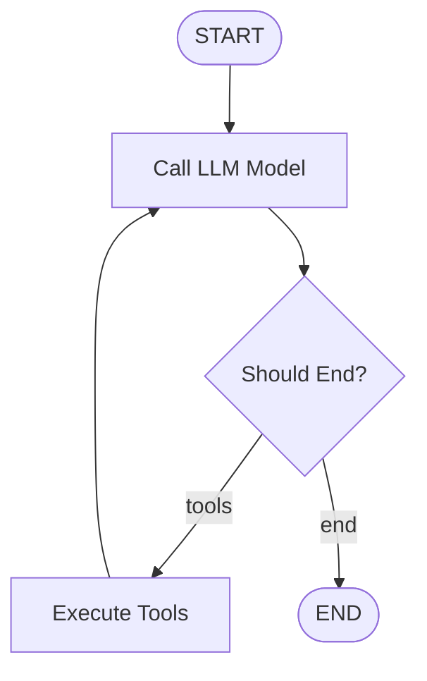

[](https://www.python.org/downloads/)


[](https://github.com/guolisen/simple_mcp_client/actions)

# Simple MCP Client

A simple command-line MCP (Model Context Protocol) client for testing MCP servers using Python. It supports chatting with various LLM providers and connecting to multiple MCP servers.

## Features

- Connect to multiple MCP servers (SSE and stdio protocols)
- Integrate with different LLM providers (Ollama, DeepSeek, OpenAI, OpenRouter)
- Interactive command-line interface with auto-completion
- Command-based tool execution
- Chat mode with LLM-driven tool execution
- Configurable via JSON configuration files

## ReAct Agent Integration

This branch introduces a ReAct (Reasoning and Acting) agent that enhances the chat functionality:

- **Intelligent Tool Reasoning**: The ReAct agent uses reasoning to determine which tools to use and when, enabling better tool chaining and multi-step problem solving
- **LangChain MCP Integration**: Seamless integration with LangChain's MultiServerMCPClient for improved tool management
- **Enhanced Chat Experience**: Clear visualization of agent reasoning and tool execution processes
- **Configurable Settings**: Customizable timeout and maximum iterations for agent operations



### Chat Command

The `chat` command has been significantly improved with the ReAct agent integration:

```bash
chat
```

Key enhancements to the chat command include:

- **LangGraph-powered reasoning**: Uses LangGraph's StateGraph to manage the agent's reasoning and tool execution flow
- **Real-time tool execution display**: Shows tool calls and results as they happen, with formatted output
- **Streaming responses**: Agent responses are streamed in real-time, providing immediate feedback
- **Improved error handling**: Better handling of timeouts and errors during tool execution
- **Context-aware conversations**: Maintains conversation context for more coherent multi-turn interactions
- **Automatic tool discovery**: Automatically discovers and makes available tools from all connected MCP servers

The chat command now displays a header with information about the agent, connected servers, and available tools:

```
┏━━━━━━━━━━━━━━━━━━━━━━━━━━━━━━━━━━━━━━━━━━━━━━━━━━━━━━━━━━━━━━━━━━━━━━━━━━━━━━━━━━━━━━━━━━━━━━━━━━━━┓
┃                                Enhanced MCP Chat with ReAct Agent                                 ┃
┡━━━━━━━━━━━━━━━━━━━━━━━━━━━━━━━━━━━━━━━━━━━━━━━━━━━━━━━━━━━━━━━━━━━━━━━━━━━━━━━━━━━━━━━━━━━━━━━━━━━━┩
│ ReAct Agent: openai/gpt-4-turbo                                                                  │
│ Connected Servers: k8s, weather                                                                  │
│ Available Tools: 15                                                                              │
│ Timeout: 60s                                                                                     │
│                                                                                                  │
│ The agent will use ReAct (Reasoning and Acting) to intelligently select and use tools.           │
│ Type exit to return to command mode.                                                             │
└──────────────────────────────────────────────────────────────────────────────────────────────────┘
```

### Chat Mode


### Execute Mode


## Installation

There are several ways to install the client:

### Using pip
```bash
pip install simple-mcp-client
```

### Using UV (recommended)

Install UV
```bash
curl -LsSf https://astral.sh/uv/install.sh | sh
```

```bash
uv venv
source .venv/bin/activate
python -m build
```

### Using pip with requirements.txt

```bash
python -m venv .venv
source .venv/bin/activate
pip install -r requirements.txt
pip install -e .
```

### Using pip directly

```bash
pip install -e .
```

### Using pip with pyproject.toml

```bash
pip install .
```

## Configuration

The client uses a configuration file to define LLM providers and MCP servers. The configuration file is stored in a platform-specific location:

- **Windows**: `%APPDATA%\simple_mcp_client\config.json`
- **Linux/macOS**: `~/.config/simple_mcp_client/config.json`

If the configuration file doesn't exist in the user's directory, the client will copy the default configuration from the package's `default_config.json` file and save it to the appropriate location.

Example configuration:

```json
{
  "llm": {
    "provider": "openai",
    "model": "claude-3-7-sonnet-20250219",
    "api_url": "https://api.gptoai.top/v1",
    "api_key": "",
    "other_params": {
      "temperature": 0.7,
      "max_tokens": 4096
    }
  },
  "mcpServers": {
    "k8s": {
      "type": "sse",
      "url": "http://192.168.182.128:8000/sse",
      "command": null,
      "args": [],
      "env": {}
    }
  },
  "default_server": "k8s"
}
```

## Usage

Start the client:

```bash
simple-mcp-client
```

Or run it directly:

```bash
python -m simple_mcp_client.main
```

## Available Commands

- `help`: Show help message
- `connect <server_name>`: Connect to an MCP server
- `disconnect <server_name>`: Disconnect from an MCP server
- `servers`: List available MCP servers
- `tools [server_name]`: List available tools, optionally from a specific server
- `resources [server_name]`: List available resources, optionally from a specific server
- `prompts [server_name]`: List available prompts, optionally from a specific server
- `formats [server_name]`: List available prompt formats, optionally from a specific server
- `execute <server_name> <tool_name> [arg1=val1 ...]`: Execute a specific tool with arguments
- `get-resource [server_name] <resource_uri>`: Get a resource from an MCP server
- `get-prompt [server_name] <prompt_name> [format=<format_name>] [arg1=val1 ...]`: Get a prompt from an MCP server
- `chat`: Start a chat session with the configured LLM and active MCP tools
- `config show`: Show current configuration
- `config llm <provider> [model=<model>] [api_url=<url>] [api_key=<key>] [param=value ...]`: Configure LLM provider
- `reload`: Reload configuration from file
- `exit`: Exit the program

## Command Examples

### Execute Command

The `execute` command runs a specific tool from an MCP server with provided arguments. The ReAct agent integration enhances this functionality by providing intelligent tool selection and reasoning in chat mode.

Execute a tool from a specific server:
```bash
execute k8s get_pod namespace=default name=my-pod
```

Execute a tool with multiple arguments:
```bash
execute weather get_forecast city="San Francisco" days=5
```

Execute a tool with JSON arguments:
```bash
execute github create_issue owner=octocat repo=hello-world title="Found a bug" body="I'm having a problem with this." labels=["bug","help wanted"]
```

Get help information for a specific tool by using the `help` parameter:
```bash
execute tavily tavily-extract help
```

Output example for help:
```
╭─────────────────────────────────────────────────────────────────────────────── Tool Help ───────────────────────────────────────────────────────────────────────────────╮
│           Server │ tavily                                                                                                                                               │
│             Tool │ tavily-extract                                                                                                                                       │
│      Description │ A powerful web content extraction tool that retrieves and processes raw content from specified URLs, ideal for data collection, content analysis,    │
│                  │ and research tasks.                                                                                                                                  │
│                  │ ───────────────────────────────────────────────────────────────────────────────────────────────────────────────────────────────────────────────────… │
│       Parameters │                                                                                                                                                      │
│                  │ Parameter        Type      Required   Description                                                                                                    │
│                  │ ──────────────────────────────────────────────────────────────────────────────────────────────────────────────────────────────────────────────────── │
│                  │ urls             array     Yes        List of URLs to extract content from                                                                           │
│                  │ extract_depth    string    No         Depth of extraction - 'basic' or 'advanced', if usrls are linkedin use 'advanced' or if explicitly told to use │
│                  │                                       advanced                                                                                                       │
│                  │ include_images   boolean   No         Include a list of images extracted from the urls in the response                                               │
│                  │ ───────────────────────────────────────────────────────────────────────────────────────────────────────────────────────────────────────────────────… │
│    Example Usage │                                                                                                                                                      │
│                  │ execute tavily tavily-extract urls=item1 extract_depth=basic include_images=true                                                                     │
│                  │ ───────────────────────────────────────────────────────────────────────────────────────────────────────────────────────────────────────────────────… │
│             Note │                                                                                                                                                      │
│                  │ For string parameters with spaces, enclose the value in quotes:                                                                                      │
│                  │   param="value with spaces"                                                                                                                          │
│                  │                                                                                                                                                      │
│                  │ Example: query="latest news about AI"                                                                                                                │
╰─────────────────────────────────────────────────────────────────────────────────────────────────────────────────────────────────────────────────────────────────────────╯
```

The output will be displayed in a formatted way, showing the tool name, arguments, and results.

### Resources Command

The `resources` command lists available resources and resource templates from connected MCP servers.

List all resources from all connected servers:
```bash
resources
```

List resources from a specific server:
```bash
resources k8s
```

Output example:
```
             Resources from k8s - Direct Resources             
┏━━━━━━━━━━━━━━━━━━┳━━━━━━━━━━━━━━━━━━━━━━━┳━━━━━━━━━━━━━━━━━━┓
┃ URI              ┃ Name                  ┃ MIME Type        ┃
┡━━━━━━━━━━━━━━━━━━╇━━━━━━━━━━━━━━━━━━━━━━━╇━━━━━━━━━━━━━━━━━━┩
│ k8s://namespaces │ Kubernetes Namespaces │ application/json │
│ k8s://resources  │ Kubernetes Resources  │ application/json │
└──────────────────┴───────────────────────┴──────────────────┘
                           Resources from k8s - Resource Templates                           
┏━━━━━━━━━━━━━━━━━━━━━━━━━━━━━━━━━━━━━━━━━━┳━━━━━━━━━━━━━━━━━━━━━━━━━━━━━━━━┳━━━━━━━━━━━━━━━┓
┃ URI Template                             ┃ Name                           ┃ MIME Type     ┃
┡━━━━━━━━━━━━━━━━━━━━━━━━━━━━━━━━━━━━━━━━━━╇━━━━━━━━━━━━━━━━━━━━━━━━━━━━━━━━╇━━━━━━━━━━━━━━━┩
│ k8s:///{namespace}                       │ Namespace Overview             │ Not specified │
│ k8s:///{resource_type}                   │ Cluster-Scoped Resources       │ Not specified │
│ k8s:///{resource_type}/{name}            │ Cluster-Scoped Resource        │ Not specified │
│ k8s://{namespace}/{resource_type}        │ Resources by Type in Namespace │ Not specified │
│ k8s://{namespace}/{resource_type}/{name} │ Namespaced Resource            │ Not specified │
└──────────────────────────────────────────┴────────────────────────────────┴───────────────┘
```

### Prompts Command

The `prompts` command lists available prompts from connected MCP servers.

List all prompts from all connected servers:
```bash
prompts
```

List prompts from a specific server:
```bash
prompts k8s
```

Output example:
```
┏━━━━━━━━━━━━━━━━━━━━━━━━━━━━━━━━━━━━━━━━━━━━━━━━━━━━━━┓
┃                All Available Prompts                 ┃
┡━━━━━━━━━━━━━━━━━━━━━━━━━━━━━━━━━━━━━━━━━━━━━━━━━━━━━━┩
│ Name               │ Description                     │
│ k8s-describe       │ Describe Kubernetes resources   │
│ k8s-troubleshoot   │ Troubleshoot Kubernetes issues  │
└────────────────────┴─────────────────────────────────┘
```

### Get-Resource Command

The `get-resource` command retrieves a resource from an MCP server.

Get a resource from any server that has it:
```bash
get-resource k8s://pods/default
```

Get a resource from a specific server:
```bash
get-resource k8s k8s://pods/default
```

### Get-Prompt Command

The `get-prompt` command retrieves a prompt from an MCP server, with optional formatting and arguments.

Get a prompt from any server that has it:
```bash
get-prompt k8s-describe
```

Get a prompt from a specific server:
```bash
get-prompt k8s k8s-describe
```

Get a prompt with a specific format:
```bash
get-prompt k8s-describe format=markdown
```

Get a prompt with arguments:
```bash
get-prompt k8s k8s-describe namespace=default resource=pod name=my-pod
```

## Environment Variables

- `MCP_LOG_LEVEL`: Set logging level (default: INFO)
- `OPENAI_API_KEY`: OpenAI API key (for OpenAI provider or LiteLLM with OpenAI models)
- `DEEPSEEK_API_KEY`: DeepSeek API key (for DeepSeek provider)
- `OPENROUTER_API_KEY`: OpenRouter API key (for OpenRouter provider)
- `ANTHROPIC_API_KEY`: Anthropic API key (for LiteLLM with Anthropic models)
- `GOOGLE_API_KEY`: Google API key (for LiteLLM with Google models)
- `MISTRAL_API_KEY`: Mistral API key (for LiteLLM with Mistral models)
- `COHERE_API_KEY`: Cohere API key (for LiteLLM with Cohere models)
- `AZURE_API_KEY`: Azure API key (for LiteLLM with Azure models)

## Recommended Models

We recommend using large models that support MCP calls, such as Qwen3 or Grok3, Grok4.

## LLM Providers

The client supports the following LLM providers:

- **Ollama**: Local LLM provider for running open-source models locally
- **OpenAI**: API-based LLM provider for accessing OpenAI's models
- **DeepSeek**: API-based LLM provider for accessing DeepSeek's models
- **OpenRouter**: API-based LLM provider that routes requests to multiple LLM backends, providing access to a wide range of models from different providers through a unified API
- **LiteLLM**: A unified API for various LLM providers (OpenAI, Anthropic, Google, Azure, etc.) with support for fallback models, load balancing, and more

### Provider-Specific Configuration

#### DeepSeek

DeepSeek requires an API key which can be provided either in the configuration file or as an environment variable (`DEEPSEEK_API_KEY`). The default API URL is `https://api.deepseek.com/v1`.

#### OpenRouter

OpenRouter requires an API key which can be provided either in the configuration file or as an environment variable (`OPENROUTER_API_KEY`). The default API URL is `https://openrouter.ai/api/v1`. 

OpenRouter supports additional parameters such as:

- `http_referer`: The HTTP referer to use when making requests (default: "https://github.com/simple_mcp_client")
- `app_name`: The name of the application to use when making requests (default: "Simple MCP Client")

#### LiteLLM

LiteLLM provides a unified interface to many different LLM providers. It supports models from OpenAI, Anthropic, Google, Azure, Mistral, Cohere, and more. The model name should be specified using the provider's format, optionally with a provider prefix.

Example configurations:

```json
{
  "llm": {
    "provider": "litellm",
    "model": "anthropic/claude-3-opus-20240229",
    "api_key": "YOUR_ANTHROPIC_API_KEY",
    "other_params": {
      "temperature": 0.7,
      "max_tokens": 4096,
      "request_timeout": 60.0
    }
  }
}
```

For OpenAI models:

```json
{
  "llm": {
    "provider": "litellm",
    "model": "gpt-4-turbo",
    "api_key": "YOUR_OPENAI_API_KEY",
    "other_params": {
      "temperature": 0.7
    }
  }
}
```

LiteLLM will automatically look for the appropriate API key in environment variables based on the provider specified in the model name:

- `OPENAI_API_KEY`: For OpenAI models
- `ANTHROPIC_API_KEY`: For Anthropic models
- `GOOGLE_API_KEY`: For Google models
- `MISTRAL_API_KEY`: For Mistral models
- `COHERE_API_KEY`: For Cohere models
- `AZURE_API_KEY`: For Azure models

You can also provide the API key directly in the configuration.

LiteLLM supports additional parameters such as:

- `request_timeout`: Timeout for API requests in seconds
- `fallbacks`: List of fallback models to try if the primary model fails
- `cache`: Enable response caching

## License

MIT
