# 🚀 Tektii Strategy SDK

<div align="center">

[](https://www.python.org/downloads/)
[](LICENSE)
[](https://github.com/tektii/tektii-strategy-sdk-python/actions)
[](https://github.com/psf/black)
[](https://docs.tektii.com)

**Build, validate, and deploy containerized trading strategies with confidence**

[🏁 Quick Start](#-quick-start) • [📖 Documentation](https://docs.tektii.com) • [💬 Community](https://github.com/tektii/tektii-strategy-sdk/discussions) • [🐛 Report Bug](https://github.com/tektii/tektii-strategy-sdk/issues)

</div>

---

## 📋 Table of Contents

- [✨ Features](#-features)
- [🔧 Prerequisites](#-prerequisites)
- [📦 Installation](#-installation)
- [🏁 Quick Start](#-quick-start)
- [🔍 How It Works](#-how-it-works)
- [✅ Strategy Validation](#-strategy-validation)
- [🎯 Strategy Development](#-strategy-development)
- [🔌 Simulated APIs](#-simulated-apis)
- [💡 Best Practices](#-best-practices)
- [🛠️ Development Setup](#️-development-setup)
- [🧪 Testing](#-testing)
- [🚢 Deployment](#-deployment)
- [🔧 Troubleshooting](#-troubleshooting)
- [🤝 Contributing](#-contributing)
- [📞 Support](#-support)
- [🗺️ Roadmap](#️-roadmap)
- [📄 License](#-license)

## ✨ Features

- **🏗️ Event-driven Architecture**: Synchronous event processing with guaranteed order execution
- **🔄 Simulated Trading APIs**: Built-in support for popular trading APIs (IB, MetaTrader, Alpaca - coming soon)
- **🛡️ Type Safety**: Full type hints and Pydantic models for configuration
- **🧩 Flexible Strategy Development**: Easy-to-use base classes for custom strategies
- **📊 Multi-asset Support**: Trade across multiple instruments within a single strategy
- **✅ Built-in Validation**: Comprehensive validation system to ensure strategies are production-ready
- **🐳 Docker Support**: Containerized deployment for consistent execution
- **📈 Performance Monitoring**: Track strategy performance and metrics

## 🔧 Prerequisites

Before you begin, ensure you have:

- **Python 3.8+** 🐍
- **pip** package manager 📦
- **make** (optional, but recommended) 🛠️
- **Docker** ((or similar) for containerized deployment) 🐳

## 📦 Installation

### Quick Install

```bash
pip install tektii-strategy-sdk
```

### Development Install

For contributing or modifying the SDK:

```bash
git clone https://github.com/tektii/tektii-strategy-sdk-python.git
cd tektii-strategy-sdk
make setup
```

## 🏁 Quick Start

### Step 1: Create Your First Strategy

```python
from tektii_sdk import Strategy, StrategyConfig
from tektii_sdk.strategy import MarketData

class MyFirstStrategy(Strategy):
    """A simple moving average crossover strategy"""

    def on_start(self):
        """Initialize your strategy"""
        self.log("🚀 Strategy started!")
        self.prices = []
        self.ma_period = self.config.parameters.get("ma_period", 20)

    def on_market_data(self, data: MarketData):
        """Process incoming market data"""
        self.prices.append(data.last)

        if len(self.prices) > self.ma_period:
            self.prices.pop(0)
            ma = sum(self.prices) / len(self.prices)

            if data.last > ma * 1.02:  # 2% above MA
                self.buy(data.symbol, 10)
            elif data.last < ma * 0.98:  # 2% below MA
                self.sell(data.symbol, 10)
```

### Step 2: Validate Your Strategy ✅

**Always validate before deployment!**

```bash
# Basic validation
tektii validate my_strategy.py MyFirstStrategy

# Validate with custom configuration
tektii validate my_strategy.py MyFirstStrategy --config config.json

# Get detailed validation report
tektii validate my_strategy.py MyFirstStrategy --verbose
```

### Step 3: Deploy to Tektii Platform 🚀

```bash
# Set up credentials
export TEKTII_API_KEY="your-api-key"
export TEKTII_STRATEGY_ID="your-strategy-id"

# Push your strategy
tektii push my_strategy.py MyFirstStrategy

# Or save credentials for future use
tektii push my_strategy.py MyFirstStrategy --save-config
```

## 🔍 How It Works

```mermaid
graph LR
    A[📝 Write Strategy] --> B[✅ Validate]
    B --> C[🧪 Test Locally]
    C --> D[🐳 Containerize]
    D --> E[🚀 Deploy to Tektii]
    E --> F[📊 Monitor Performance]

    style B fill:#90EE90
```

<div align="center">



</div>

1. **Write** your strategy extending the base `Strategy` class
2. **Validate** using the built-in validator to ensure compatibility
3. **Deploy** to the Tektii platform for backtesting
4. **Monitor** performance and adjust parameters

## ✅ Strategy Validation

The SDK includes a **comprehensive validation system** that checks your strategy before deployment:

### What Gets Validated?

#### 🏗️ Structure Checks
- ✓ Correct inheritance from `Strategy` base class
- ✓ Implementation of required methods (`on_start`, `on_market_data`)
- ✓ Proper method signatures

#### ⚡ Runtime Checks
- ✓ Strategy instantiation
- ✓ Initialization without errors
- ✓ Market data processing
- ✓ Order placement functionality

#### 📊 Quality Checks
- ✓ Error handling capabilities
- ✓ Performance characteristics (events/second)
- ✓ Memory usage patterns
- ✓ Input data validation

### Validation Output Example

```
✅ Strategy validation PASSED

Performance Metrics:
  • Events per second: 125
  • Memory usage: 12.3 MB
  • Initialization time: 0.03s

Warnings:
  ⚠️  Consider adding error handling for network failures

Strategy Details:
  • Name: MyFirstStrategy
  • Version: 1.0.0
  • Compatible: ✓
```

### Common Validation Errors and Solutions

<details>
<summary>❌ "Does not inherit from Strategy"</summary>

```python
# Wrong
class MyStrategy:
    pass

# Correct ✓
from tektii_sdk import Strategy

class MyStrategy(Strategy):
    pass
```
</details>

<details>
<summary>❌ "on_market_data is not implemented"</summary>

```python
# Wrong
class MyStrategy(Strategy):
    def on_start(self):
        pass

# Correct ✓
class MyStrategy(Strategy):
    def on_start(self):
        pass

    def on_market_data(self, data):
        # Process market data
        pass
```
</details>

<details>
<summary>❌ "Failed to initialize strategy"</summary>

```python
# Wrong - KeyError if parameter missing
def __init__(self, config):
    super().__init__(config)
    self.threshold = config.parameters["threshold"]

# Correct ✓ - Handle missing parameters
def __init__(self, config):
    super().__init__(config)
    self.threshold = config.parameters.get("threshold", 100.0)
```
</details>

## 🎯 Strategy Development

### Available Event Handlers

```python
class AdvancedStrategy(Strategy):
    def on_start(self):
        """Called once when strategy starts"""
        self.initialize_indicators()

    def on_market_data(self, data: MarketData):
        """Called for each market data update"""
        self.update_indicators(data)
        self.check_signals(data)

    def on_order_update(self, order):
        """Called when order status changes"""
        self.log(f"Order {order.id}: {order.status}")

    def on_position_update(self, position):
        """Called when position changes"""
        self.track_pnl(position)

    def on_stop(self):
        """Called when strategy stops"""
        self.cleanup()
```

### State Management

```python
class StatefulStrategy(Strategy):
    def on_start(self):
        # Initialize state
        self.positions = {}
        self.pending_orders = set()
        self.indicators = {
            'rsi': deque(maxlen=14),
            'ma_fast': deque(maxlen=10),
            'ma_slow': deque(maxlen=30)
        }
        self.daily_pnl = 0.0
```

## 🔌 Simulated APIs

### Interactive Brokers (IB) Style API

```python
from tektii_sdk.apis import SimulatedIB
from tektii_sdk.apis.ib import Contract, IBOrder

class IBStrategy(Strategy):
    def __init__(self, config, ib_api):
        super().__init__(config)
        self.ib = ib_api

        # Register IB-style callbacks
        self.ib.pendingTickersEvent(self.on_tickers)
        self.ib.orderStatusEvent(self.on_order_status)

    def on_start(self):
        self.ib.connect()

        # Subscribe to market data
        for symbol in self.config.symbols:
            contract = Contract(symbol=symbol)
            self.ib.reqMktData(contract)

    def on_tickers(self, tickers):
        for ticker in tickers:
            if self.should_buy(ticker):
                contract = ticker['contract']
                order = IBOrder.marketOrder("BUY", 10)
                self.ib.placeOrder(contract, order)
```

### Coming Soon 🚧
- MetaTrader API
- Alpaca API
- Custom API adapters

## 💡 Best Practices

### 1. Robust Error Handling

```python
def on_market_data(self, data: MarketData):
    try:
        self.process_tick(data)
    except Exception as e:
        self.log(f"Error processing tick: {e}", level="error")
        # Don't let errors crash the strategy
        self.handle_error(e)
```

### 2. Parameter Validation

```python
def on_start(self):
    # Validate parameters with defaults
    self.lookback = self.config.parameters.get("lookback", 20)
    if self.lookback < 2:
        raise ValueError("Lookback period must be at least 2")

    self.position_size = self.config.parameters.get("position_size", 100)
    if self.position_size <= 0:
        raise ValueError("Position size must be positive")
```

### 3. Efficient Data Structures

```python
from collections import deque

def on_start(self):
    # Use deque for sliding windows
    self.price_window = deque(maxlen=self.lookback)
    self.volume_window = deque(maxlen=self.lookback)

    # Pre-allocate arrays for performance
    self.signals = np.zeros(1000)
```

### 4. Logging and Monitoring

```python
def on_market_data(self, data: MarketData):
    # Log important events
    if self.should_trade(data):
        self.log(f"Signal detected for {data.symbol} at {data.last}")

    # Track metrics
    self.metrics['ticks_processed'] += 1
    if self.metrics['ticks_processed'] % 1000 == 0:
        self.log(f"Processed {self.metrics['ticks_processed']} ticks")
```

## 🛠️ Development Setup

### Option 1: Automated Setup (Recommended) 🚀

```bash
git clone https://github.com/tektii/tektii-strategy-sdk.git
cd tektii-strategy-sdk
make setup         # Complete setup for first-time users
# OR
make setup-dev     # Setup with development dependencies
```

### Option 2: Manual Setup 📝

<details>
<summary>Click to expand manual setup instructions</summary>

```bash
# Create virtual environment
python -m venv venv
source venv/bin/activate  # On Windows: venv\Scripts\activate

# Install dependencies
pip install -r requirements.txt
pip install grpcio-tools

# Pull and generate proto files
python proto/pull_proto.py
python -m grpc_tools.protoc -Iproto --python_out=tektii_sdk/proto --grpc_python_out=tektii_sdk/proto proto/strategy.proto

# Fix imports
sed -i 's/import strategy_pb2/from . import strategy_pb2/' tektii_sdk/proto/*_grpc.py

# Install package in development mode
pip install -e .
```
</details>

### Verify Installation ✅

```bash
# Run tests
pytest tests/

# Check CLI
tektii --help

# Validate example strategy
tektii validate examples/simple_ma_strategy.py SimpleMAStrategy

# Push example strategy (requires API credentials)
tektii push examples/simple_ma_strategy.py SimpleMAStrategy
```

## 🧪 Testing

### Unit Testing Your Strategy

```python
# tests/test_my_strategy.py
import pytest
from my_strategy import MyStrategy
from tektii_sdk import StrategyConfig
from tektii_sdk.testing import StrategyTester

def test_strategy_initialization():
    config = StrategyConfig(
        name="TestStrategy",
        symbols=["TEST-USD"],
        initial_capital=10000
    )
    strategy = MyStrategy(config)
    assert strategy.config.initial_capital == 10000

def test_strategy_signals():
    tester = StrategyTester(MyStrategy)
    tester.feed_data([
        {"symbol": "TEST-USD", "last": 100},
        {"symbol": "TEST-USD", "last": 110},
    ])
    assert len(tester.get_orders()) > 0
```

### Running Tests

```bash
# Run all tests
make test

# Run with coverage
make test-coverage

# Run specific test
pytest tests/test_my_strategy.py::test_strategy_signals -v
```

## 🚢 Deployment

Deploy your strategies to the Tektii platform with the `tektii push` command.

### Prerequisites

- Docker installed and running
- Tektii account with API key
- Strategy ID from the Tektii web console

### Configuration

Set up your credentials using environment variables or a config file:

```bash
# Option 1: Environment variables
export TEKTII_API_KEY="your-api-key"
export TEKTII_STRATEGY_ID="your-strategy-id"

# Option 2: Config file (~/.tektii/config.json)
{
  "api_key": "your-api-key",
  "strategy_id": "your-strategy-id"
}
```

### Pushing Your Strategy

```bash
# Basic push
tektii push my_strategy.py MyStrategy

# Push and save configuration
tektii push my_strategy.py MyStrategy --save-config

### What Happens During Push

1. **Validation** - Strategy is validated locally
2. **Git SHA** - Current commit SHA is captured (if in Git repo)
3. **Version Creation** - New version created via API
4. **Docker Build** - Container image built (creates Dockerfile if needed)
5. **Registry Push** - Image pushed to private registry
6. **Ready** - Strategy available for backtesting

### Docker Support

If no Dockerfile exists, a default one is created with:
- Python 3.11 slim base image
- Non-root user for security
- Automatic dependency installation
- Platform optimization (linux/amd64)

## 🔧 Troubleshooting

### Common Issues and Solutions

<details>
<summary>📛 ModuleNotFoundError: No module named 'grpc_tools'</summary>

```bash
pip install grpcio-tools
```
</details>

<details>
<summary>📛 Import errors with proto files</summary>

```bash
make clean
make proto
# OR manually:
python -m grpc_tools.protoc -Iproto --python_out=tektii_sdk/proto --grpc_python_out=tektii_sdk/proto proto/strategy.proto
```
</details>

<details>
<summary>📛 Strategy validation fails</summary>

1. Check inheritance: `class MyStrategy(Strategy)`
2. Implement required methods: `on_start()` and `on_market_data()`
3. Handle missing parameters with defaults
4. Run with `--verbose` for detailed error messages
</details>

<details>
<summary>📛 Permission errors on Unix/Linux</summary>

```bash
chmod +x setup.sh
sudo make install  # If installing globally
```
</details>

<details>
<summary>📛 Docker not found during push</summary>

```bash
# Install Docker: https://docs.docker.com/get-docker/
# Ensure Docker daemon is running
docker --version
```
</details>

<details>
<summary>📛 Authentication failed during push</summary>

1. Verify API key is correct
2. Check if key has expired
3. Ensure strategy ID matches one in web console
</details>

## 🤝 Contributing

We love contributions! 💖 Please see our [Contributing Guide](CONTRIBUTING.md) for details.

1. Fork the repository
2. Create a feature branch (`git checkout -b feature/amazing-feature`)
3. Commit your changes (`git commit -m '✨ Add amazing feature'`)
4. Push to the branch (`git push origin feature/amazing-feature`)
5. Open a Pull Request

### Development Commands

```bash
make format     # Format code with black
make lint       # Run linting checks
make test       # Run test suite
```

## 📞 Support

Need help? We're here for you!

- 📖 **Documentation**: [docs.tektii.com](https://docs.tektii.com)
- 💬 **Discussions**: [GitHub Discussions](https://github.com/tektii/tektii-strategy-sdk/discussions)
- 🐛 **Issues**: [GitHub Issues](https://github.com/tektii/tektii-strategy-sdk/issues)
- 📧 **Email**: support@tektii.com
- 💰 **Trading Community**: [Discord](https://discord.gg/tektii)


## 📄 License

This project is licensed under the MIT License - see the [LICENSE](LICENSE) file for details.

---

<div align="center">

**Built with ❤️ by the Tektii Team**

[🌟 Star us on GitHub](https://github.com/tektii/tektii-strategy-sdk) • [🐦 Follow on Twitter](https://twitter.com/tektii) • [🏢 Visit tektii.com](https://tektii.com)

</div>
