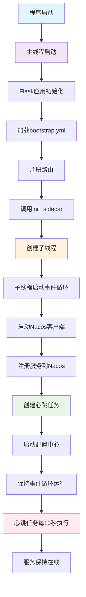
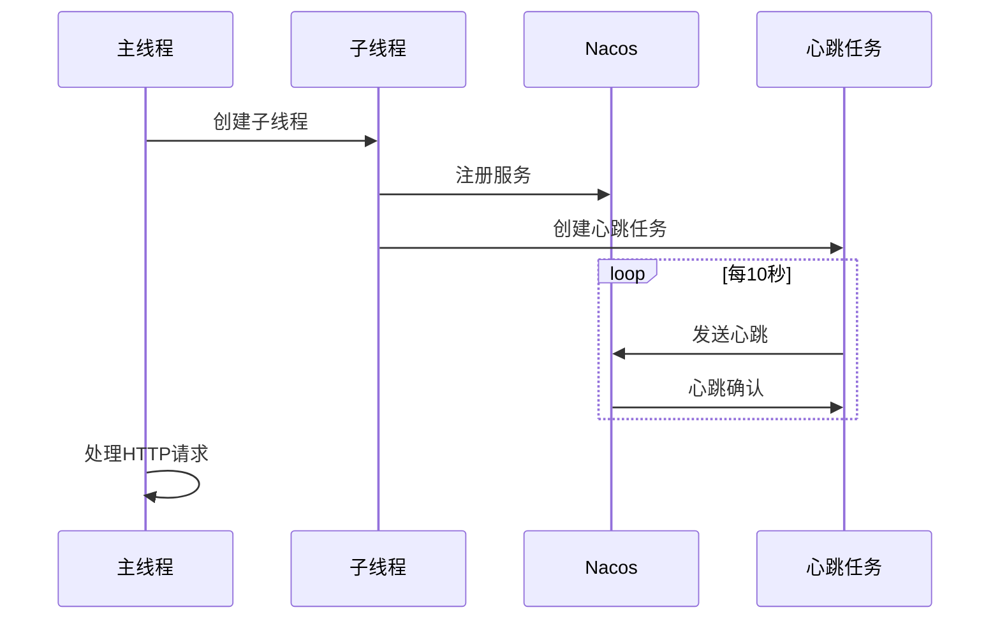
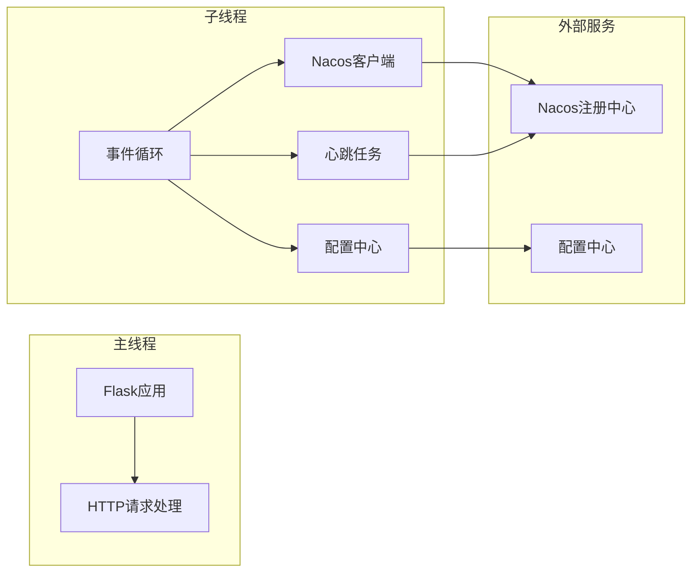

# Ultra Pass Sidecar

> 功能描述: sidecar库文档，包含API说明、安装指南、使用示例、异构服务支持等  
> @author: lzg  
> @created: 2025-07-01 15:47:21  
> @version: 1.0.0  

Ultra Pass Python Sidecar 是一个简洁的Python微服务sidecar库，支持自动注册到Nacos和Feign风格调用。

## 功能特性

- ✅ **自动服务注册**：一键注册到Nacos服务发现中心
- ✅ **Feign风格调用**：类似Java Feign的简洁客户端调用
- ✅ **异构服务支持**：支持调用Java、Python等不同语言的服务
- ✅ **配置中心支持**：自动从Nacos配置中心拉取配置
- ✅ **心跳保活**：自动心跳机制，保持服务在线
- ✅ **优雅关闭**：支持信号处理，优雅注销服务
- ✅ **多框架支持**：支持Flask、FastAPI等主流框架

## 快速开始

### 1. 安装依赖

#### 方式一：安装所有依赖（推荐）
```bash
pip install ultra-paas-sidecar==0.0.14
```

#### 方式二：从源码安装
```bash
git clone https://github.com/****/ultra-pass-py-sidecar.git
cd ultra-pass-py-sidecar/ultra_pass_sidecar
pip install -e .
```

### 2. 配置文件

创建 `bootstrap.yml`：

```yaml
server:
  port: 9202

application:
  name: python-test-server

profiles:
  active: dev

cloud:
  nacos:
    discovery:
      server-addr: 49.233.171.89:8848
      ip: 10.12.6.236
    config:
      server-addr: 49.233.171.89:8848
      file-extension: yml
      shared-configs:
        - application-${spring.profiles.active}.${spring.cloud.nacos.config.file-extension}
```

### 3. 服务端使用

```python
from flask import Flask
from ultra_pass_sidecar import init_sidecar, config_local, config_remote

app = Flask(__name__)

@app.route('/api/hello/<name>')
def hello(name):
    return {'message': f'Hello, {name}!'}

if __name__ == '__main__':
    # 一行代码启动sidecar
    init_sidecar(app) 
    
    # 从本地读取端口
    port = config_local('server.port', 9202)
    
    # 从配置中心读取其他配置
    redis_host = config_remote('spring.data.redis.host', 'localhost')
    app.run(host='0.0.0.0', port=port, debug=True)
```

### 4. 客户端使用

```python
import asyncio
from ultra_pass_sidecar import feign, get

@feign("python-test-server")
class HelloService:
    @get("/api/hello/{name}")
    async def hello(self, name: str):
        pass

async def main():
    service = HelloService()
    result = await service.hello("World")
    print(result)

if __name__ == '__main__':
    asyncio.run(main())
```

### 5. 多框架支持示例

#### Flask应用
```python
from flask import Flask
from ultra_pass_sidecar import init_sidecar

app = Flask(__name__)

@app.route('/api/users/<user_id>')
def get_user(user_id):
    return {'user_id': user_id, 'name': f'User{user_id}'}

if __name__ == '__main__':
    init_sidecar(app)  # 自动设置权限拦截器
    app.run(host='0.0.0.0', port=9202)
```

#### FastAPI应用
```python
from fastapi import FastAPI
from ultra_pass_sidecar import init_sidecar

app = FastAPI()

@app.get("/api/users/{user_id}")
async def get_user(user_id: int):
    return {'user_id': user_id, 'name': f'User{user_id}'}

if __name__ == '__main__':
    init_sidecar(app)  # 自动设置权限拦截器
    import uvicorn
    uvicorn.run(app, host='0.0.0.0', port=9202)
```

#### Django应用
```python
# settings.py
INSTALLED_APPS = [
    # ... 其他应用
    'ultra_pass_sidecar',
]

# views.py
from django.http import JsonResponse
from ultra_pass_sidecar import init_sidecar

def get_user(request, user_id):
    return JsonResponse({'user_id': user_id, 'name': f'User{user_id}'})

# 在Django启动时初始化
init_sidecar()
```

## 系统架构

### 线程架构图



### 并行执行时序图



### 系统组件图



## API 参考

### 核心函数

#### `init_sidecar()`
初始化sidecar，自动注册服务到Nacos。

#### `feign(service_name: str)`
定义Feign客户端的装饰器。

#### `get(path: str)` / `post(path: str)`
HTTP请求装饰器。

#### `config_remote(config_key: str, default: Any = None)`
从Nacos配置中心获取配置值。

#### `config_local(config_key: str, default: Any = None)`
从本地bootstrap.yml获取配置值。

### 配置说明

| 配置项 | 说明 | 示例 |
|--------|------|------|
| `server.port` | 服务端口 | `9202` |
| `application.name` | 服务名称 | `python-test-server` |
| `cloud.nacos.discovery.server-addr` | Nacos地址 | `49.233.171.89:8848` |
| `cloud.nacos.discovery.ip` | 服务IP | `10.12.6.236` |

### 权限配置

```yaml
# 权限配置
auth:
  enabled: true     # 是否开启权限检查
  fail_open: false  # 容错机制，权限服务失败时的行为
  exclude_paths:    # 排除权限检查的路径
    - /api/hello
    - /api/health
    - /static
  timeout: 5000     # 权限检查超时时间(毫秒)
```

**Token获取方式：**
- **Authorization头**：`Authorization: Bearer <token>`
- **Cookie**：`token=<token>`, `access_token=<token>`
- **URL参数**：`?token=<token>`, `?access_token=<token>`
- **自定义头**：`X-Auth-Token: <token>`, `X-Token: <token>`

## 心跳机制

- **心跳间隔**：10秒
- **超时时间**：90秒（3次心跳失败后下线）
- **自动重连**：心跳失败时自动重试
- **优雅关闭**：程序退出时自动注销服务

## 技术栈

### 核心依赖
- **Python 3.8+** - 编程语言
- **Flask** - Web框架
- **aiohttp** - 异步HTTP客户端
- **PyYAML** - YAML配置文件解析
- **asyncio** - 异步编程支持
- **requests** - HTTP客户端库
- **python-dotenv** - 环境变量管理

### Flask生态系统
- **Flask** - 轻量级Web框架
- **Jinja2** - 模板引擎
- **Werkzeug** - WSGI工具库
- **Gunicorn** - 生产级WSGI服务器
- **uWSGI** - 高性能WSGI服务器
- **Gevent** - 异步网络库
- **Eventlet** - 网络应用框架
- **Flask-CORS** - 跨域资源共享

### 支持的Web框架
- **Flask** - 轻量级Web框架
- **FastAPI** - 现代高性能Web框架
- **Starlette** - ASGI框架
- **Uvicorn** - ASGI服务器
- **Django** - 全功能Web框架
- **Gunicorn** - WSGI服务器
- **Tornado** - 异步Web框架

### 可选依赖
- **SQLAlchemy** - ORM框架
- **Redis** - 缓存数据库
- **Prometheus** - 监控指标
- **Structlog** - 结构化日志
- **Pydantic** - 数据验证
- **Rich** - 终端美化
- **Click/Typer** - 命令行工具

### 开发工具
- **Pytest** - 测试框架
- **Black** - 代码格式化
- **Flake8** - 代码检查
- **MyPy** - 类型检查

## 安装选项

### 完整安装（推荐）
```bash
pip install ultra-paas-sidecar
```
包含所有依赖，支持所有功能。

## 部署和运维

### 生产环境部署

#### 使用Gunicorn部署Flask应用
```bash
# 安装Gunicorn
pip install gunicorn

# 启动应用
gunicorn -w 4 -b 0.0.0.0:9202 --worker-class gevent demo_server:app
```

#### 使用uWSGI部署
```bash
# 安装uWSGI
pip install uwsgi

# 启动应用
uwsgi --http 0.0.0.0:9202 --wsgi-file demo_server.py --callable app --workers 4
```

#### 使用Docker部署
```dockerfile
FROM python:3.9-slim

WORKDIR /app
COPY requirements.txt .
RUN pip install -r requirements.txt

COPY . .
EXPOSE 9202

CMD ["python", "demo_server.py"]
```

### 监控和日志

#### 健康检查
```bash
# 检查服务状态
curl http://localhost:9202/health

# 检查Nacos注册状态
curl http://localhost:8848/nacos/v1/ns/instance/list?serviceName=python-test-server
```

#### 日志配置
```python
import logging
from ultra_pass_sidecar import init_sidecar

# 配置日志
logging.basicConfig(
    level=logging.INFO,
    format='%(asctime)s - %(name)s - %(levelname)s - %(message)s'
)

# 启动sidecar
init_sidecar(app)
```

## 注意事项

1. **端口配置**：确保bootstrap.yml中的端口未被占用
2. **网络连接**：确保能访问Nacos服务器
3. **IP配置**：生产环境需要配置正确的服务IP
4. **心跳监控**：观察日志中的心跳信息确认服务在线
5. **权限配置**：生产环境建议启用权限检查
6. **跨域配置**：前端调用时可能需要配置CORS
