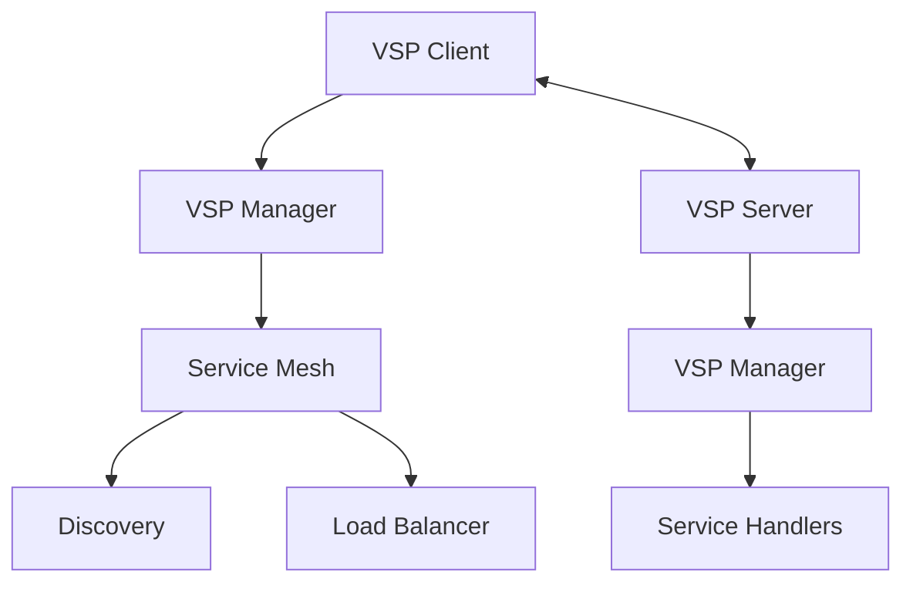

# VSP Protocol

The Velithon Service Protocol (VSP) is a high-performance communication protocol for microservices. VSP provides basic service discovery, message passing, and load balancing.

## 🌟 Features

- **High Performance**: Rust-based implementation with optimized messaging
- **Service Discovery**: Static, mDNS, and Consul-based service discovery
- **Load Balancing**: Round-robin and weighted load balancing
- **Message Passing**: Efficient JSON-based protocol with caching
- **Connection Pooling**: Basic connection management

## 🏗️ VSP Architecture



## 🚀 Quick Start

### Setting up VSP Server

```python
from velithon import Velithon
from velithon.vsp import VSPManager

app = Velithon()

# Create VSP manager
vsp_manager = VSPManager(name="user-service")

@vsp_manager.vsp_service("get_user")
async def get_user(user_id: str) -> dict:
    # Your service logic here
    return {"id": user_id, "name": "John Doe"}

@app.on_startup()
async def startup():
    await vsp_manager.start_server(host="0.0.0.0", port=9090)

@app.on_shutdown()
async def shutdown():
    vsp_manager.close()
```

### VSP Client

```python
from velithon.vsp import VSPClient, ServiceMesh, StaticDiscovery
from velithon._velithon import ServiceInfo

# Create service mesh with static discovery
service_mesh = ServiceMesh(discovery_type='static')
service_mesh.register(ServiceInfo(
    "user-service",
    "127.0.0.1", 
    9090
))

client = VSPClient(
    service_mesh=service_mesh,
    transport_factory=lambda manager: None,  # Transport factory
    max_transports=5
)

# Call remote service
async def call_user_service():
    try:
        result = await client.call(
            service_name="user-service",
            endpoint="get_user",
            body={"user_id": "123"}
        )
        return result
    except Exception as e:
        print(f"VSP call failed: {e}")
        return None

# Use in Velithon route
@app.get("/users/{user_id}")
async def get_user_proxy(request: Request):
    user_id = request.path_params["user_id"]
    
    result = await client.call(
        service_name="user-service",
        endpoint="get_user", 
        body={"user_id": user_id}
    )
    return result
```

## 📡 Service Discovery

### Static Discovery

```python
from velithon.vsp import ServiceMesh, DiscoveryType
from velithon._velithon import ServiceInfo

# Configure static service discovery
service_mesh = ServiceMesh(discovery_type=DiscoveryType.STATIC)

# Register services
service_mesh.register(ServiceInfo(
    "order-service",
    "192.168.1.10",
    9090
))

service_mesh.register(ServiceInfo(
    "order-service", 
    "192.168.1.11",
    9090
))
```

### Consul Discovery

```python
from velithon.vsp import ServiceMesh, DiscoveryType

# Configure Consul service discovery  
service_mesh = ServiceMesh(
    discovery_type=DiscoveryType.CONSUL,
    consul_host="consul.service.local",
    consul_port=8500
)
```

### mDNS Discovery

```python
from velithon.vsp import ServiceMesh, DiscoveryType

# Configure mDNS service discovery
service_mesh = ServiceMesh(discovery_type=DiscoveryType.MDNS)
```

## 🔄 Message Protocol

VSP uses a simple JSON-based message format with performance optimizations.

### VSP Message

```python
from velithon.vsp import VSPMessage

# Create a message
message = VSPMessage(
    request_id="req-123",
    service="user-service", 
    endpoint="get_user",
    body={"user_id": "123"},
    is_response=False
)

# Messages support serialization caching for performance
serialized = message.serialize()
```

### Service Handlers

```python
from velithon.vsp import VSPManager

vsp_manager = VSPManager(name="user-service")

@vsp_manager.vsp_service("get_user")
async def get_user(user_id: str) -> dict:
    # Service logic
    return {"id": user_id, "name": "John Doe", "email": "john@example.com"}

@vsp_manager.vsp_service("create_user") 
async def create_user(name: str, email: str) -> dict:
    # Create user logic
    new_user = {"id": "new-id", "name": name, "email": email}
    return new_user

@vsp_manager.vsp_service("update_user")
async def update_user(user_id: str, **updates) -> dict:
    # Update user logic
    return {"id": user_id, "updated": True}
```

## 🔧 Connection Management

### Connection Pool

```python
from velithon.vsp import ConnectionPool

# Basic connection pool
connection_pool = ConnectionPool(
    max_size=10,
    timeout=30.0
)

# Use with VSP client (connection pooling is handled automatically)
```

### Transport Configuration

```python
from velithon.vsp import TCPTransport

# TCP transport (default and only available transport)
# Transport configuration is handled internally by VSP
```

## ⚖️ Load Balancing

### Built-in Load Balancing

```python
from velithon.vsp import ServiceMesh
from velithon._velithon import RoundRobinBalancer, WeightedBalancer

# Round-robin load balancing (default)
service_mesh = ServiceMesh(
    discovery_type='static',
    load_balancer=RoundRobinBalancer()
)

# Weighted load balancing
weighted_balancer = WeightedBalancer()
service_mesh = ServiceMesh(
    discovery_type='static', 
    load_balancer=weighted_balancer
)
```

## � Complete Example

```python
from velithon import Velithon
from velithon.vsp import VSPManager, VSPClient, ServiceMesh
from velithon._velithon import ServiceInfo

# Main application
app = Velithon()

# VSP Manager for this service
vsp_manager = VSPManager(name="api-gateway")

# VSP Client for calling other services  
service_mesh = ServiceMesh(discovery_type='static')
service_mesh.register(ServiceInfo(
    "user-service",
    "127.0.0.1", 
    9091
))

client = VSPClient(
    service_mesh=service_mesh,
    transport_factory=lambda manager: None,
    max_transports=5
)

# Define VSP service endpoints
@vsp_manager.vsp_service("get_user_info")
async def get_user_info(user_id: str) -> dict:
    # This service can be called by other VSP clients
    return {"id": user_id, "name": "John Doe", "service": "api-gateway"}

# HTTP endpoints that use VSP to call other services
@app.get("/users/{user_id}")
async def get_user(request: Request):
    user_id = request.path_params["user_id"]
    
    try:
        result = await client.call(
            service_name="user-service",
            endpoint="get_user",
            body={"user_id": user_id}
        )
        return result
    except Exception as e:
        return {"error": str(e)}

@app.post("/orders")
async def create_order(request: Request):
    order_data = await request.json()
    
    try:
        result = await client.call(
            service_name="order-service", 
            endpoint="create_order",
            body=order_data
        )
        return result
    except Exception as e:
        return {"error": str(e)}

# Lifecycle management
@app.on_startup()
async def startup():
    await vsp_manager.start_server(host="0.0.0.0", port=9090)

@app.on_shutdown()
async def shutdown():
    vsp_manager.close()

if __name__ == "__main__":
    app.run()
```

## 🚀 Performance Features

### Message Caching

VSP automatically caches serialized messages for better performance:

```python
# Messages are automatically cached when serialized repeatedly
message = VSPMessage(
    request_id="req-123",
    service="user-service",
    endpoint="get_user", 
    body={"user_id": "123"}
)

# First serialization - creates cache
data1 = message.serialize()

# Subsequent serializations use cache
data2 = message.serialize()  # Uses cached version
```

### Worker Types

```python
from velithon.vsp import VSPManager, WorkerType

# Asyncio workers (default)
vsp_manager = VSPManager(
    name="service",
    worker_type=WorkerType.ASYNCIO,
    num_workers=4
)

# Multicore workers for CPU-intensive tasks
vsp_manager = VSPManager(
    name="service", 
    worker_type=WorkerType.MULTICORE,
    num_workers=4
)
```

### Performance Monitoring

```python
# Get performance statistics
stats = vsp_manager.get_performance_stats()
print(f"Messages processed: {stats['messages_processed']}")
print(f"Average processing time: {stats['avg_processing_time']}")
print(f"Active workers: {stats['active_workers']}")
```

## 📚 Additional Features

### Service Information

```python
from velithon._velithon import ServiceInfo

# Create service info
service = ServiceInfo(
    "user-service",
    "192.168.1.10",
    9090
)

# Check service health
if service.is_healthy():
    print(f"Service {service.name} is healthy")
```

### VSP Call Decorator

```python
# Use decorator for easier VSP calls
@vsp_manager.vsp_call("user-service", "get_user")
async def get_user_data(user_id: str):
    # This will automatically call the VSP service
    pass

# Usage
user_data = await get_user_data(user_id="123")
```
